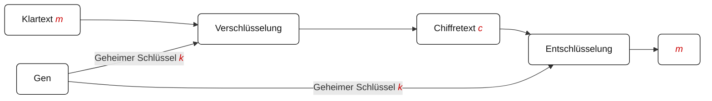
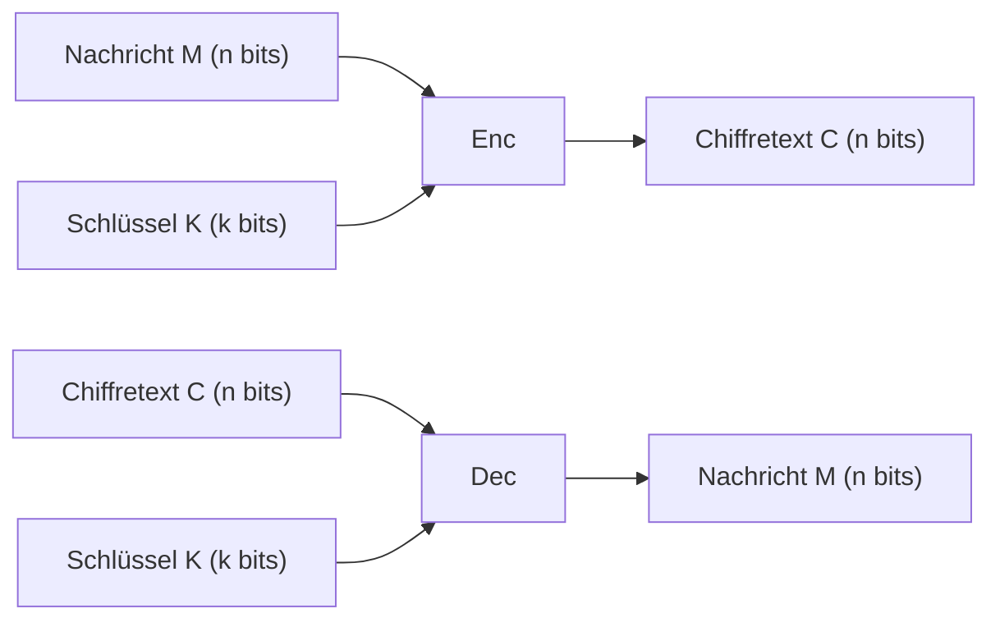
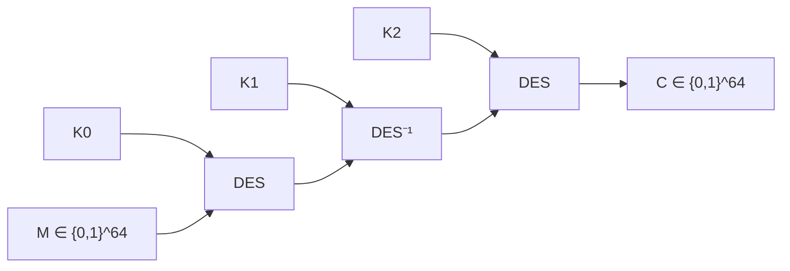

Es gibt 3 Ziele der Kryptographie:
1. Vertraulichkeit: Angerifer kann Inhalt der Nachrichten nicht lernen
2. Integrität: Angreifer kann Nachricht nicht ändern, ohne die Änderung bekannt wird
3. Authentizität: Angreifer kann nicht bahaupten, dass eine Nachricht von jemand kam, die diese nicht gesendet hat

Es gibt 2 Arten von Kryptographie: Symmetrie (gleicher Schlüssel zum Ver- und Entschlüsseln) und Asymmetrie (2 Schlüssel zum Ver- und Entschlüsseln).

**Kerckhoffs´Prinzip**: ein Kryptosystem muss selbst dann sicher sein, wenn alles daran öffentlich bekannt ist -außer dem Schlüssel.

Es gibt auch 2 Arten von Schiffren: **klassische** Chiffren (bsp. Shift-Chiffre, Substitutionschiffre) und **moderne** Chiffren. Moderne Chiffre enthält 3 zu merkende Dinge: Formale Definitionen, systematisches Design, und sehr sichere kryptographische Konstruktionen mit Sicherheitsbeweisen (beim Sicherheitsbeweis gibt ansonsten kryptographische Annahme: wäre Annahme falsch, wäre Verfahren nicht mehr sicher).

### Kryptographische primitive

|                     | **Symmetrische Kryptoprimitive**                                   | **Asymmetrische Kryptoprimitive**               |
|---------------------|---------------------------------------------------------------------|--------------------------------------------------|
| **Vertraulichkeit** | <ul><li>Symmetrische Chiffren</li><li>Blockchiffren</li></ul>      | <ul><li>Public Key Encryption (PKE)</li></ul>   |
| **Integrität & Authentizität** | <ul><li>Message Authentication Codes (MAC)</li></ul>   | <ul><li>Digitale Signaturen</li></ul>           |

### Kryptographische Konstruktionen (Beispiele)

|                     | **Symmetrische Konstruktionen**                                   | **Asymmetrische Konstruktionen**                         |
|---------------------|-------------------------------------------------------------------|----------------------------------------------------------|
| **Vertraulichkeit** | <ul><li>One-Time Pad</li><li>DES (3DES), AES</li></ul>            | <ul><li>RSA Verschlüsselung</li><li>ElGamal Verschlüsselung</li></ul> |
| **Integrität & Authentizität** | <ul><li>CBC-MAC</li><li>HMAC</li></ul>                 | <ul><li>RSA Signaturen</li><li>Schnorr Signaturen</li></ul>          |

**Symmetrische Kryptographie**

**Sicherheitsspiel**
1. IND-CPA: Angreifer darf so viele Nachrichten verschlüsseln lassen, wie es will. Aber die Gewinnwahrscheinlichkeot des Angreifers liegt immer bei gegen 1/2
- Gefahr: Chosen Ciphertext Angriff, bsp. Padding Orakel Angriff
2. IND-CCA: Angreifer bekommt Zugang zu Orakel, das ausgewählte Chiffretexte entschlüsseln kann. Aber die Gewinnwahrscheinlichkeot des Angreifers liegt immer bei gegen 1/2

**One-Time-Pad (OTP)** kann auch Vernam Chiffre genannt werden
- OTP zur Verschlüsselung von Bitstrings der Länge n
- Formal definition:
  + Gen: Ausgabe zufälliger Schlüssel $k \overset{\mathrm{R}}{\gets} \{0,1\}^n$.
  + Enc: für m ∈ M: Ausgabe Enc(k, m) = k ⊕ m.
  + Dec: für c ∈ C: Ausgabe Dec(k, c) = k ⊕ c.
- Sicherheit: mit dem Annahme: Schlüssel darf nur einmal verwendet werden

### Blockschiffre
- Ver- und Entschlüsselung von Nachrichten/Chiffretextblöcken mit fixer Länge
- Blocklänge n =|m|=|c|: häufig 64-128 Bits
- Schlüssellänge k: häufig 128-256 Bits

**Data Encryption Standard (DES)** 
- Blocklänge n= 64 Bits
- Schlüssellänge k= 56 Bits

**Triple DES**
- Schlüssellänge: 3*56= 168 Bits

- This Modell kann mit MitM Angriff attackiert werden, oder mit Seite-Kanal-Angriffe und Fehlerangriffe.
- Probleme:
  + Nicht IND-CPA sicher
  + Nicht möglich Nachrichten beliebiger Länge zu verschlüsseln
 
### Modes of Operation
**Electronic Code Book (ECB) Modus**

- Der Klartext muss um ein Padding eingefügt werden, wenn |m| kein Vielfaches der Blocklänge ist
- Dieses Modus ist deterministisch

**Cipher Block Chaining (CBC) Modus**

- CBC ist IND-CPA sicher, aber es gibt Probleme mit Padding sind häufig in der Praxis. So was ist Padding Angriffe auf CBC? Annahme: Angreifer hat Chiffretext und Zugriff auf Padding Orakel, hat aber keine Ahnungüber Klartext und Schlüssel. Schritte von Angreifer: Angreifer ändert Chiffretext Block 1 so lange, bis gültiges Padding entsteht, weiter mit andere Blocks wird Angreifer ursprünglichen Klartext rekonstruieren können.

**Counter Modus (CTR)** 

