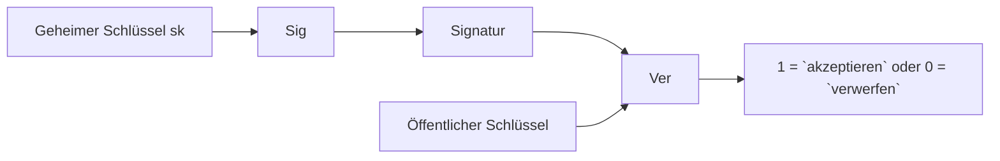

Es gibt 3 Ziele der Kryptographie:
1. Vertraulichkeit: Angerifer kann Inhalt der Nachrichten nicht lernen
2. Integrität: Angreifer kann Nachricht nicht ändern, ohne die Änderung bekannt wird
3. Authentizität: Angreifer kann nicht bahaupten, dass eine Nachricht von jemand kam, die diese nicht gesendet hat

Es gibt 2 Arten von Kryptographie: Symmetrie (gleicher Schlüssel zum Ver- und Entschlüsseln) und Asymmetrie (2 Schlüssel zum Ver- und Entschlüsseln).

**Kerckhoffs´Prinzip**: ein Kryptosystem muss selbst dann sicher sein, wenn alles daran öffentlich bekannt ist -außer dem Schlüssel.

Es gibt auch 2 Arten von Schiffren: **klassische** Chiffren (bsp. Shift-Chiffre: Caesars Chiffre, Substitutionschiffre) und **moderne** Chiffren. Moderne Chiffre enthält 3 zu merkende Dinge: Formale Definitionen, systematisches Design, und sehr sichere kryptographische Konstruktionen mit Sicherheitsbeweisen (beim Sicherheitsbeweis gibt ansonsten kryptographische Annahme: wäre Annahme falsch, wäre Verfahren nicht mehr sicher).

### Kryptographische primitive

|                     | **Symmetrische Kryptoprimitive**                                   | **Asymmetrische Kryptoprimitive**               |
|---------------------|---------------------------------------------------------------------|--------------------------------------------------|
| **Vertraulichkeit** | <ul><li>Symmetrische Chiffren</li><li>Blockchiffren</li></ul>      | <ul><li>Public Key Encryption (PKE)</li></ul>   |
| **Integrität & Authentizität** | <ul><li>Message Authentication Codes (MAC)</li></ul>   | <ul><li>Digitale Signaturen</li></ul>           |

### Kryptographische Konstruktionen (Beispiele)

|                     | **Symmetrische Konstruktionen**                                   | **Asymmetrische Konstruktionen**                         |
|---------------------|-------------------------------------------------------------------|----------------------------------------------------------|
| **Vertraulichkeit** | <ul><li>One-Time Pad</li><li>DES (3DES), AES</li></ul>            | <ul><li>RSA Verschlüsselung</li><li>ElGamal Verschlüsselung</li></ul> |
| **Integrität & Authentizität** | <ul><li>CBC-MAC</li><li>HMAC</li></ul>                 | <ul><li>RSA Signaturen</li><li>Schnorr Signaturen</li></ul>          |

**Symmetrische Kryptographie**
- Algorithmen: (Gen, Enc, Dec)

**Sicherheitsspiel**
1. IND-CPA: Angreifer darf so viele Nachrichten verschlüsseln lassen, wie es will. Aber die Gewinnwahrscheinlichkeot des Angreifers liegt immer bei gegen 1/2
- Gefahr: Chosen Ciphertext Angriff, bsp. Padding Orakel Angriff
2. IND-CCA: Angreifer bekommt Zugang zu Orakel, das ausgewählte Chiffretexte entschlüsseln kann. Aber die Gewinnwahrscheinlichkeot des Angreifers liegt immer bei gegen 1/2

**One-Time-Pad (OTP)** kann auch Vernam Chiffre genannt werden
- OTP zur Verschlüsselung von Bitstrings der Länge n
- Formal definition:
  + Gen: Ausgabe zufälliger Schlüssel $k \overset{\mathrm{R}}{\gets} \{0,1\}^n$.
  + Enc: für m ∈ M: Ausgabe Enc(k, m) = k ⊕ m.
  + Dec: für c ∈ C: Ausgabe Dec(k, c) = k ⊕ c.
- Sicherheit: mit dem Annahme: Schlüssel darf nur einmal verwendet werden

### Blockschiffre
- Ver- und Entschlüsselung von Nachrichten/Chiffretextblöcken mit fixer Länge
- Blocklänge n =|m|=|c|: häufig 64-128 Bits
- Schlüssellänge k: häufig 128-256 Bits
- Enc(.) hier spielt die Rolle als PRP, so wir schätzen eine Blockschiffre stark oder nicht dadurch ein, ob Schlüsselraum groß genug oder nicht ist. Dies vorstellt uns auch die Sicherheit von Blockschiffre (Angreifer kann nicht zwischen Enc(.) und P(.) unterscheiden).

**Data Encryption Standard (DES)** 
- Blocklänge n= 64 Bits
- Schlüssellänge k= 56 Bits

**Triple DES**
- Schlüssellänge: 3*56= 168 Bits

- This Modell kann mit MitM Angriff attackiert werden, oder mit Seite-Kanal-Angriffe und Fehlerangriffe.
- Probleme:
  + Nicht IND-CPA sicher
  + Nicht möglich Nachrichten beliebiger Länge zu verschlüsseln
 
### Modes of Operation
**Electronic Code Book (ECB) Modus**

- Der Klartext muss um ein Padding eingefügt werden, wenn |m| kein Vielfaches der Blocklänge ist
- Dieses Modus ist deterministisch

**Cipher Block Chaining (CBC) Modus**

- CBC ist IND-CPA sicher, aber es gibt Probleme mit Padding sind häufig in der Praxis. So was ist **Padding Angriffe** auf CBC? Annahme: Angreifer hat Chiffretext und Zugriff auf Padding Orakel, hat aber keine Ahnungüber Klartext und Schlüssel. Schritte von Angreifer: Angreifer ändert Chiffretext Block 1 so lange, bis gültiges Padding entsteht, weiter mit andere Blocks wird Angreifer ursprünglichen Klartext rekonstruieren können.

**Counter Modus (CTR)** 

---

**Kryptographische Hashfunktionen** $H: \ {0,1\}^\* \to \{0,1\}^n$
- Eingabe: Nachricht beliebiger Länge
- Ausgabe: fixe Länge
- 3 Sicherheitsdefinitionen:
  + Preimage resistance: gegeben h ist es schwer m zu finden, so dass H(m) = h
  + Second Preimage resistance: gegeben m ist es schwer m´ ≠ m zu finden, so dass h := H(m) = H(m´)
  + Collision resistance: es ist schwer, m und m´ zu finden, so dass h := H(m) = H(m´)
 
### Message Authentication Codes (MACs)
- Für Erhaltung Integrität und Vertraulichkeit der Nachricht
- Algorithmen: (Gen, Mac, Vrfy)

   

**CBC-MAC**

und mit Nachricht unterschiedlicher Länge, aber es ist nicht sicher, da der Tag für die modifizierte Nachricht berechnet werden kann:

Wir anwenden stattdessen **HMAC** für die Nachrichten beliebiger Länge. die Schritte sind: 1. Berechne y = H(m) der langen Nachricht m mit Hilfe von hashfunktion; 2. Berechne MAC

**Authentifizierte Verschlüsselung** kombinieren Verschlüsselung und Integritätsschutz, um Ziele: Vertraulichkeit, Integrität, und Authentizität der Nachricht zu gewährleisten.
1. Encrypt-then-MAC
   1. Verschlüsseln: c= $\mathrm{Enc}_{k_E}(\text{nonce}, m)$ (nonce hier kann auch IV sein)
   2. Authentisieren: t= $\mathrm{MAC}_{k_M}(\text{AAD} || c)$
   - Sende: (nonce, c, t)
   - Empfang: Tag prüfen, und entschlüsseln nur bei Erfolg
   - Probleme: anfällig für Padding/Timing- Orakel in bestimmten Modi (TLS-CBC: Lucky-13, Padding-Orakel); IND-CCA sicher durch Authentifizierung
2. Mac-then-Encrypt:
   1. Authentisieren: t= $\mathrm{MAC}_{k_M}(\text{m})$
   2. Verschlüsseln: c= $\mathrm{Enc}_{k_E}(\text{nonce}, m||t)$
   - Sende: (nonce, c)
   - Empfang: Erst entschlüsseln, dann Tag prüfen

**Asysmmetrische Kryptographie**
- Es gibt stattdessen ein Schlüsselpaar (pk, sk), dies macht es möglich, dass kein Schlüsselaustausch notwendig ist, dies folgt auch, dass nur n Schlüsselpaare gebraucht sind, statt n(n-1)/2
- Algorithmen: (Gen, Enc, Dec)

**RSA Verschlüsselung**
1. RSA Schlüsselerzeugung: GenRSA(n) mit Sicherheitsparameter n
   - Wähle 2 n-bit *Primzahlen* p, q mit p ≠ q
   - Berechne N= p*q
   - Wähle e> 1, sodass ggT(e, 𝝋(N)) = 1
   - Berechne d = $\{e\}^\{-1\}$ mod𝝋(N); 𝝋(N) =(p-1)(q-1)
   - Ausgabe: (N,e,d) = GenRSA(n)
     
   

2. RSA Annahmen:
   1. d ist benögtigt, um die Invertierung der RSA Funktion zu berechnen
   2. y ist zufällig in $\{Z\}^\{+\}_\{N\}$
   3. Gegebn (N, e, y) ist es schwierig x zu berechnen, so dass z ≡ $\{x\}^\{e\}$ mod N
- **Homomorphe Verschlüsselung**: Verschlüsselungsverfahren heißt (multiplikativ) homomorph, wenn $\mathrm{Enc}(\mathsf{pk}, m_0)\cdot \mathrm{Enc}(\mathsf{pk}, m_1)
= \mathrm{Enc}(\mathsf{pk}, m_0\cdot m_1).$
  - Textbuch RSA ist homomorph, da $(m_0^{\,e} \bmod N)\cdot (m_1^{\,e} \bmod N)
\equiv (m_0\cdot m_1)^{e} \pmod N.$
- Diese Verschlüsselung ist deterministisch, so damit Textbuch RSA nicht mehr deterministisch wird, tragen wir Zufälligkeit in Encoding-Schritt ein, und Format wird geprüft in Decoding-Schritt. Dies nennen wir **RSA OAEP**:

  

Denn Textbuch RSA ist fast immer unsicher in der Praxis, brauchen wir eine alternative Verschlüsselungsverfahren. Nächste betrachten wir das **Elgamal Verfahren**
- Diskrete Logarithmus Annahme:
  + Setup: zyklische Gruppe G der Ordnung q mit Generator g und q prim
  + Gegeben: *zufälliges* h ∈ G
  + Suche: x, sodass $\{g\}^\{x\}$ = h
  + Annahme: diskreten Logarithmus zu finden ist schwer für geeignete Gruppe G
  + Andere Varianten: **CDH- und DDH-Annahme**:
    1. CDH-Annahme: es ist schwer, $\{g\}^\{xy\}$ zu berechnen
    2. DDH-Annahme: es ist schwer, zu entscheiden, ob ein T aus $\{g\}^\{xy\}$ kommt oder zufällig ist
**Schlüsselaustausch**
1. Diffie-Hellman Schlüsselaustausch:
   
   Zur Verbesserung der Praxistauglichkeit wird **hybride Verschlüsselung** eingesetzt: Sie kombiniert einen asymmetrischen Schlüsselaustausch (KEM) mit der effizienten symmetrischen Verschlüsselung der Daten (DEM).
   - Verschlüsselung: 
  - Entschlüsselung: 

**Signaturen**
*Digitale Signaturen*

- Der Paar (pk, sk) ermöglicht auch **Mehrfachauthentifizierung**: Empfänger bekommt einmal öffentlichen Schlüssel pk von Sender über einen authentifizierte Kanal, dann der Empfänger kann jedes Mal eine neue Signatur aus dem Sender mithilfe von demselben pk prüfen.
  + Algorithmen: (Gen, Sig, Ver)
    
  + Sig(sk,m) hängt stark von Nachricht ab, so Angreifer kann keine Signeturen auf neue Nachricht fälschen.
 
Um die Authentizität und Integrität der Nachricht zu prüfen (Angreifer kann keine Signatur auf neue Nachricht fälschen), wenden **UEF-CMA** Sicherheitsspiel an
