**Sicherheit** heißt beide Safety und Security auf Englisch:
- Safety: gegenüber Fehlern
- Security: gegenüber böswilligen Handlungen

Es gibt 5 **Sicherheiteigenschaften** (erweitert):
1. Vertrauenlichkeit von Daten/Nachrichten
2. Integrität von Daten/Berechnungen
3. Verfügbarkeit von Dienst
   (CIA-Triade)
5. Authentizität von Dateien
6. Anonzmität von Benutzern
   
Kryptographie liefert 3 **Ziele**:
1. Vertraulichkeit: Angerifer kann Inhalt der Nachrichten nicht lernen
2. Integrität: Angreifer kann Nachricht nicht ändern, ohne die Änderung bekannt wird
3. Authentizität: Angreifer kann nicht bahaupten, dass eine Nachricht von jemand kam, die diese nicht gesendet hat

Es gibt 2 Arten von Kryptographie: Symmetrie (gleicher Schlüssel zum Ver- und Entschlüsseln) und Asymmetrie (2 Schlüssel zum Ver- und Entschlüsseln).

**Kerckhoffs´Prinzip**: ein Kryptosystem muss selbst dann sicher sein, wenn alles daran öffentlich bekannt ist -außer dem Schlüssel.

Es gibt auch 2 Arten von Schiffren: **klassische** Chiffren (bsp. Shift-Chiffre: Caesars Chiffre, Substitutionschiffre) und **moderne** Chiffren. Moderne Chiffre enthält 3 zu merkende Dinge: Formale Definitionen, systematisches Design, und sehr sichere kryptographische Konstruktionen mit Sicherheitsbeweisen (beim Sicherheitsbeweis gibt ansonsten kryptographische Annahme: wäre Annahme falsch, wäre Verfahren nicht mehr sicher).

### Kryptographische primitive

|                     | **Symmetrische Kryptoprimitive**                                   | **Asymmetrische Kryptoprimitive**               |
|---------------------|---------------------------------------------------------------------|--------------------------------------------------|
| **Vertraulichkeit** | <ul><li>Symmetrische Chiffren</li><li>Blockchiffren</li></ul>      | <ul><li>Public Key Encryption (PKE)</li></ul>   |
| **Integrität & Authentizität** | <ul><li>Message Authentication Codes (MAC)</li></ul>   | <ul><li>Digitale Signaturen</li></ul>           |

### Kryptographische Konstruktionen (Beispiele)

|                     | **Symmetrische Konstruktionen**                                   | **Asymmetrische Konstruktionen**                         |
|---------------------|-------------------------------------------------------------------|----------------------------------------------------------|
| **Vertraulichkeit** | <ul><li>One-Time Pad</li><li>DES (3DES), AES</li></ul>            | <ul><li>RSA Verschlüsselung</li><li>ElGamal Verschlüsselung</li></ul> |
| **Integrität & Authentizität** | <ul><li>CBC-MAC</li><li>HMAC</li></ul>                 | <ul><li>RSA Signaturen</li><li>Schnorr Signaturen</li></ul>          |

**Symmetrische Kryptographie**
- Algorithmen: (Gen, Enc, Dec)

**Sicherheitsspiel**
1. IND-CPA: Angreifer darf so viele Nachrichten verschlüsseln lassen, wie es will. Aber die Gewinnwahrscheinlichkeot des Angreifers liegt immer bei gegen 1/2
- Gefahr: Chosen Ciphertext Angriff, bsp. Padding Orakel Angriff
2. IND-CCA: Angreifer bekommt Zugang zu Orakel, das ausgewählte Chiffretexte entschlüsseln kann. Aber die Gewinnwahrscheinlichkeot des Angreifers liegt immer bei gegen 1/2

**One-Time-Pad (OTP)** kann auch Vernam Chiffre genannt werden
- OTP zur Verschlüsselung von Bitstrings der Länge n
- Formal definition:
  + Gen: Ausgabe zufälliger Schlüssel $k \overset{\mathrm{R}}{\gets} \{0,1\}^n$.
  + Enc: für m ∈ M: Ausgabe Enc(k, m) = k ⊕ m.
  + Dec: für c ∈ C: Ausgabe Dec(k, c) = k ⊕ c.
- Sicherheit: mit dem Annahme: Schlüssel darf nur einmal verwendet werden

### Blockschiffre
- Ver- und Entschlüsselung von Nachrichten/Chiffretextblöcken mit fixer Länge
- Blocklänge n =|m|=|c|: häufig 64-128 Bits
- Schlüssellänge k: häufig 128-256 Bits
- Enc(.) hier spielt die Rolle als PRP, so wir schätzen eine Blockschiffre stark oder nicht dadurch ein, ob Schlüsselraum groß genug oder nicht ist. Dies vorstellt uns auch die Sicherheit von Blockschiffre (Angreifer kann nicht zwischen Enc(.) und P(.) unterscheiden).

**Data Encryption Standard (DES)** 
- Blocklänge n= 64 Bits
- Schlüssellänge k= 56 Bits

**Triple DES**
- Schlüssellänge: 3*56= 168 Bits

- This Modell kann mit MitM Angriff attackiert werden, oder mit Seite-Kanal-Angriffe und Fehlerangriffe.
- Probleme:
  + Nicht IND-CPA sicher
  + Nicht möglich Nachrichten beliebiger Länge zu verschlüsseln
 
### Modes of Operation
**Electronic Code Book (ECB) Modus**

- Der Klartext muss um ein Padding eingefügt werden, wenn |m| kein Vielfaches der Blocklänge ist
- Dieses Modus ist deterministisch

**Cipher Block Chaining (CBC) Modus**

- CBC ist IND-CPA sicher, aber es gibt Probleme mit Padding sind häufig in der Praxis. So was ist **Padding Angriffe** auf CBC? Annahme: Angreifer hat Chiffretext und Zugriff auf Padding Orakel, hat aber keine Ahnungüber Klartext und Schlüssel. Schritte von Angreifer: Angreifer ändert Chiffretext Block 1 so lange, bis gültiges Padding entsteht, weiter mit andere Blocks wird Angreifer ursprünglichen Klartext rekonstruieren können.

**Counter Modus (CTR)** 

---

**Kryptographische Hashfunktionen** $H: \ {0,1\}^\* \to \{0,1\}^n$
- Eingabe: Nachricht beliebiger Länge
- Ausgabe: fixe Länge
- 3 Sicherheitsdefinitionen:
  + Preimage resistance: gegeben h ist es schwer m zu finden, so dass H(m) = h
  + Second Preimage resistance: gegeben m ist es schwer m´ ≠ m zu finden, so dass h := H(m) = H(m´)
  + Collision resistance: es ist schwer, m und m´ zu finden, so dass h := H(m) = H(m´)
 
### Message Authentication Codes (MACs)
- Für Erhaltung Integrität und Authentifizität der Nachricht
- Algorithmen: (Gen, Mac, Vrfy)

   

**CBC-MAC**

und mit Nachricht unterschiedlicher Länge, aber es ist nicht sicher, beispielweise sei MAC(M) = t und MAC(B) = s, so die neue Nachricht M´ = M || (t ⊕ B) hat den gültigen Tag s.

Wir anwenden stattdessen **HMAC** für die Nachrichten beliebiger Länge. die Schritte sind: 1. Berechne y = H(m) der langen Nachricht m mit Hilfe von hashfunktion; 2. Berechne MAC

**Authentifizierte Verschlüsselung** kombinieren Verschlüsselung und Integritätsschutz, um Ziele: Vertraulichkeit, Integrität, und Authentizität der Nachricht zu gewährleisten.
1. Encrypt-then-MAC
   1. Verschlüsseln: c= $\mathrm{Enc}_{k_E}(\text{nonce}, m)$ (nonce hier kann auch IV sein)
   2. Authentisieren: t= $\mathrm{MAC}_{k_M}(\text{AAD} || c)$
   - Sende: (nonce, c, t)
   - Empfang: Tag prüfen, und entschlüsseln nur bei Erfolg
   - Probleme: anfällig für Padding/Timing- Orakel in bestimmten Modi (TLS-CBC: Lucky-13, Padding-Orakel); IND-CCA sicher durch Authentifizierung
2. Mac-then-Encrypt:
   1. Authentisieren: t= $\mathrm{MAC}_{k_M}(\text{m})$
   2. Verschlüsseln: c= $\mathrm{Enc}_{k_E}(\text{nonce}, m||t)$
   - Sende: (nonce, c)
   - Empfang: Erst entschlüsseln, dann Tag prüfen

**Asysmmetrische Kryptographie**
- Es gibt stattdessen ein Schlüsselpaar (pk, sk), dies macht es möglich, dass kein Schlüsselaustausch notwendig ist, dies folgt auch, dass nur n Schlüsselpaare gebraucht sind, statt n(n-1)/2
- Algorithmen: (Gen, Enc, Dec)

**RSA Verschlüsselung**
1. RSA Schlüsselerzeugung: GenRSA(n) mit Sicherheitsparameter n
   - Wähle 2 n-bit *Primzahlen* p, q mit p ≠ q
   - Berechne N= p*q
   - Wähle e> 1, sodass ggT(e, 𝝋(N)) = 1
   - Berechne d = $\{e\}^\{-1\}$ mod𝝋(N); 𝝋(N) =(p-1)(q-1)
   - Ausgabe: (N,e,d) = GenRSA(n)
     
   

2. RSA Annahmen:
   1. d ist benögtigt, um die Invertierung der RSA Funktion zu berechnen
   2. y ist zufällig in $\{Z\}^\{+\}_\{N\}$
   3. Gegebn (N, e, y) ist es schwierig x zu berechnen, so dass z ≡ $\{x\}^\{e\}$ mod N
- **Homomorphe Verschlüsselung**: Verschlüsselungsverfahren heißt (multiplikativ) homomorph, wenn $\mathrm{Enc}(\mathsf{pk}, m_0)\cdot \mathrm{Enc}(\mathsf{pk}, m_1)
= \mathrm{Enc}(\mathsf{pk}, m_0\cdot m_1).$
  - Textbuch RSA ist homomorph, da $(m_0^{\,e} \bmod N)\cdot (m_1^{\,e} \bmod N)
\equiv (m_0\cdot m_1)^{e} \pmod N.$
- Diese Verschlüsselung ist deterministisch, so damit Textbuch RSA nicht mehr deterministisch wird, tragen wir Zufälligkeit in Encoding-Schritt ein, und Format wird geprüft in Decoding-Schritt. Dies nennen wir **RSA OAEP**:

  

Denn Textbuch RSA ist fast immer unsicher in der Praxis, brauchen wir eine alternative Verschlüsselungsverfahren. Nächste betrachten wir das **Elgamal Verfahren**
- Diskrete Logarithmus Annahme:
  + Setup: zyklische Gruppe G der Ordnung q mit Generator g und q prim
  + Gegeben: *zufälliges* h ∈ G
  + Suche: x, sodass $\{g\}^\{x\}$ = h
  + Annahme: diskreten Logarithmus zu finden ist schwer für geeignete Gruppe G
  + Andere Varianten: **CDH- und DDH-Annahme**:
    1. CDH-Annahme: es ist schwer, $\{g\}^\{xy\}$ zu berechnen
    2. DDH-Annahme: es ist schwer, zu entscheiden, ob ein T aus $\{g\}^\{xy\}$ kommt oder zufällig ist
**Schlüsselaustausch**
1. Diffie-Hellman Schlüsselaustausch:
   
   Zur Verbesserung der Praxistauglichkeit wird **hybride Verschlüsselung** eingesetzt: Sie kombiniert einen asymmetrischen Schlüsselaustausch (KEM) mit der effizienten symmetrischen Verschlüsselung der Daten (DEM).
   - Verschlüsselung: 
  - Entschlüsselung: 

**Signaturen**
*Digitale Signaturen*

```mermaid
flowchart LR
    A[Geheimer Schlüssel sk] --> B[Sig]
    B --> C[Signatur]
    C --> D[Ver]
    E[Öffentlicher Schlüssel] --> D
    D --> F[1 = `akzeptieren` oder 0 = `verwerfen`]
```

- Der Paar (pk, sk) ermöglicht auch **Mehrfachauthentifizierung**: einmalig Schlüssel authentisieren => anschließend beliebig viele Nachrichten signiert prüfen.
  + Algorithmen: (Gen, Sig, Ver)
    
  + Sig(sk,m) hängt stark von Nachricht ab, so Angreifer kann keine Signeturen auf neue Nachricht fälschen.
 
Um die Authentizität und Integrität der Nachricht zu prüfen (Angreifer kann keine Signatur auf neue Nachricht fälschen), wenden **EUF-CMA** Sicherheitsspiel an

Bis jetzt kennen wir 3 Arten für Datenintegrität: Koolisions-resistente Hashfunktion, digitale Signaturen, MACs. Weiter werden wir uns mit **Signaturverfahren** beschäftigen. Es gibt 2 Arten von Signaturverfahren: **RSA-basierte Signaturen**, und **Diskreter-Logarithmus-basiert**; beide Verfahren folgen dem sogenannten *"Hash-and-Sign"-Prinzip*
- Hash-and-Sign-Prinzip ermöglicht das Signieren von beliebig langen Nachrichten, und Hashfunktion trägt zut Sicherheit des Verfahren bei.
  
1. RSA-basiert Signaturen:
   - RSA Signieren: hier wird sk = (N,d) verwendet
     1. Hashe Nachricht m auf H(m)
     2. Kodiere "kurzen" Hashwert auf RSA-Länge
     3. "Kern"-Signaturverfahren: wende RSA-Schlüssel $\{(·)\}^\{d\} mod N$ an
   - RSA Verifizieren: hier wird pk = (N,e) verwendet
     1. Hashe Nachricht m auf H(m)
     2. Kodiere "kurzen" Hashwert auf RSA-Länge
     3. Vergleiche Signatur $\{s\}^\{e\} mod N$ mit Encode(H(m))

2. Diskrete-Logarithmus-basiert Signaturen: hier betrachten wir **Schnorr-Signaturen**:
   - Setup:
     + Gruppe G zyklisch, Primordnung q, Generator g
     + Schlüssel: privat $\{x\} \in {1,...,q-1}$, öffentlich $\{y\} = \{g\}^\{x\}$
   - Signieren:
     1. Wähle *zufällige Nonce k* $\in {1,...,q-1}$
     2. $\{R\} = \{g\}^\{k\}$, Challenge r = H(R||m)
     3. s = k + r*x*(mod q)
     4. Signatur: (r,s)
   - Verifikation
     1. $\{R'\} = \{g\}^\{s\}*\{y\}^\{-r\}$
     2. v = H(R'||m)
     3. Ausgabe 1 iff v = r, sonst Ausgabe 0
    
**Zertifikate**
1. Zertifizierungshierarchie:

```mermaid
   flowchart TB
    root[Root-CA]
    inter[übergeordnete CA]
    ca[CA]
    holder[Schlüsselinhaber]

    root -->|Zertifiziert mittels Signatur| inter
    inter -->|Zertifiziert mittels Signatur| ca
    ca -->|Zertifiziert mittels Signatur| holder
```

2. Zertifikate revozieren
   1. Variante 1: Certificate Revocation Lists (CRLs)
      - Veröffentlicht unterschriebene Liste aller gesperrter Zertifikate
   2. Online Certificate Status Protocol (OCSP)
      - Benutzer fragt Gültigkeit eines bestimmten Zertifikats ab
      - Es gibt viele Vorteile:
        + Echtzeitabfrage
        + Kürzer & effizienter

Jetzt unterscheiden wir uns die folgenden Begriffe:
1. Identifizierung: Identität feststellen
2. Authentisierung: Identität bestätigen
3. Autorisierung: bestimmen, was gegenüber machen darf nach bestandener Kontrolle

## Authentisierung
### 3 Faktoren zur Authentisierung – Übersicht

| Faktor (Auth) | Beispiele | Vorteile | Nachteile |
|---|---|---|---|
| **Wissen - Was man weiß** | Passwort, PIN | einfach zu ändern; einfach mitnehmbar | kann vergessen werden; leicht zu duplizieren/phishen |
| **Besitz - Was man hat** | Chipkarte, Hardware-Token| einfach mitnehmbar; nicht leicht zu duplizieren | übertragbar/teilbar; leicht zu stehlen/verlieren |
| **biometrische Authentisierung - Was man ist** | Biometrie: Fingerabdruck, Gesicht| nicht übertragbar; individuell | oft (relativ) fälschbar; unveränderbar bei Leak; Datenschutz/Privacy-Probleme |

**Passwortspeicherung**
1. Naive: einfacher Abgleich mit im Klartext gespeicherten Passwörtern
2. Verschlüsselung: Speichere Passwärter verschlüsselt, Sever hat zusätzlich Schlüsselpaar (sk, pk). Hier sind die Einwegfunktionen benötigt.
3. Hashen: Speichere Passwörter als Hash
4. Rainbow Table: benutzen Hashfunktion H: Passwort -> Hash und Reduktionsfunktion R: Hash -> Passwort, um eine Kette für jede Passwörtern zu erstellen. Aber es Time-Memorz Tradeoff gibt: je länger die Ketten, desto weniger Speicherbedarf, aber desto mehr Zeitaufwand
5. Salted Hashing: wähle zufälligen Salt S, mit mindestens 64 Bits, speiche H(S||pwd) in Passwort.
6. Peppering: verhält wie Salted Hashing, aber Salt(s) geheim halten

**Tokens**
Es existiert 2 **Arten von Token**: *Software*- (bsp. Web-Cookies) und *Hardware*-Token (bsp. Autoschlüssel), ansonsten betrachten wir auch 2 **Eigenschaften von Token**: *statisch* (bsp. einfache Überstragung des Geheimnisses) und *dynamisch* (Berechnung mit Geheimnis zur Authentisierung). Mithilfe von dynamisches Token können wir **Replay-Angriffe** vorbeugen.

**Biometrische Authentisierung**
- Fehler:
  + Falsch positiv
  + Falsch negativ
- Probleme:
  + nicht widerrufbar
  + benötigt vertrauenswürdige Geräte vor Ort
  + oft leicht zu fälschen

**Single-Sign-On (SSO)**
- Vorteile:
  + Nur ein Passwort notwendig
  + Phishing-Attacken schwerer, da einzelne Login-Stelle leichter auf Korrektheit überprüft werden kann
  + IT-Sicherheitmaßnahmen fokussieren sich auf zentrale Stelle
 - Nachteil: Verfügbarkeit von Dienst hängt von Verfügbarkeit des SSO ab
 - Für Authentisierung des SSOs, wenden wir Kerberos Protokoll an.
   

## Autorisierung
- Autorisierung heißt, dass wir die Rechten für jemand auf jede Datei zuweisen werden (Zugriffkontrolle)
- Schutzziel: Integrität und Vertraulichkeit
- Es gibt 2 Arten der Autorisierung:
  1. Rechtfestsetzung:
     1. Discretionary Access Control (DAC): Eigentümer des Objekts legt Zugriffsrechte für Subjekte fest
     2. Mandatory Access Control (MAC): Autorität setzt Zugriffsrechte fest
  2. Granularität der Zuweisung:
     1. Role-based Acess Control (RBAC): Zugriffsrecht durch Rolle festgelegt 
     2. Attribute-based Access Control (ABAC): feinere Zugriffsrecht gemäß logischer Formel

Beisiele für **DAC**: 
1. Acces Matrix Model

2. Acces Control List
   

Für **MAC** ist **Bell-LaPadula Modell** das klassische Modell mit Fokus auf Vertraulichkeit in Multi-Level Security. Dieses Model regelt die Informationsflüsse in eine Hierarchie: 
- No-Read-Up Regel: Lesezugriff (*read*) nur erlaubt wenn Hierarchie Subjekt ≥ Hierarchie Objekt
- No-Write-Down Regel: Erzeugung von Objekten (*append*) nur für Hierarchie ≥ Hierarchie des Subjekts
So muss jedem Subjekt eine Sicherheitsklasse $\{SC(s)\} \in \{SC\}$ zugewiesen (*Clearance*), und jedem Objekt wird eine Sicherheitsklasse $\{SC(o)\} \in \{SC\}$ zugewiesen (*Classification*)

### Netzwerksicherheit
**WLAN vs. WAN**
- Local Area Netzwerk (LAN): Menge an verknüpften lokalen Geräten, die miteinander kommunizieren können
- Wide Area Netz (WAN): Verbinden mehrer LAN mit Routern
  

**Protokoll**: Vereinbarung wie einzelne Knoten im Netzwerk miteinander kommunizieren:
- Syntax: Wie ist die Kommunikation strukturiert und spezifiert
- Semantik: Bedeutung der Kommunikation

**Netwerk-schichtenmodelle**
1. OSI Modell: Kommunikation zwischen 2 OSI Modell:

2. TCP/IP Modell: Kommunikation zwischen 2 TCP/IP Modell:
   

**Protokolle auf jedem Layer**

1. Link Layer:
   - Bietet an: Übertragung zwischen 2 Punkten inklusive Konvertierung in physikalische Signale
   - Beispiele: Ethernet, WiFi, Address Resolution protocol (ARP)
   - Die kommunikation muss beinhalten: Senderadresse, Zieladresse, und Daten
   - Identifikation: mit **MAC Adressen**:
     + 6 Byte Adresse, die jedes netzwerkfähige Gerät im Internat besitzt
     + Weltweit eindeutige Adresse der Hardware (eindeutig pro Netwerkschnittstelle)
     + steht aus: OUI (erste 3 Bytes = Hersteller) + gerätespezifischer Teil (letzte 3 Bytes)
     + Beispiel: 13:37:ca:fe:f0:0d
   - Angriffe auf Link Layer:
     Nutzt die Wahrheit, dass manchen LANs Broadcast Kommunikation nutzen, der Angreifer kann zuhören mithilfe von Netzwerkkarte in ''promiscuous mode'', oder Analyse mit ''Paket Sniffer''. Ansonsten benutzt Link Layer MAC Adresse für Identifikation, führt dies zu einige Angriffstechniken:
     
     1. MACs als Zugrifftechniken: is kein Angriff, aber ein Schwach von Link Layer, weil MAC Adresse leicht spoofbar ist, ansonsten MAC Adrressen sind auch leicht per Software zu ändern
        
     2. MAC Flooding: is ein Angriff, bei dem der Angreifer den MAC-
Adressspeicher eines Switches mit vielen gefälschten Einträgen füllt. Ist die Tabelle überlaufen, kennt der Switch die echten Zuordnungen nicht mehr und floodet Frames an alle Ports - er verhält sich faktisch wie ein Hub

     3. ARP Spoofing /ARP Poisoning:
        - is nur möglich, wenn A ermittelt in *IPv4* zu einer bekannten IP-Adresse per ARP, da ARP keine Authentisierung besitzt, so A akzeptiert auch unangeforderte Antworten unf überschreiben ihre ARP-Cache
        - Nutzt die Wahrheit, dass wenn A eine Nachricht an B über LAN schicken möchte und nur B's IP Adresse kannt, dann A muss B's MAC Adresse lernen, um Link Layer Protokoll zu nutzen, das Protokoll werde beispielweise so aussieht:
        - Hier ist ein Angrifftechnik, dass der Angreifer die Identität einer anderen Partei vortäuscht, also um Datenverkehr anderer Nutzer über den eigenen Rechner zu leiten. Die Folgen von diesem sind, MitM und DoS Angriffe überführen zu lassen
        - Protokoll: A stellt die Anfrage via Broadcast, so Angreifer sendet daher gefälschte ARP-Replies, damit A die MAC Adresse von Angreifer in Cache speichern.
        - Gegenmaßnahmen:
          + durch Monitoring erkennen
          + Verschlüsselung des Datenverkehrs aufhöheren Schichten (IPSec, TLS) gegen MitM-Angriff
          + Nutzt stattdessen IPv6 für Neighbor Discovery Protocol (NDP)
    
      4. DHCP Spoofing (Dynamic Host Configuration Protocol Spoofing):
         - Obwohl DHCP das Protokoll von Applikation Layer: es nutzt UDP (Transport Layer) und initiale Broadcoasts laufen (Link Layer), aber dieser Angriff nutzt die Schwachstelle auf Link Layer ausnutzen: der Client muss zuerst via Broadcast Anfrage nach Konfiguration schicken, DHCP-Server kann Client ein Angebot für Konfiguration machen (bsw., IP-Adresse, Gateway, usw.) - hier kann auch Angreifer eigenes Angebot schicken, weiterhin wählt Client Angebot des Angreifers, denn er kann unehrliche/ehrliche Angebote nicht unterscheiden. Am Ende ausgewählter Server bestätigt Konfiguration.
         - Zusammenfassung: DHCP Spoofing ist der **Angriff auf Link Layer, der Auswirkungen auf den Internet Layer** hat: Der Angreifer gibt sich im Link Layer als DHCP-Server aus, wodurch Clients falsche IP-, Gateway- und DNS-Einstellungen (Internet Layer) erhalten.
         - Gegenmaßnahmen:
           + Monitoring, IDS
           + DHCP Snooping
           + Verwendung von Schutzmechanism aus höheren Ebenen

 2. Internet Layer:
    - Bietet an: Sendung von Paketen von jedem Quellgerät zu jedm Zielgerät
    - erlaubt die Kommunikation über verschiedene LANs hinweg mittels globaler Adressierung
    - Pakete beinhalten: Sender-, Zieladdresse, Daten; Pakete mitgleicher Sender-, Zieladdresse können unterschiedliche Routen nehmen
      **Internet Protocol (IP)**:
      - is die Protokoll zur Kommunikatio zwischen Geräten im Internet, hat eindeutige Identifikation von Geräten im Internet mittels **IP Adresse**
      1. IPv4: 32 Bit Adresse der Form: 120.19.22.00
      2. IPv6: 128 Bit Adresse der Form: 2607:f140:8801::1:23
      - Probleme von IP: is **unzuverlässig**:
        + Pakete können verloren gehen
        + Pakete können Fehler aufweisen
        + Pakete können in falscher Ordnung beim Empfänger eintreffen
    - **Internet Control Message Protocol** (ICMP): wird von Routern und Hosts verwendet, um Fehler- und Steuerungsnachrichten über den IP-Verkehr auszutauschen; er wird direkt über IP übertragen
      + **Ping of Death** bezeichnet ein absichtlich übergroßes (durch Fragmentierung) ICMP-Echo-Paket, das beim Reassemblieren das IP-Limit überschreitet und so Systeme zum Absturz bringen kann – es handelt sich nicht um normale Pings.
    
3. Transport Layer:
   - Bietet an: Ende-zu-Ende Kommunikation im Internet für verschiedene Dienste, ermöglicht unterschiedliche Anwendung auf einem Host durch **Ports** (120.19.22.00 **:443**)
   - Protokolle: TCP, UDP, und QUIC
     # TCP vs. UDP – Übersicht

| Protokoll | Verbindung | Zuverlässigkeit | Reihenfolge | Übertragung/Overhead | Kurzbeschreibung |
|---|---|---|---|---|---|
| **TCP** | Verbindungsorientiert (stellt Verbindung zwischen Endpunkten her) | **Zuverlässig** (korrekte Pakete werden bestätigt/neu gesendet) | **Geordnet** (Pakete kommen in korrekter Reihenfolge an) | **Langsamer** (mehr Kontrollmechanismen bsp. Handshake) | Für zuverlässige, geordnete Datenströme. |
| **UDP** | Verbindungslos | **Unzuverlässig** (keine Garantie für Zustellung) | **Ungeordnet** (keine Reihenfolge-Garantie) | **Schneller** (weniger Overhead) | Für einfache, latenzkritische Übertragungen. |
   - Eigenschaften von TCP:
     + TCP teilt beim Sender die Nachricht in kleinere Pakete auf und setzt diese beim Empfönger wieder zusammen
     + Verwendung von **Sequenznummern**, um Ordnung beim Empfänger wieder herzustellen; jeder TCP-Verbindung erfordert 2 Arten von Sequenznummnern: isn für Nachrichten vom Client an den Server (client_isn) und isn für Nachrichten vom Server an den Client (server_isn) und ISNs ist zufällig für jede neue Verbindung für Verhinderung von TCP hijacking)
     + Empfänger antwortet mit Empfangsbestätigung **ACK**. Wenn ACK nicht beim Sender eintrifft, sender das Paket erneut
     Datenübertragung mit TCP:
       
   - TCP Flags:
     1. ACK:
        + Indikator dafür, dass der Benutzer den Empfang von etwas bestätigt
     2. SYN:
        + Indikator für den Beginn der Verbindung
     3. FIN:
        + ist eine Möglichkeit, die Verbindung zu beenden
        + erfordert eine Bestätigung (ACK)
        + es werden keine Pakete mehr gesendet, aber weiterhin empfangen
     4. RST
        + ist eine öglichkeit, eine Verbindung zu beenden
        + erfordert keine Bestätigung (ACK)
        + es werden keine Pakete mehr gesendet und empfangen
   - Angriffe:
      1. TCP Hijacking: ist ein Angriff, darin Angreifer eine bestehende TCP Besitzung manipuliert (Daten ändern oder einschleusen); es geben 2 Arten:
         1. Dateninjektion: Spoofing von Datenpaketen, um schädliche Daten in eine Verbindung einzuschleusen. Für Spoofing muss Angreifer INS des Absender kennen. Normalerweise geben es 2 Arten von Angreifer:
            1. On-path-Angreifer: Verhältnismäßig einfach (Race-Condition)
            2. Off-Path-Angreifer: 32-Bit-ISN erraten
            - Gegenmaßnahmen:
              + Nutze Protokolle in höherer Schicht, um Angriffe zu verhindern
              + Zufällige Wahl der ISN schützt vor Off-Path Angreifer
         2. RST-Injektion: Spoofing eines RST-Pakets, um eine Verbindung zwangsweise zu beenden. Es wird manchmal von Zensur- oder Filter-Systeme benutzt; ein Dritter fälscht ein TCP-Segment mit RST-Flag, so beide Enpunkte glauben, der Peer habe die Verbindung zurückgestzt, führt dazu, dass Verbindung abbricht (DoS-Angriff)
       2. TCP Flooding: nutzt die Wahrheit aus, dass SYN Speicher nur beschränkte Anzahl an 'nicht abgeschlossenen' TCP Verbindung speichert; Angreifer sende viele SYN-Anfragen, ohne SYN-ACK mit ACK zu beantworten (DoS Angriff)
          - Gegenmaßnahme: SYN Cookies: Da man alle Werte aus später ampfangenen Werten extrahieren kann, bis auf SeqNr_S. so wir können TCP-Buffer erst an bei abgeschlossenem Handshake legen, dies macht den Angriff teuer; es gibt aber Problem, weil SeqNr_S nicht vorhersagbar sein darf. Aber wir können Speicher mit SYN-Cookie reserviert: \[ \text{SeqNr\_S} := H(k_s, \text{SeqNr\_C}, \text{IP\_C}, \text{Port\_C}) \]. So nur wenn \[ \text{SeqNr\_S +1} := H(k_s, \text{SeqNr\_C}, \text{IP\_C}, \text{Port\_C}) +1 \] dann wird Speicher reserviert.
4.  Application Layer:
   - Bietet an: Funktion für netzbasierte Software; bsp. HTTP/HTTPS für Webseite, FTP für Filesharing, usw.
   - Adressierung der Anwendung mittels Ports
   - Protokoll für Routing: Border Gateway Protokoll (BGP)
     + Jedes AS teilt seine aktuellen Routen mit seinen Nachbarn
     + Metrik für Paket Routing:
       1. Länge des Präfix
       2. Bei mehreren Routen zum selben Ziel wird die kürzeste Route gewählt
     + BGP Hijacking: Angreifer erstellt korrumpiertes AS, was macht falsche Angaben zur Erreichbarkeit von Netzen
       - Gegenmaßnahmen:
         1. Überwachung des Internetverkehrs
         2. RIR speichern wem welche Präfixe gehören
         3. Nutzen Resource Public Key Infrastructure (RPKI): Kryptographische Absicherung von BGP Bekanntmachungen

