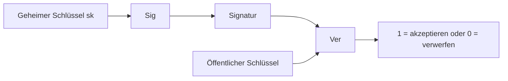
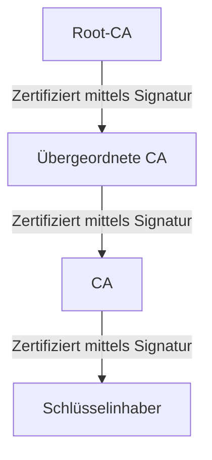

**Sicherheit** heißt beide Safety und Security auf Englisch:
- Safety: gegenüber Fehlern
- Security: gegenüber böswilligen Handlungen 

Es gibt 5 **Sicherheiteigenschaften** (erweitert):
1. Vertraulichkeit von Daten/Nachrichten
2. Integrität von Daten/Berechnungen
3. Verfügbarkeit von Dienst
   (CIA-Triade)
5. Authentizität von Dateien
6. Anonymität von Benutzern
   
Kryptographie liefert 4 **Ziele**:
1. Vertraulichkeit: Angreifer kann Inhalt der Nachrichten nicht lernen
2. Integrität: Angreifer kann Nachricht nicht ändern, ohne die Änderung bemerkt wird
3. Authentizität: Angreifer kann nicht behaupten, dass eine Nachricht von jemand kam, die diese nicht gesendet hat
4. nicht-Abstreitbarkeit: Angreifer kann nicht das Senden einer Nachricht später nicht leugnen

Es gibt 2 Arten von Kryptographie: Symmetrie (gleicher Schlüssel zum Ver- und Entschlüsseln) und Asymmetrie (2 Schlüssel zum Ver- und Entschlüsseln).

**Symmetrische Kryptosysteme** ist ein 5-Tupel (M,K,C,e,d), sodass für alle Klartexte $m \in \mathcal{M}$ und $k \in \mathcal{K}$ gilt, dass d(e(m,k), k) = m.

**Kerckhoffs´ Prinzip**: ein Kryptosystem muss selbst dann sicher sein, wenn alles dran öffentlich bekannt ist -außer dem Schlüssel.

Es gibt auch 2 Arten von Chiffren: **klassische** Chiffren (bsp. Shift-Chiffre: Caesars Chiffre, Substitution-Chiffre, Vigenere-chiffre, OTP) und **moderne** Chiffren. Moderne Chiffre enthält 3 zu merkende Dinge: Formale Definitionen, systematisches Design, und sehr sichere kryptographische Konstruktionen mit Sicherheitsbeweisen (beim Sicherheitsbeweis gibt ansonsten kryptographische Annahme: wäre Annahme falsch, wäre Verfahren nicht mehr sicher).

Die Sicherheit von klassicher Chiffre basiert häufig auf der Geheimhaltung des Algorithmus selbst (Security by Obscurity), nutzte mechanische oder manuelle Methoden.

Die Sicherheit von moderner Chiffre basiert aus Mathematik und Komplexitätstheorie, und beruht ausschließlich auf der Geheimhaltung des Schlüssels.

### Kryptographische primitive

|                     | **Symmetrische Kryptoprimitive**                                   | **Asymmetrische Kryptoprimitive**               |
|---------------------|---------------------------------------------------------------------|--------------------------------------------------|
| **Vertraulichkeit** | <ul><li>Symmetrische Chiffren</li><li>Blockchiffren</li></ul>      | <ul><li>Public Key Encryption (PKE)</li></ul>   |
| **Integrität & Authentizität** | <ul><li>Message Authentication Codes (MAC)</li></ul>   | <ul><li>Digitale Signaturen</li></ul>           |

### Kryptographische Konstruktionen (Beispiele)

|                     | **Symmetrische Konstruktionen**                                   | **Asymmetrische Konstruktionen**                         |
|---------------------|-------------------------------------------------------------------|----------------------------------------------------------|
| **Vertraulichkeit** | <ul><li>One-Time Pad</li><li>DES (3DES), AES</li></ul>            | <ul><li>RSA Verschlüsselung</li><li>ElGamal Verschlüsselung</li></ul> |
| **Integrität & Authentizität** | <ul><li>CBC-MAC</li><li>HMAC</li></ul>                 | <ul><li>RSA Signaturen</li><li>Schnorr Signaturen</li></ul>          |

### Symmetrische Kryptographie
- Algorithmen: (Gen, Enc, Dec)

**Sicherheitsspiel**
1. IND-COA: Angreifer sieht nur Ciphertexte, Spiel ist, dass Angreifer 2 möglichen Klartexten unterschieden können muss. Aber die Gewinnwahrscheinlichkeit des Angreifers liegt immer bei gegen 1/2
2. IND-KPA: Angreifer kennt Paare (m,c), und kann daraus Statistik und Muster ableiten, hat feste Formate und Standards, und wiederkehrende Signaturen/Footer in Emails, Spiel ist, dass Angreifer 2 möglichen Klartexten unterschieden können muss. Aber die Gewinnwahrscheinlichkeit des Angreifers liegt immer bei gegen 1/2 
3. IND-CPA: Angreifer darf so viele Nachrichten verschlüsseln lassen, wie es will. Aber die Gewinnwahrscheinlichkeit des Angreifers liegt immer bei gegen 1/2
- Gefahr: Chosen Ciphertext Angriff, bsp. Padding Orakel Angriff
4. IND-CCA: Angreifer bekommt Zugang zu Orakel, das ausgewählte Chiffretexte entschlüsseln kann. Aber die Gewinnwahrscheinlichkeit des Angreifers liegt immer bei gegen 1/2

**Perfekte Sicherheit**

Formell gilt bei perfekter Sicherheit für alle Klartexte m und alle Ciphertexte c die Gleichung P[m|c] = P[m].

**One-Time-Pad (OTP)** kann auch Vernam Chiffre genannt werden
- OTP zur Verschlüsselung von Bitstrings der Länge n
- Formal definition:
  + Gen: Ausgabe zufälliger Schlüssel $k \overset{\mathrm{R}}{\gets} \{0,1\}^n$.
  + Enc: für m ∈ M: Ausgabe Enc(k, m) = k ⊕ m.
  + Dec: für c ∈ C: Ausgabe Dec(k, c) = k ⊕ c.
- Sicherheit:
  + Der Schlüssel darf nur einmal verwendet werden
  + Der Schlüssel muss echt zufällig generiert sein
  + Der Schlüssel muss mindestens so lang sein wie die Nachricht
  + Der Schlüssel muss absolut geheim gehalten und sicher ausgetauscht werden

### Block-Chiffre
- Blockchiffren sind Kryptosysteme, die nur Blöcke fester Länge verschlüsseln können
- Ver- und Entschlüsselung von Nachrichten/Chiffretextblöcken mit fixer Länge
- Blocklänge n =|m|=|c|: häufig 64-128 Bits
- Schlüssellänge k: häufig 128-256 Bits, und die gleiche Schlüssel kann mehrmals auf unterschiedliche Blocks verwendet werden
- Enc(.) hier spielt die Rolle als PRP, so wir schätzen eine Block-Chiffre stark oder nicht dadurch ein, ob Schlüsselraum groß genug oder nicht ist. Dies vorstellt uns auch die Sicherheit von Block-Chiffre (Angreifer kann nicht zwischen Enc(.) und P(.) unterscheiden).
- Beispiele von Blockchiffren: AES, DES, 3-DES, Serpent, Twofish, Blowfish, usw.

DES, 3-DES, AES, Serpent, Twofish, Blowfish sind Blockchiffren (konkrete Algorithmen, die eine PRP auf festen Blockgrößen implementieren).

**Data Encryption Standard (DES)** 
- Blocklänge n= 64 Bits
- Schlüssellänge k= 56 Bits
- Ciphertextslänge c= 64 Bits
- Hauptschwachpunkt: kurzer Schlüsssel

**Triple DES**
- Schlüssellänge: 3*56= 168 Bits

- angreifbar mit MitM Angriff (112 Bits).

**Advanced Encryption Standard (AES)**
 - Block-Größe: 128 Bits 
 - Schlüssellänge: 128, 192 oder 256 Bits
 - ist mit Seiten-Kanal-Angriffe oder Fehleerangriffe angreifbar.
 - Probleme von AES:
  + ist nur sicher solange die Implementierung und dazugehörige Systeme richtig konfiguriert sind
  + Schwache Schlüssel und IV-Generierung kann die Sicherheit von AES gefährden
  + Side-channel Angriffe können verwendet werden. um den Schlüssel abzuleiten (Gegenmaßnahme: Konstantzeit-Implementierung für Timing Angriffe, Maskierung für Power Ananlysis, oder AES-NI - eine Hardwareunterstützung/ eine Erweiterung des x86-Befehlssatzes von Intel- und AMD-Prozessoren, die eine sichere und schnellere Anwendung von AES) 
  
- Probleme von Block-Chiffren:
  + Nicht IND-CPA sicher, weil es deterministisch ist
  + Nicht möglich Nachrichten beliebiger Länge zu verschlüsseln

### Modes of Operation
ECB, CBC, CTR sind Betriebsmodi (Modes of Operation), die eine Blockchiffre verwenden, um lange Nachrichten (mehrere Blöcke) zu ver- und entschlüsseln.

**Electronic Code Book (ECB) Modus**

- Der Klartext muss um ein Padding eingefügt werden, wenn |m| kein Vielfaches der Blocklänge ist
- Vorteile:
  + Einfache Bedienung: Implementierung ist unkompliziert, Jeder Block wird unabhängig bearbeitet
  + Schnelligkeit: Ver- und Entschlüsselung parallelisierbar
  + Fehlertoleranz: beschädigte Datenblöcke können nicht andere Blöcke beeinflussen und deren Ver-/Entschlüsselung beeinträchtigen
- Nachteile:
  + Deterministisch
  + Kein Diffusion: kleine Änderungen im Klartext führen zu lokalisierte Äderungen im Geheimtext

**Cipher Block Chaining (CBC) Modus**

- Zur Formalisierung von CBC benötigen wir **randoisierte Kryptosysteme**:
  + ein randomisierte symmetrisches Kryptosystem ist ein 6-Tupel (M,K,C,R,e,d), sodass für alle Klartexte $m \in \mathcal{M}$ und $k \in \mathcal{K}$ gilt, dass d(e(m,k,r), k,r) = m.

- Für Sicherheit muss der Wert aus R gleichverteilt zufällig gewählt werden (damit unvorhersagbar), und darf nur einmal verwendet wird.
- Verschlüsselung ist nicht parallelisierbar + Entschlüsselung ist parallelisierbar. Da bei Entschlüsselung parallelisierbar ist, führt ein fehlerhafter Chiffreblock nur zur fehlerhaften Entschlüsselung des aktuellen und unmittelbar nachfolgenden Chiffreblock
  
- CBC ist **IND-CPA sicher**, wenn das Initialization Vector (IV) zufällig und unvorhersagbar ist, und es nicht wiederverwendet wird, aber CBC hat häufig Problem mit Padding in der Praxis.
- Was ist **Padding Angriffe** auf CBC?
  + Annahme:
    1. Angreifer hat Chiffretext und Zugriff auf Padding Orakel, hat aber keine Ahnung über Klartext und Schlüssel. 
    2. Ansonsten muss der Webserver ein überprüfbares Padding Schema (PKSC#7) verwenden. 
   + Schritte von Angreifer: Angreifer muss verraten, ob ein entschlüsselter Text ein gültiges Padding ist. Dann beobachtet er entweder durch Fehlermeldungen oder side-channel Messungen, und herausfindet das gültiges Padding.

**Counter Modus (CTR)** 

- Nonce kommt aus einer **randomisierte Zählfunktion**, was einen Zufallswert (Nonce) und eine natürliche Zahl (Counter) auf eine Bitkette fester Länge an. Eine einfache Implementierung benutzt die Binärdarstellung der natürlich Zahl mit 0-Padding (LSB- oder MSB-Kodierung). **Problem** ist, dass ein randomisierter Zähler kann nie injektiv sein, so kann man die Periode nur so lang wie möglich wählen.
  
- Die Länge von der Kombination von Nonce und Counter hängt von der Größe des Blocks. diese Länge definiert den maximale Werte von Nonce und Counter.
- Ver- und Entschlüsselung können parallelisiert werden
- CTR ist eine OTP Konstruktion mit der Blockchiffre als Pseudozufallsgenerator.
  
- **Nonce vs. IV**: Nonce wird benutzt, da CTR nur Einzigartigkeit benögtigt, Nonce kann auch deterministisch sein (→ uniqueness matters), aber IV betonnt auch die Unvorhersagbarkeit (→ unpredicablity matters). So Nonce verhindert die Wiederverwendung von Schlüsselströmen, während IV das Durchsickern von Informationen aus gewähltern Klartext verhindert.

### Stromchiffren
- Stromchiffren können beliebig lange Bitketten verschlüsseln
  + Klar- und Chiffretexte sind Bitketten beliebiger Länge
  + Schlüssel-Länge ist fest
  + Ein pseudozufälliger Schlüsselstrom wird aus dem Schlüssel erzeugt
  + Ver- und Entsclüsselung ist bitweises XOR mit dem Schlüsselstrom
- Ein Kryptosystem heißt Stromchiffre, wenn es eine Funktion (Schlüsselstromgenerator) $\mathrm{keystream}(x,z) = |x|$ und |x| heißt Schlüsselstrom gibt, so dass $e(x,z) = d(x,z) = x \oplus \mathrm{keystream}(x,z)$

- **ChaCha20** ist eine moderne Stromchiffre, die als eine Alternative von AES entwickelt wurde:
  + Blocklänge: 512 Bits
  + Schlüssellänge: 256 Bits
  + ist schneller als AES ohne Hardwareunterstützung wie AES-NI
  + geeignet für leistungsschwache Geräte
  + geeignet für high-throughput und low-latency Protokollen
  + nicht anfällig für Timing und Cache Angriffe, aber anfällig für Power/EM Analysis Angriffe
  + oft verwendet in TLS 1.3, Wireguard VPN, usw.
 
---

**Kryptographische Hashfunktionen** $H: \ {0,1\}^\* \to \{0,1\}^n$
- Eingabe: Nachricht beliebiger Länge
- Ausgabe: fixe Länge
- 3 wichtige Eigenschaften für Haskfunktion:
  + deterministisch
  + schnelle Berechnungen
  + Integritätsschutz: kleine Änderungen führen zu einem anderen Hash
- 3 Sicherheitsdefinitionen:
  + Pre-image resistance: gegeben h ist es schwer m zu finden, so dass H(m) = h
  + Second Preimage resistance: gegeben m ist es schwer m´ ≠ m zu finden, so dass h := H(m) = H(m´)
  + Collision resistance: es ist schwer, m und m´ zu finden, so dass h := H(m) = H(m´)
 
| Hashfunktion   | Output               | Sicherheit           | Anwendung                                              |
|---------------|----------------------|----------------------|--------------------------------------------------------|
| MD5           | 128 Bits             | Unsicher             | X                                                      |
| SHA-1         | 160 Bits             | Unsicher seit 2017   | X                                                      |
| SHA-256       | 256 Bits             | Sicher               | TLS/SSL, hashing, Blockchain                           |
| SHA-3/Keccak  | 224/256/384/512 Bits | Sicher               | Ähnlich wie SHA-2 (aber langsamer ohne Hardware Unterstützung) |

 
### Message Authentication Codes (MACs)
- Für Erhaltung Integrität und Authentifizität der Nachricht
- Algorithmen: (Gen, Mac, Vrfy)

   

**CBC-MAC**

und mit Nachricht unterschiedlicher Länge, aber es ist nicht sicher, beispielweise sei MAC(M) = t und MAC(B) = s, so die neue Nachricht M´ = M || (t ⊕ B) hat den gültigen Tag s.

Wir wenden stattdessen **HMAC** für die Nachrichten beliebiger Länge an. 
$\text{HMAC}_K(m) = H\bigl((K' \oplus \text{opad}) \ \|\ H((K' \oplus \text{ipad}) \ \|\ m)\bigr)$

**Authentifizierte Verschlüsselung** kombinieren Verschlüsselung und Integritätsschutz, um Ziele: Vertraulichkeit, Integrität, und Authentizität der Nachricht zu gewährleisten.
1. Encrypt-then-MAC
   1. Verschlüsseln: c= $\mathrm{Enc}_{k_E}(\text{nonce}, m)$ (nonce hier kann auch IV sein)
   2. Authentisieren: t= $\mathrm{MAC}_{k_M}(\text{AAD} || c)$
   - Sende: (nonce, c, t)
   - Empfang: Tag prüfen, und entschlüsseln nur bei Erfolg
   - Probleme: anfällig für Padding/Timing- Orakel in bestimmten Modi (TLS-CBC: Lucky-13, Padding-Orakel); IND-CCA sicher durch Authentifizierung
2. Mac-then-Encrypt:
   1. Authentisieren: t= $\mathrm{MAC}_{k_M}(\text{m})$
   2. Verschlüsseln: c= $\mathrm{Enc}_{k_E}(\text{nonce}, m||t)$
   - Sende: (nonce, c)
   - Empfang: Erst entschlüsseln, dann Tag prüfen

### Asymmetrische Kryptographie
- Es gibt stattdessen ein Schlüsselpaar (pk, sk), dies macht es möglich, dass kein Schlüsselaustausch notwendig ist, dies folgt auch, dass nur n Schlüsselpaare gebraucht sind, statt n(n-1)/2
- ist ein 7-Tupel $(\mathcal{M}, \mathcal{K}_s, \mathcal{K}_p, \mathcal{K}, \mathcal{C}, e, d)$, mit
  + $\mathcal{M}$ ist Menge von Klartext
  + $\mathcal{K}_s$ ist Menge von geheimen / privaten Schlüsseln
  + $\mathcal{K}_p$ ist Menge von öffentlichen Schlüsseln
  + $\mathcal{K} \subset \mathcal{K}_s \times \mathcal{K}_p$ ist Menge von Schlüsselpaaren
  + $\mathcal{C}$ ist Menge von Shiffretexten
  + $e$ ist Verschlüsselungsfunktion: $\mathcal{M} \times \mathcal{K}_p \rightarrow \mathcal{C}$
  + $d$ ist Entschlüsselungsfunktion: $\mathcal{C} \times \mathcal{K}_s \rightarrow \mathcal{M}$

- Algorithmen: (Gen, Enc, Dec)

**RSA-Kryptosystem**
1. RSA Schlüsselerzeugung: GenRSA(n) mit Sicherheitsparameter n
   - Wähle 2 große *Primzahlen* p, q mit p ≠ q, und gleicher Länge
   - Setze $N = pq$ und $\varphi(N) = (p-1)(q-1)$
   - Wähle $e$ mit $1 < e < \varphi(N)$ und $\gcd(e,\varphi(N))=1$.
   - Berechne $d$ als multiplikatives Inverses von $e$ modulo $\varphi(N)$:
   \[
   ed \equiv 1 \pmod{\varphi(N)}.
   \]
   - Öffentlicher Schlüssel: $pk=(N,e)$, privater Schlüssel: $sk=(N,d)$
   - Ausgabe: (N,e,d) = GenRSA(n)
     
   

2. Textbuch RSA
   \[
   \text{Enc}(N,e,m)=m^e \bmod N,\qquad \text{Dec}(N,d,c)=c^d \bmod N
   \]
   **Achtung:** Textbook RSA ist **nicht sicher** (deterministisch, malleable, keine IND-CPA/CCA-Sicherheit).
   - Textbuch RSA ist homomorph, da $(m_0^{\,e} \bmod N)\cdot (m_1^{\,e} \bmod N) \equiv (m_0\cdot m_1)^{e} \pmod N.$

3. RSA-OAEP:
In der Praxis benutzt man RSA **mit sicherem Padding**, typischerweise **RSA-OAEP**.
- Ziel: Randomisierung + Schutz gegen viele strukturelle Angriffe
- Für CCA-Sicherheit nutzt man heute häufig **KEM-DEM** bzw. direkt moderne Protokolle/AEAD.

  

Denn Textbuch RSA ist fast immer unsicher in der Praxis, brauchen wir eine alternative Verschlüsselungsverfahren. Nächste betrachten wir das **Elgamal Verfahren**
ElGamal arbeitet in einer zyklischen Gruppe $G$ der Ordnung $q$ mit Generator $g$.

**Schlüsselgenerierung (von Alice)**
1. Wähle geheim $a \in \{1,\dots,q-1\}$ und setze $A=g^a$.
2. Öffentlicher Schlüssel: $pk=(G,g,A)$, privater Schlüssel: $sk=(G,g,a)$.
   
**Verschlüsselung (an Alice)**
Für Nachricht $m \in G$:
1. Wähle zufällig $r \in \{1,\dots,q-1\}$ und setze $R=g^r$.
2. Berechne gemeinsamen Schlüssel:
   \[
   K=A^r=g^{ar}
   \]
3. Setze $C=m \circ K$.
4. Ciphertext: $(R,C)$.

**Entschlüsselung (Alice)**
1. Berechne
   \[
   K = R^a = g^{ra}
   \]
2. Ausgabe:
   \[
   m = C \circ K^{-1}.
   \]

**Sicherheitsintuition:** ElGamal ist (unter passenden Gruppenannahmen) **IND-CPA-sicher**, weil $r$ frisch random ist. Typisch: IND-CPA unter der **DDH-Annahme** (je nach Setting).

**Diskrete Logarithmus Annahme**
Setup: zyklische Gruppe $G$ der Ordnung $q$ mit Generator $g$.

- **DLog-Annahme:** gegeben $h\in G$, finde $x$ mit $g^x=h$ (schwer).
- **CDH-Annahme:** gegeben $g^x, g^y$, berechne $g^{xy}$ (schwer).
- **DDH-Annahme:** gegeben $(g^x, g^y, T)$, entscheide ob $T=g^{xy}$ oder zufällig (schwer).
       
#### Schlüsselaustausch
- Beide Parteien erzeugen gemeinsam einen Schlüssel, ohne ihn direkt zu übertragen.
- Beispiel: Diffie–Hellman (DH): beide berechnen denselben geheimen Wert $K=g^{xy}$.

1. Diffie-Hellman Schlüsselaustausch (**DH**):
   
   - Ziel: Zwei Parteien erzeugen einen gemeinsamen Sitzungsschlüssel, ohne ihn direkt zu senden.
   Die Parteien einigen sich auf Primzahl $p$ (damit Gruppe $G=\mathbb{Z}_p$) sowie Generator $g$ von $\mathbb{Z}_p^\* = \{1,\dots,p-1\}$.
   1. A wählt privat $a$ zufällig (mit $0<a<p$) und sendet $g^a \bmod p$ an B.  
   2. B wählt privat $b$ zufällig (mit $0<b<p$) und sendet $g^b \bmod p$ an A.  
   3. A berechnet $(g^b)^a \bmod p$.  
   4. B berechnet $g^{ab} \bmod p$.  
   Da $(g^b)^a = g^{ab}$ gilt, erhalten beide denselben Schlüssel. 
   
   - DH alleine bietet **keine Authentizität** → anfällig für **Man-in-the-Middle**, wenn man nicht zusätzlich authentifiziert (z.B. Signaturen/Zertifikate).

2. Needham–Schroeder-Schlüsselaustausch (symmetrisch)
   Protokoll:
   $A \rightarrow T: A, B, N_A$  
   $T \rightarrow A: N_A, K, B, \{K, A\}_{K_B}, \{K, A\}_{K_A}$  
   $A \rightarrow B: \{K, A\}_{K_B}$  
   $B \rightarrow A: \{N_B\}_K$  
   $A \rightarrow B: \{N_B - 1\}_K$  
   
   Dabei sind $N_A, N_B$ Nonces (“number used once”), d.h. zufällig generierte Zahlen, die unter keinen Umständen zweimal verwendet werden sollen. 
   
   - Unsicher bei Replay, falls ein Angreifer einen alten Schlüssel $K'$ gebrochen und alte Nachrichten gespeichert hat.

3. Needham–Schroeder (asymmetrisch)
   Seien $K_{P_A}, K_{P_B}$ die öffentlichen Schlüssel von A bzw. B, sowie $K_{S_T}$ der private Signaturschlüssel von T.
   
   $A \rightarrow T: A, B$  
   $T \rightarrow A: K_{P_B}, \{B\}_{K_{S_T}}$  
   $A \rightarrow B: \{N_A, A\}_{K_{P_B}}$  
   $B \rightarrow T: B, A$  
   $T \rightarrow B: K_{P_A}, \{A\}_{K_{S_T}}$  
   $B \rightarrow A: \{N_A, N_B\}_{K_{P_A}}$  
   $A \rightarrow B: \{N_B\}_{K_{P_B}}$ 

**Sicherheit DH gegen passive Angreifer: Computational Diffi-Hellman (CDH)**
Angreifer kennt $G, g, g^a, g^b$, aber nicht $a,b$.  
Er muss $g^{ab}$ bestimmen → Instanz des CDH-Problems.
   - Input: $g, g^a, g^b$  
   - Output: $g^{ab}$  
Anmerkungen: CDH gilt als schwer (Basis von ElGamal); DH kann in jeder zyklischen Gruppe implementiert werden. 

**Sicherheit gegen MitM-Angriff auf DH**
- Problem: MitM: “Simultane” Ausführung zweier DH-Protokolle → A und B erhalten verschiedene Schlüssel, E kennt beide.
- Lösung: Nachrichten müssen signiert werden → authenticated DH (oder *Station-to-Station-Protokoll*)
  
**Station-to-Station-Protokoll - STS**
   Annahme: Beide Parteien haben Signaturschlüssel $sk_A$, $sk_B$; die Zertifikate sind beiden bekannt.
   
   $A \rightarrow B: g^a$  
   $B \rightarrow A: g^b,\ \mathrm{sig}_{sk_B}(g^a,g^b)_{K}$, wobei $K=g^{ab}$ der DH-Schlüssel ist.  
   $A \rightarrow B: \mathrm{sig}_{sk_A}(g^a,g^b)_{K}$ 
   
   Anmerkungen:  
      - Die Signatur erlaubt einen Test der Integrität von $g^a$ und $g^b$.  
      - A und B können die Signatur nur dann entschlüsseln, wenn $K$ korrekt ist. 

**Schlüsselverteilung (Key distribution):**
- Ein Schlüssel wird von einer Instanz erzeugt und an die Kommunikationspartner verteilt.
- Beispiel: ein zentraler Server/KDC verteilt Sitzungsschlüssel (Kerberos-Idee).

Zur Verbesserung der Praxistauglichkeit wird **hybride Verschlüsselung - KEM-DEM** eingesetzt: Sie kombiniert einen asymmetrischen Schlüsselaustausch (**KEM - Key Encapsulation**) mit der effizienten symmetrischen Verschlüsselung der Daten (**DEM - Data Encapsulation**).
  - Schema:
    1. Erzeuge zufälligen Sitzungsschlüssel $k$
    2. $c_1 = \text{Enc}^{\text{sym}}_k(m)$  (z.B. AES-GCM / ChaCha20-Poly1305)
    3. $c_2 = \text{Enc}^{\text{pk}}(pk, k)$  (z.B. RSA-OAEP oder (EC)DH-basierter KEM)
    4. Sende $(c_1, c_2)$
       
  - Verschlüsselung: 
  - Entschlüsselung: 
  - Vorteil: effizient + (mit AEAD/KEM) sehr gute Sicherheitseigenschaften, oft bis hin zu IND-CCA.
  - Nachteil: Sicherheit ist abhängig von der Sicherheit zweiter Kryptosysteme
    
**Signaturen**
*Digitale Signaturen* erlauben:
- einen Test auf *Authentizität* und *Integrität* einer Nachricht,
- sowie (in der Praxis) *Nicht-Abstreitbarkeit* des Absenders.
Grundlage ist asymmetrische Kryptographie: Es wird mit dem privaten Schlüssel signiert und mit dem öffentlichen Schlüssel verifiziert.

- Der Paar (pk, sk) ermöglicht auch **Mehrfachauthentifizierung**: einmalig Schlüssel authentisieren => anschließend beliebig viele Nachrichten signiert prüfen.
  + Algorithmen: (Gen, Sig, Ver)
    
  + Sig(sk,m) hängt stark von Nachricht ab, so Angreifer kann keine Signeturen auf neue Nachricht fälschen.
 
EUF-CMA-Sicherheit formalisiert, dass ein Angreifer keine neuen gültigen Signaturen erzeugen kann → Voraussetzung für Authentizität und (kryptographische) Nicht-Abstreitbarkeit.

**Digitale Signaturen – rechtlicher Rahmen (eIDAS / VDG)**

Die EU-Verordnung **eIDAS** (in Deutschland u.a. durch das **Vertrauensdienstegesetz (VDG)**) unterscheidet drei Arten elektronischer Signaturen:

1. Einfache elektronische Signatur (EES)
- Kann Beweiskraft haben, aber **keine besondere rechtliche Vermutung**.
- Beispiel: eingescannte Unterschrift / Name unter einer E-Mail.

2. Fortgeschrittene elektronische Signatur (FES)
- *Eindeutig dem Unterzeichner zugeordnet* (Identifizierung möglich).
- Wird mit Signaturerstellungsdaten erzeugt, die *unter alleiniger Kontrolle* des Unterzeichners stehen.
- *Nachträgliche Änderungen* der signierten Daten müssen erkennbar sein.
- *Keine automatische Gleichstellung* mit der handschriftlichen Unterschrift.

3. Qualifizierte elektronische Signatur (QES)
- *Rechtlich gleichgestellt* mit der handschriftlichen Unterschrift.
- Basiert auf einem *qualifizierten Zertifikat* eines qualifizierten Vertrauensdiensteanbieters.
- Wird mit einer *qualifizierten Signaturerstellungseinheit* erzeugt (z.B. Smartcard).
- EU-weit anerkannt, wenn sie auf einem qualifizierten Zertifikat eines Mitgliedstaats beruht.

Bis jetzt kennen wir 3 Arten für Datenintegrität: Kollisions-resistente Hashfunktion, digitale Signaturen, MACs. Weiter werden wir uns mit **Signaturverfahren** beschäftigen. Es gibt 2 Arten von Signaturverfahren: **RSA-basierte Signaturen** (RSA-Familie), und **Diskreter-Logarithmus-basierte Signaturen** (DLog-Familie z.B DSA/ECDSA, Schnorr); beide Verfahren folgen dem sogenannten *"Hash-and-Sign"-Prinzip*
- Hash-and-Sign-Prinzip ermöglicht das Signieren von beliebig langen Nachrichten, und Hashfunktion trägt zut Sicherheit des Verfahren bei.
  

**Sicherheitsbegriff**
1. Wissen des Angreifers:
   1. Key-Only Attack: Angreifer kennt nur den öffentlichen Schlüssel
   2. Known Signature Attack: Angreifer kennt (mehrere) Paare von Nachrichten und zugehörigen Signaturen
   3. Chosen Message Attack: Angreifer kann (im Voraus) für beliebig viele selbstgewählte Nachrichten zugehörige Signature bekommen
   4. Adaptive Chosen Message Attack: Angreifer kann (auch während des Angriffs selbst) für beliebig viele selbstgewählte Nachrichten zugehörige Signaturen bekommen
2. Ziele des Angreifers:
   1. Existential Forgery: ein neues gültiges Nachricht/Signatur-Paar
   2. Selective Forgery: gültige Signatur zu einzelnen neuen Nachrichten. dabei sind die Nachrichten schon vor dem Angriff bestimmt
   3. Universal Forgery: gültige Signatur zu jedem beliebigem Dokument
   4. Total Break: Angreifer bestimmt den geheimen Schlüssel
**Stärkster Sicherheitsbegriff: Existential forgery under adaptive chosen message attacks (EUF-CMA)

1. RSA-basiert Signaturen:
   - RSA Schlüsselgenerierung:
     + öffentlicher Schlüssel *(e,n)* und privater Schlüssel *(d,n)*
     + eine Hashfunktion h mit Bild zwischen 0 und n ist auch benötigt
   - RSA Signieren: hier wird sk = (N,d) verwendet
     1. Hashe Nachricht m auf H(m)
     2. Kodiere "kurzen" Hashwert auf RSA-Länge: $s = D(H(m), (d,n)) \bmod n$
     3. "Kern"-Signaturverfahren: wende RSA-Schlüssel $\{(H(m))\}^\{d\} \bmod n$ an
   - RSA Verifizieren: hier wird pk = (N,e) verwendet
     1. Hashe Nachricht m auf H(m)
     2. Kodiere "kurzen" Hashwert auf RSA-Länge: $ E(s,(e,n)) \equiv \{(s)\}^\{e\} \bmod n$
     3. Vergleiche Signatur $\{s\}^\{e\} mod N$ mit Encode(H(m))

2. Diskrete-Logarithmus-basiert Signaturen:
   1. **Schnorr-Signaturen**:
      - Setup:
        + Gruppe G zyklisch, Primordnung q, Generator g
        + Schlüssel: privat $\{x\} \in {1,...,q-1}$, öffentlich $\{y\} = \{g\}^\{x\}$
      - Signieren:einer Nachricht $m$:
         1. Wähle zufällig (und geheim) $k \in \{1,\dots,q-1\}$.
         2. Berechne $R = g^k$ und $r = H(R \,\|\, m)$.
         3. Berechne $s = k + r x \pmod q$.
         4. Signatur ist $(r,s)$.
      - Verifikationvon $(r,s)$ zu $m$:
         1. Berechne $R' = g^s \cdot y^{-r}$.
         2. Berechne $v = H(R' \,\|\, m)$.
         3. Ausgabe 1 iff v = r, sonst Ausgabe 0
   2. Digital Signature Algorithm (DSA)
      - Setup:
        + Wähle Primzahlen $p,q$ mit $q \mid (p-1)$ und einen Generator $g$ der Untergruppe der Ordnung $q$ in $\mathbb{Z}_p^\*$; $q$ soll eine große Primzahl sein (160 Bit, 224 Bit oder 256 Bit).
        + Typisch: $g = h^{(p-1)/q} \bmod p$ für ein geeignetes $h$.
        + privater Schlüssel $x \in \{1,\dots,q-1\}$, öffentlicher Schlüssel $y = g^x \bmod p$
      - Signieren: einer Nachricht $m$:
         1. Berechne $h = H(m)$ (und reduziere ggf. modulo $q$).
         2. Wähle zufällig (und geheim) $k \in \{1,\dots,q-1\}$.
         3. Berechne
            \[
            r = (g^k \bmod p) \bmod q.
            \]
            Falls $r=0$, wähle neues $k$.
         4. Berechne
            \[
            s = k^{-1}(h + x r) \bmod q.
            \]
            Falls $s=0$, wähle neues $k$.
         5. Signatur ist $(r,s)$.
      - Verifikation: von $(r,s)$ zu $m$:
         1. Prüfe $0<r<q$ und $0<s<q$, sonst reject.
         2. Berechne $h = H(m)$ und
            \[
            w = s^{-1} \bmod q,\quad
            u_1 = hw \bmod q,\quad
            u_2 = rw \bmod q.
            \]
         3. Berechne
            \[
            v = ((g^{u_1}\cdot y^{u_2}) \bmod p) \bmod q.
            \]
         4. Akzeptiere gdw. $v = r$.
    Der Nonce $k$ muss pro Signatur **frisch, gleichverteilt und geheim** sein.
Wenn $k$ wiederverwendet wird oder vorhersagbar ist, kann der private Schlüssel $x$ geleakt werden.

Auch wenn die Kryptographie-Algorithmen sicher sind, bleibt das System unsicher, wenn
- Schlüssel nicht geheim bleiben oder
- Schlüssel schlecht erzeugt wurden (z.B. RSA-Modul $N$ leicht faktorisierbar).

### Arten von Schlüsseln
1. Langzeitschlüssel (*long-term keys*):
  - lange Gültigkeit (z.B. Monate/Jahre)
  - häufig für **Authentifizierung** (z.B. Zertifikate/Signaturschlüssel)
  - sollten besonders gut geschützt werden

2. Kurzzeitschlüssel / Sitzungsschlüssel (*short-term / session keys*):
  - gültig nur für eine Sitzung (z.B. ein Verbindungsaufbau / Download / Anruf)
  - Vorteil: weniger Daten pro Schlüssel → weniger Risiko bei Kompromittierung
  - effizient für symmetrische Verschlüsselung (AES/ChaCha)

### Zertifikate
Asymmetrische Kryptographie löst das Key-Distribution-Problem, aber schafft ein neues Problem:
**Wie weiß ich, dass ein öffentlicher Schlüssel wirklich zur richtigen Identität gehört?**
→ Ohne diese Bindung sind Man-in-the-Middle-Angriffe möglich.

Es gibt zwei grundsätzliche Ansätze:
1. Zentralisierter Ansatz: X.509-Zertifikate (PKI)
   - **Zentraler / hierarchischer Ansatz**: Vertrauen wird in einer Hierarchie organisiert.
   - Eine **Zertifizierungsstelle (CA)** signiert öffentliche Schlüssel und bindet sie an Identitäten.
   - Typisch entsteht eine **Zertifikatskette**:
     + End-Entity-Zertifikat (z.B. Serverzertifikat) wird von einer Intermediate CA signiert
     + Intermediate CA wird von einer höheren CA signiert
     + Oben steht ein **Root-Zertifikat** (Root CA), dem der Client bereits vertraut (Trust Store)

**Idee:** Wenn ich der Root-CA vertraue, kann ich über die Kette auch dem Serverzertifikat vertrauen.

**Wichtig:** Das größte praktische Problem asymmetrischer Kryptographie ist oft nicht der Algorithmus, sondern die **PKI** (Vertrauensanker, Zertifikatsverwaltung, Fehlkonfigurationen, kompromittierte CAs).

2. Dezentraler Ansatz: Web of Trust (PGP)
   - Kein zentraler Trust-Anker (keine „eine“ CA).
   - Nutzer verwalten **Keyrings/Schlüsselbünde**:
     + eigener Schlüssel
     + Signaturen/Zertifikate anderer öffentlicher Schlüssel
   - Parteien können sich gegenseitig **zertifizieren** (Schlüssel signieren).
   - Vertrauen ist **graduell** (verschiedene Vertrauensstufen).
   - Problem/Frage: Ist Vertrauen **transitiv**?
     + Wenn ich B vertraue, vertraue ich dann automatisch auch C, wenn B C „zertifiziert“?

**Vergleich PKI/X.509 und Web of Trust**
- PKI/X.509: zentral, hierarchisch, gut für globale Skalierung (z.B. Web/TLS), aber starke Abhängigkeit von CAs/Trust Stores.
- Web of Trust: dezentral, nutzergetrieben, gut für Communities, aber schwieriger zu skalieren und zu evaluieren, weil Vertrauen nicht eindeutig ist.

**Schlüsselverlust und -kompromittierung**
- Schlüsselverlust kann es machen, dass Nachrichten nicht mehr lesbar sind
- Schlüsselkompromittierung kann es machen, dass Nachrichten nicht mehr geheim sind
- Um diese zu vermeiden, die ungültigen Schlüsseln sollen dadurch wiedergeruft werden:
  + Ablaufdatum: X.509, Web of Trus
  + Widerrufszertifikate:
    - X.509: durch CA
    - Web of Trust: durch Benutzer oder angegebene Partei

**Typischer Ablauf: Zertifikatsprüfung**
Ein Client akzeptiert ein Serverzertifikat nur, wenn u.a.:
- die Signaturen der Zertifikatskette gültig sind (bis zu einem vertrauenswürdigen Root)
- das Zertifikat zeitlich gültig ist (NotBefore/NotAfter)
- der Name passt (Domainname in SubjectAltName)
- das Zertifikat nicht widerrufen ist (CRL/OCSP, je nach Modell)

1. Zertifizierungshierarchie:

2. Zertifikate revozieren
   1. Variante 1: Certificate Revocation Lists (CRLs)
      - Veröffentlicht unterschriebene Liste aller gesperrter Zertifikate
   2. Online Certificate Status Protocol (OCSP)
      - Benutzer fragt Gültigkeit eines bestimmten Zertifikats ab
      - Es gibt viele Vorteile:
        + Echtzeitabfrage
        + Kürzer & effizienter
**Was tun mit widerrufenen Zertifikaten?** (certificate revocation list) 
   - Alle speichern alles? Ineffizient, Updates müssen alle erreichen.  
   - Zentralisierter Server? Vertrauen, Erreichbarkeit (Flaschenhals).  

Jetzt unterscheiden wir uns die folgenden Begriffe:
1. Identifizierung: Identität feststellen
2. Authentisierung: Identität bestätigen
3. Autorisierung: bestimmen, was gegenüber machen darf nach bestandener Kontrolle

**Dolev–Yao-Angreifermodell**

Angreifer hat volle Kontrolle über den Kommunikationskanal und kann: 
   - Nachrichten abfangen  
   - Übermittlung verzögern  
   - Nachrichten unterdrücken  
   - Nachrichten ersetzen  
   - unter falscher Identität senden  

Aber: Angreifer kann kryptographische Primitive nicht brechen (“perfekte Kryptographie”).

Unterscheidung:  
   - passive Angreifer (nur abhören)  
   - aktive Angreifer (Kanal beeinflussen)

## Authentisierung
### 3 Faktoren zur Authentisierung – Übersicht

| Faktor (Auth) | Beispiele | Vorteile | Nachteile |
|---|---|---|---|
| **Wissen - Was man weiß** | Passwort, PIN | einfach zu ändern; einfach mitnehmbar | kann vergessen werden; leicht zu duplizieren/phishen |
| **Besitz - Was man hat** | Chipkarte, Hardware-Token| einfach mitnehmbar; nicht leicht zu duplizieren | übertragbar/teilbar; leicht zu stehlen/verlieren |
| **biometrische Authentisierung - Was man ist** | Biometrie: Fingerabdruck, Gesicht| nicht übertragbar; individuell | oft (relativ) fälschbar; unveränderbar bei Leak; Datenschutz/Privacy-Probleme |

**Passwortspeicherung**
1. Naive: einfacher Abgleich mit im Klartext gespeicherten Passwörtern
2. Verschlüsselung: Speichere Passwärter verschlüsselt, Sever hat zusätzlich Schlüsselpaar (sk, pk). Hier sind die Einwegfunktionen benötigt.
3. Hashen: Speichere Passwörter als Hash
4. Rainbow Table: benutzen Hashfunktion H: Passwort → Hash und Reduktionsfunktion R: Hash → Passwort, um eine Kette für jede Passwörtern zu erstellen. Aber es Time-Memorz Tradeoff gibt: je länger die Ketten, desto weniger Speicherbedarf, aber desto mehr Zeitaufwand
5. Salted Hashing: wähle zufälligen Salt S, mit mindestens 64 Bits, speichere H(S||pwd) in Passwort.
6. Peppering: verhält wie Salted Hashing, aber Salt(s) geheim halten (nicht zusammen mit den Hashes in der DB steht.

**Tokens**
Es existiert 2 **Arten von Token**: *Software*- (bsp. Web-Cookies) und *Hardware*-Token (bsp. Autoschlüssel), ansonsten betrachten wir auch 2 **Eigenschaften von Token**: *statisch* (bsp. einfache Überstragung des Geheimnisses) und *dynamisch* (Berechnung mit Geheimnis zur Authentisierung). Mithilfe von dynamisches Token können wir **Replay-Angriffe** vorbeugen.

**Biometrische Authentisierung**
- Fehler:
  + Falsch positiv
  + Falsch negativ
- Probleme:
  + nicht widerrufbar
  + benötigt vertrauenswürdige Geräte vor Ort
  + oft leicht zu fälschen

**Single-Sign-On (SSO)**
- ist eine Authentifizierungsmethode. Sie ermöglicht es einem Benutzer, sich mit einem einzigen Satz von Anmeldeinformationen bei mehreren unabhängigen Softwaresystemen anzumelden
- Idee: ein zentraler, vertrauenwürdiger Anbieter bestätigt unsere Identität gegeüber allen anderen Diensten, auf die wir zugreifen möchten. Wir melden sich einmal an und haben Zugriff auf alles.
- Vorteile:
  + Nur ein starkes Passwort notwendig
  + Erhöhte Sicherheit: bessere Kontrolle über den Zugriff von Ressourcen
  + Einfachheit und Komfort: kein ständiges Suchen nach Passwörter oder Zurücksetzen vergessener Zugangsdaten
  + IT-Sicherheitmaßnahmen fokussieren sich auf zentrale Stelle
 - Nachteil:
   + Verfügbarkeit von Dienst hängt von Verfügbarkeit des SSO ab
   + Wenn das SSO-login kompromittiert wird, kann ein Angreifen nun als das Opfer auf
Ressourcen und Diensten zugreifen
 - Ein Beispiel für ein SSO-Protokoll ist **Kerberos** (v.a. im Unternehmensumfeld). Andere verbreitete Varianten nutzen SAML oder OpenID Connect.
   
   + Ziele von Kerberos:
     - Authentifizierung von Subjekten, genannt **Principals**: unter anderem Benutzer, PC/Laptop, Server
     - Austausch von Sitzungs-Schlüsseln für Principals basierend auf Needham-Schroeder
     - SSO für Dienste innerhalb einer administrativen Domäne (Realm): Benutzer authentisiert sich einmal zentral, danach keine separate Authentisierung pro Dienst nötig
   + Ziel eines SSO-Konzepts: Benutzeer authentisiert sich einmal, keine separate Authentisierung bei Dienstnutzung mehr erforderlich
   + Design: pro Domäne (Realm) gibt es ein **Key Distribution Center (KDC)**
   + Aufgabe des KDC:
     - Authentifizierung der Clients (Principals) seiner Domäne => **Authentication Server (AS)**
     - Ausstellen von Tickets als Identitätsausweise => **Ticket Granting Server (TGS)**:
       + ein Ticket ist nur für einen Client C und einen Server S
       + das Ticket, das vom AS für die Nutzung des TGS ausgestellt wird, heißt **Ticket Granting Ticket (TGT)**: $T_{C,S} = (S, C, addr, timestamp, lifetime, K_{C,S})$; Ablauf eines Kerberos: Login (lokal am Client): Benutzer gibt Password ein, daraus wird ein Schlüssel generiert: $K_{\text{Bob}} := \mathrm{Hash}(\text{Passwort})$
         1. Bob → AS: Cleint verschlüsselt aktuellen Timestamp mit $K_{\text{Bob}}$ und sendet ihn mit Nonce ${\text{Bob}}_1 + Ziel {\text{TGS}}$
         2. AS → Bob: AS entschlüsselt mit dem in der Schlüsseldatenbank hinterlegten $K_{\text{Bob}}$ und stellt nur dann ein TGT aus, wenn der Timestamp “frisch” ist
         3. Bob → TGS: Bob beantragt beim TGS ein Ticket für einen konkreten Service (z.B. SMB) und sendet dafür u.a das TGT und einen Authenticator $A_{\text{Bob}} = (\text{Bob}, \mathit{IP\_Addr}, timestamp)$
         4. TGS → Client: TGS prüft TGT + Authenticator und stellt ein Service-Ticket (z.B. für SMB) aus, inkl. Sitzungsschlüssel $K_{\text{Bob,SMB}}$
         5. Client → Service (SMB): Bob nutzt das Ticket beim SMB-Server (Ticket + Authenticator)
   + Authentifizierung eines Principals:
     - **Pre-Shared Secrets** zwischen KDC und Principal
     - Der KDC kennt die Secrets aller Netzwerkteilnehmer
   + Angriffe auf Kerberos:
     1. Pass-the-Hash:
        - Grundprinzip: Angreifer stiehlt das PAssword-Hash
        - Ziel: Hashes werden aus dem Arbeitsspeicher eines bereits kompromittierten Computers extrahiert
        - Angriffsablauf: Angreifer verwendet diesen gestohlenen Hash direkt, um sich beim KDC zu authentifizieren
        - Ergebnis: KDC glaubt, dass der Angreifer sei der legitime Benutzer und stellt ihm ein TGT aus
        - Auswirkung: Angreifer kann sich im Netzwerk als Benutzer ausgeben, Ressourcen, Ressourcen zugreifen und sich seitlich im Netzwerk bewegen
     2. Golden Ticket:
        - Definition: Golden Ticket ist ein komplett gefälschtes TGT
        - Voraussetzung: Angreifer hat bereits höchste Privilegien und erlangt den Passwort-Hash des KRBTGT-Kontos
        - Ziel: der Passwort-Hash des KRB-TGT-Kontos
        - Bedeutung des KRBTGT: ist ein Dienstkonto, dessen Schlüssel vom KDC verwendet wird, um alle legitimen TGTs in der Dömane kryptographisch zu signieren und zu verschlüsseln
        - Angriffablauf: mit dem gestohlenen KRBTGT-Schlüssel kann der Angreifer sein eigenes TGT "offline" erstellen
        - Macht des Tickets: der Angreifer kann dabei festlegen:
          1. für welchen Benutzer es gilt
          2. welche Berechtigungen es enthält
          3. wie lang es gültig ist
        - Auswirkung: der Angreifer erhält langfristigen und uneingeschränkten Zugriff auf alle Ressourcen in der Dömane

## Autorisierung
- Autorisierung kontroliert wer darf was auf welcher Ressource (**Zugriffkontrolle**)
- Schutzziel: Integrität und Vertraulichkeit
- Es gibt 2 Arten der Autorisierung:
  1. Rechtfestsetzung - Nach wer die Policy festlegt:
     1. **Discretionary Access Control (DAC)**: Benutzerbestimmbare Zugriffskontrolle: Eigentümer des Objekts legt Zugriffsrechte für Subjekte fest
     2. **Mandatory Access Control (MAC)**: Systembestimmte Zugriffskontrolle: Autorität setzt Zugriffsrechte fest
  2. Zuweisungsprinzip - Nach wie die Policy modelliert wird:
     1. **Role-based Acess Control (RBAC)**: Zugriffsrecht durch Rolle festgelegt 
     2. **Attribute-based Access Control (ABAC)**: feinere Zugriffsrecht gemäß logischer Formel

Beisiele für **DAC**: 
1. Acces Matrix Model

2. Acces Control List
   
- Vorteile:
  + sehr einfach und intuitiv nutzbar, flexibel einsetzbar
  + einfach zu implementieren
- Nachteile:
  + keine formale Garantien für Informationsfluss
  + kann dynamische Rechte nicht gut abbilden
  + Rechtevergabe und -rücknahme relativ komplex
  + trojanische Pferde: Programme, mit ungewolltem Zugriffsmuster
  + Beschränkter Zugriff, z.B. Änderung des eigenen Passworts in der Passwortdatei schwierig zu implementieren

Beispiel von **MAC** ist **Bell-LaPadula Modell** das klassische Modell mit Fokus auf Vertraulichkeit in Multi-Level Security. Dieses Model regelt die Informationsflüsse in eine Hierarchie: 
- **No-Read-Up Regel**: Lesezugriff (*read*) nur erlaubt wenn Hierarchie Subjekt ≥ Hierarchie Objekt
- **No-Write-Down Regel**: Erzeugung von Objekten (*append*) nur für Hierarchie ≥ Hierarchie des Subjekts
So muss jedem Subjekt eine Sicherheitsklasse $\{SC(s)\} \in \{SC\}$ zugewiesen (*Clearance*), und jedem Objekt wird eine Sicherheitsklasse $\{SC(o)\} \in \{SC\}$ zugewiesen (*Classification*)

Auf Sicherheitsklasse SC wird eine partielle Ordung $\le$ definiert:
$\forall (l,c) \in SC : (l,c) \le (l',c') \iff l \le l' \land c \subseteq c'$

- Nachteile:
  + Information/Objekte werden sukzessive immer höher eingestuft
  + Blindes Schreiben: Subjekt darf Umständen Objekte schreiben aber nicht mehr lesen (Problem der Integrität)
  + Keine Modellierung von "covert channels"
- Vorteile:
  + einfach zu implementierendes Modell
  + gut geeignet zum Nachbilden hierarchischer Informationsflüsse
  + einige UNIX-Betriebsysteme bieten BLP-Erweiterungen an

### Netzwerksicherheit
**WLAN vs. WAN**
- Local Area Netzwerk (LAN): Menge an verknüpften lokalen Geräten, die miteinander kommunizieren können
- Wide Area Netz (WAN): Verbinden mehrer LAN mit Routern
  

**Protokoll**: Vereinbarung wie einzelne Knoten im Netzwerk miteinander kommunizieren:
- Syntax: Wie ist die Kommunikation strukturiert und spezifiert
- Semantik: Bedeutung der Kommunikation

**Netzwerk-schichtenmodelle**
1. Open System Interconnection (OSI Modell): Kommunikation zwischen 2 OSI Modell:

2. TCP/IP Modell: Kommunikation zwischen 2 TCP/IP Modell:
   

### Protokolle auf jedem Layer
**OSI Modell**

**TCP/IP Modell**

1. **Link Layer**:
   - Bietet an: Übertragung zwischen 2 Punkten inklusive Konvertierung in physikalische Signale
   - Beispiele: Ethernet, WiFi, Address Resolution protocol (ARP)
   - Die kommunikation muss beinhalten: Senderadresse, Zieladresse, und Daten
   - Identifikation: mit **MAC Adressen**:
     + 6 Byte Adresse, die jedes netzwerkfähige Gerät im Internat besitzt
     + Weltweit eindeutige Adresse der Hardware (eindeutig pro Netzwerkschnittstelle)
     + steht aus: OUI (erste 3 Bytes = Hersteller) + gerätespezifischer Teil (letzte 3 Bytes)
     + Beispiel: 13:37:ca:fe:f0:0d
   - Angriffe auf Link Layer:
     Nutzt die Wahrheit, dass manchen LANs Broadcast Kommunikation nutzen, der Angreifer kann zuhören mithilfe von Netzwerkkarte in ''promiscuous mode'', oder Analyse mit ''Paket Sniffer''. Ansonsten benutzt Link Layer MAC Adresse für Identifikation, führt dies zu einige Angriffstechniken:
     
     1. MACs als Zugrifftechniken: is kein Angriff, aber ein Schwach von Link Layer, weil MAC Adresse leicht spoofbar ist, ansonsten MAC Adrressen sind auch leicht per Software zu ändern
        
     2. MAC Flooding: is ein Angriff, bei dem der Angreifer den MAC-
Adressspeicher eines Switches mit vielen gefälschten Einträgen füllt. Ist die Tabelle überlaufen, kennt der Switch die echten Zuordnungen nicht mehr und floodet Frames an alle Ports - er verhält sich faktisch wie ein Hub

     3. ARP Spoofing /ARP Poisoning:
        - is nur möglich, wenn A ermittelt in *IPv4* zu einer bekannten IP-Adresse per ARP, da ARP keine Authentisierung besitzt, so A akzeptiert auch unangeforderte Antworten unf überschreiben ihre ARP-Cache
        - Nutzt die Wahrheit, dass wenn A eine Nachricht an B über LAN schicken möchte und nur B's IP Adresse kannt, dann A muss B's MAC Adresse lernen, um Link Layer Protokoll zu nutzen, das Protokoll werde beispielweise so aussieht:
        - Hier ist ein Angrifftechnik, dass der Angreifer die Identität einer anderen Partei vortäuscht, also um Datenverkehr anderer Nutzer über den eigenen Rechner zu leiten. Die Folgen von diesem sind, MitM und DoS Angriffe überführen zu lassen
        - Protokoll: A stellt die Anfrage via Broadcast, so Angreifer sendet daher gefälschte ARP-Replies, damit A die MAC Adresse von Angreifer in Cache speichern.
        - Gegenmaßnahmen:
          + durch Monitoring erkennen
          + Verschlüsselung des Datenverkehrs aufhöheren Schichten (IPSec, TLS) gegen MitM-Angriff
          + Nutzt stattdessen IPv6 für Neighbor Discovery Protocol (NDP)
    
      4. DHCP Spoofing (Dynamic Host Configuration Protocol Spoofing):
         - Obwohl DHCP das Protokoll von Applikation Layer: es nutzt UDP (Transport Layer) und initiale Broadcoasts laufen (Link Layer), aber dieser Angriff nutzt die Schwachstelle auf Link Layer ausnutzen: der Client muss zuerst via Broadcast Anfrage nach Konfiguration schicken, DHCP-Server kann Client ein Angebot für Konfiguration machen (bsw., IP-Adresse, Gateway, usw.) - hier kann auch Angreifer eigenes Angebot schicken, weiterhin wählt Client Angebot des Angreifers, denn er kann unehrliche/ehrliche Angebote nicht unterscheiden. Am Ende ausgewählter Server bestätigt Konfiguration.
         - Zusammenfassung: DHCP Spoofing ist der **Angriff auf Link Layer, der Auswirkungen auf den Internet Layer** hat: Der Angreifer gibt sich im Link Layer als DHCP-Server aus, wodurch Clients falsche IP-, Gateway- und DNS-Einstellungen (Internet Layer) erhalten.
         - Gegenmaßnahmen:
           + Monitoring, IDS
           + DHCP Snooping
           + Verwendung von Schutzmechanism aus höheren Ebenen
   
 2. **Internet Layer**:
    - Bietet an: Sendung von Paketen von jedem Quellgerät zu jedm Zielgerät
    - erlaubt die Kommunikation über verschiedene LANs hinweg mittels globaler Adressierung
    - Pakete beinhalten: Sender-, Zieladdresse, Daten; Pakete mitgleicher Sender-, Zieladdresse können unterschiedliche Routen nehmen
      **Internet Protocol (IP)**:
      - is die Protokoll zur Kommunikatio zwischen Geräten im Internet, hat eindeutige Identifikation von Geräten im Internet mittels **IP Adresse**
      1. IPv4: 32 Bit Adresse der Form: 120.19.22.00
      2. IPv6: 128 Bit Adresse der Form: 2607:f140:8801::1:23
      - Probleme von IP: is **unzuverlässig**:
        + Pakete können verloren gehen
        + Pakete können Fehler aufweisen
        + Pakete können in falscher Ordnung beim Empfänger eintreffen
    - **Internet Control Message Protocol** (ICMP): wird von Routern und Hosts verwendet, um Fehler- und Steuerungsnachrichten über den IP-Verkehr auszutauschen; er wird direkt über IP übertragen
      + **Ping of Death** bezeichnet ein absichtlich übergroßes (durch Fragmentierung) ICMP-Echo-Paket, das beim Reassemblieren das IP-Limit überschreitet und so Systeme zum Absturz bringen kann – es handelt sich nicht um normale Pings.
    
3. **Transport Layer**:
   - Bietet an: Ende-zu-Ende Kommunikation im Internet für verschiedene Dienste, ermöglicht unterschiedliche Anwendung auf einem Host durch **Ports** (120.19.22.00 **:443**)
   - Protokolle: TCP, UDP, und QUIC
     ## TCP vs. UDP – Übersicht

| Protokoll | Verbindung | Zuverlässigkeit | Reihenfolge | Übertragung/Overhead | Kurzbeschreibung |
|---|---|---|---|---|---|
| **TCP** | Verbindungsorientiert (stellt Verbindung zwischen Endpunkten her) | **Zuverlässig** (korrekte Pakete werden bestätigt/neu gesendet) | **Geordnet** (Pakete kommen in korrekter Reihenfolge an) | **Langsamer** (mehr Kontrollmechanismen bsp. Handshake) | Für zuverlässige, geordnete Datenströme. |
| **UDP** | Verbindungslos | **Unzuverlässig** (keine Garantie für Zustellung) | **Ungeordnet** (keine Reihenfolge-Garantie) | **Schneller** (weniger Overhead) | Für einfache, latenzkritische Übertragungen. |
   - Eigenschaften von TCP:
     + TCP teilt beim Sender die Nachricht in kleinere Pakete auf und setzt diese beim Empfönger wieder zusammen
     + Verwendung von **Sequenznummern**, um Ordnung beim Empfänger wieder herzustellen; jeder TCP-Verbindung erfordert 2 Arten von Sequenznummnern: isn für Nachrichten vom Client an den Server (client_isn) und isn für Nachrichten vom Server an den Client (server_isn) und ISNs ist zufällig für jede neue Verbindung für Verhinderung von TCP hijacking)
     + Empfänger antwortet mit Empfangsbestätigung **ACK**. Wenn ACK nicht beim Sender eintrifft, sendet das Paket erneut
     + Weiterhin gibt es ein kryptografisches Protokoll oberhalb von TCP: TLS (Transport Layer Security), das per Handshake Sitzungsschlüssel aushandelt und danach Anwendungsadten vertraulich und integritätgeschützt überträgt
     Datenübertragung mit TCP:
       
   - TCP Flags:
     1. ACK:
        + Indikator dafür, dass der Benutzer den Empfang von etwas bestätigt
     2. SYN:
        + Indikator für den Beginn der Verbindung
     3. FIN:
        + ist eine Möglichkeit, die Verbindung zu beenden
        + erfordert eine Bestätigung (ACK)
        + es werden keine Pakete mehr gesendet, aber weiterhin empfangen
     4. RST
        + ist eine öglichkeit, eine Verbindung zu beenden
        + erfordert keine Bestätigung (ACK)
        + es werden keine Pakete mehr gesendet und empfangen
   - Angriffe:
      1. TCP Hijacking: ist ein Angriff, darin Angreifer eine bestehende TCP Besitzung manipuliert (Daten ändern oder einschleusen); es geben 2 Arten:
         1. Dateninjektion: Spoofing von Datenpaketen, um schädliche Daten in eine Verbindung einzuschleusen. Für Spoofing muss Angreifer INS des Absender kennen. Normalerweise geben es 2 Arten von Angreifer:
            1. On-path-Angreifer: Verhältnismäßig einfach (Race-Condition)
            2. Off-Path-Angreifer: 32-Bit-ISN erraten
            - Gegenmaßnahmen:
              + Nutze Protokolle in höherer Schicht, um Angriffe zu verhindern
              + Zufällige Wahl der ISN schützt vor Off-Path Angreifer
         2. RST-Injektion: Spoofing eines RST-Pakets, um eine Verbindung zwangsweise zu beenden. Es wird manchmal von Zensur- oder Filter-Systeme benutzt; ein Dritter fälscht ein TCP-Segment mit RST-Flag, so beide Enpunkte glauben, der Peer habe die Verbindung zurückgestzt, führt dazu, dass Verbindung abbricht (**DoS-Angriff**)
       2. TCP Flooding: nutzt die Wahrheit aus, dass SYN Speicher nur beschränkte Anzahl an 'nicht abgeschlossenen' TCP Verbindung speichert; Angreifer sende viele SYN-Anfragen, ohne SYN-ACK mit ACK zu beantworten (**DoS Angriff**)
          - Gegenmaßnahme: SYN Cookies: Da man alle Werte aus später ampfangenen Werten extrahieren kann, bis auf SeqNr_S. so wir können TCP-Buffer erst an bei abgeschlossenem Handshake legen, dies macht den Angriff teuer; es gibt aber Problem, weil SeqNr_S nicht vorhersagbar sein darf. Aber wir können Speicher mit SYN-Cookie reservieren: $\mathrm{SeqNr\_S} := H(k_s,\ \mathrm{SeqNr\_C},\ \mathrm{IP\_C},\ \mathrm{Port\_C})$. So, nur wenn $\mathrm{SeqNr\_S} + 1 = H(k_s,\ \mathrm{SeqNr\_C},\ \mathrm{IP\_C},\\mathrm{Port\_C}) + 1,$ dann wird Speicher reserviert.

4. **Application Layer**:
   - Bietet an: Funktion für netzbasierte Software; bsp. HTTP/HTTPS für Webseite, FTP für Filesharing, usw.
   - Adressierung der Anwendung mittels Ports
   - Protokolle:
     1. HTTP/HTTPS: Transport von Web-Inhalten
        + HTTP: über TCP 80, zustandlos
        + HTTPS: HTTP über TLS, meist TCP 443
     2. DNS/DNSSEC: Namensauflösung
        + DNS (Domain Name System)
        + DNSSEC: Signiert DNS-Records für Integrität und Authentizität
     3. SMTP: E-Mail-Übertragung: über Ports 25 (Server nach Server), 587 (Submission mit STATTLS), und 465 (SMTPS/ TLS-wrapped)
   - Protokoll für Routing: **Border Gateway Protokoll (BGP)**
     + Jedes AS teilt seine aktuellen Routen mit seinen Nachbarn
     + Metrik für Paket Routing:
       1. Länge des Präfix
       2. Bei mehreren Routen zum selben Ziel wird die kürzeste Route gewählt
     + **BGP Hijacking**: Angreifer erstellt korrumpiertes AS, was macht falsche Angaben zur Erreichbarkeit von Netzen. Dies ist typischerweise ein MitM Angriff, was bedeutet, dass der Angreifer die kompplette Kommunikation des Opfers sieht, dies ermöglicht weitere Angriffe wie DoS, Ausleiten von Login-Daten, Mitlesen von Email-Nachrichten
       1. Sub-prefix Hijack: Announcen eines spezifischeren Prefix betrifft prinzipiell alle Netze im Internet
       2. Same-prefix Hijack: Announcen des selben Prefix betrifft nur Netze welche eine kürzere Route zum Angreifer haben als Ziel
       3. AS_PATH Fälschung: Angeifer fügt den tatsächlichen AS-Path in seinen eigenen AS-Pfad ein, um die Route legitimer erscheinen zu lassen und die Detektion zu erschweren
        - Gegenmaßnahmen:
         1. Überwachung des Internetverkehrs
         2. **Regional Internet Registries (RIRs)** speichern wem welche Präfixe gehören; RIRs betreiben **Internet Routing Registries (IRRs)**, dort kann eingetragen werden wem welche Präfixe gehören.
            - IRR ist ein Netzwerk verteilter Datenbanken, die von den RIRs, anderen Dienstanbietern und dritten gepflegt werden
            - Das IRR hostet Daten, die notwendig sind, um die Inhalte von BGP-Ankündigungen zu validieren und Netzwerke den Ursprungs-ASes zuzuordnen
            - Das IRR ist bekanntermaßen ungenau, da es ständig manuell aktualisiert werden muss
            - es wird gelegentlich noch als sekundäre Informationsquellen genutzt, ist aber nicht das primäre Instrumentarium zur BGP-Verteidigung
         3. Nutzen **Resource Public Key Infrastructure (RPKI)**: Kryptographische Absicherung von BGP Bekanntmachungen:
            - Ziel von RPKI: Kryptographisch prüfbare Bindung zwischen **Internetressourcen** (IP-Präfixe, AS-Nummern) und deren **rechtmäßigem Inhaber**, um Routing sicherer zu machen
            - Architektur:
              + RPKI ist eine PKI, die die Zuteilungshierarchie von IP-Adressen und ASNs abbildet (IANA → RIRs → LIRs/Provider → Kunden). RPKI liefert die "Root of Trust"
              + Die RPKI-Datenobjekte werden in verteilten Repositories veröffentlicht und von **"Relying Parties" (RP)** geladen/validiert
            - **Route Origin Authorization (ROA)** (für Origin) ist ein dignierte Dokument innerhalb von RPKI, das krytographisch signierte Aussage (*Dieses Präfix darf von diesem Origin-AS angekündigt werden* (+ optional **max. Präfixlänge**)) ausgibt.
            - **Route Origin Validation (ROV)** (Prüfung) ist die Prüfung/Validierung durch Router/Provider: sie vergleicht BGP-Announcements mit ROAs und bewertet die Route. **Typische Validitätszustände** (ROV-Ergebnis):
              1. **VALID**: Announcement passt zu einer ROA
              2. **INVALID**: ROA existiert, aber Origin-AS oder Präfixlänge passt nicht (kann Hijack oder Fehlkonfig sein)
              3. **UNKNOWN / NOT FOUND**: keine passende ROA vorhanden 
            - Was RPKI leistet:
              + primäre Schutz gegen falsche *Origin*-Ankündigungen, aber es löst nicht automatisch das ganze BGP-Problem
            - Herausforderungen: Deployment/Abdeckung, Fehlkonfigurationen (falsche ROAs) und Policy-Entscheidung, wie man mit INVALID umgeht (filtern vs. depriorisieren)
        4. **BGPSec** sichert zusätzlich den AS-Path:
           - BGPSec erweitert BGP um ein optionales Attribut, in dem jede AS, die das Update weiterleitet, eine digitale Signatur über den relevanten Update-Inhalt hinzufügt. Dadurch kann der Empfänger prüfen, dass der AS-Path nicht manipuliert wurde.
           - BGPSec nutzt RPKI auch für Router-Zertifikat, damit Router überhaupt Schlüssel/Identität haben, um diese Pfad-Signaturen zu erzeugen und zu prüfen
           - Erschränkungen:
             + Hoher Rechenaufwand: Kryptografische Funktionen für große Routing-Tabellen müssen von den Routern ausgeführt werden
             + Verwaltungskomplexität: Es gibt keine zentrale Instanz (Autorität) für die Verwaltung von Präfixen und Zertifikaten
             + Abhängigkeit von RPKI: RPKI ist noch nicht vollständig flächendeckend im Einsatz
             + Aktive Forschung: Es existieren viele verschiedene Variationen dieses Protokolls
             + Schrittweise Einführung von BGPSec unmöglich: Geräte auf dem Pfad, die kein BGPSec sprechen, führen zum Verlust aller vorherigen BGPSec-Informationen (die Kette bricht ab)
   - Hier werden wir genauer betrachten, was **TLS** ist:
     + TLS ist ein Sicherheitsprotokoll, das oberhalb von TCP arbeitet und oft als Teil der Anwendungsshicht betrachtet wird
     + Dies ermöglicht sichere Kommunikationskanäle für das Internet:
       * Vertraulichkeit: Angreifer kann Kommunikation nicht mitlesen
       * Integrität: Verhindert Abänderung der Kommunikation
       * Authentizität: Client komuniziert mit dem legitimen Server
     + Der Aufbau von TLS:
       * Handshake:
         + ist Aushandlung kryptographischer Verfahren/Parameter
         + Authentikation Etabilierung eines Sitzungsschlüssels k
         + geben es 3 Handshake-Familien:
           1. Ephemeral Diffie-Hellman (TLS-DHE)
           2. Static Diffie-Hellman (TLS-DH)
           3. RSA Verschlüsselung (TLS-RSA)
         + Beispiel für TLS-DHE Handshake (vereinfacht):
           
$\mathrm{fin}_C$ und $\mathrm{fin}_S$ wirken als Message Authentication Code (MAC), der die Integrität von übertragenen Daten schützt
       * Record Layer: Dateverschlüsselung und Authentifizierung mit Schlüssel k
         
      + Cipher Suites: gehören zu TLS, legen fest, mit welchen Algorihmen eine TLS-Verbindung arbeitet. Es gibt Unterschied unter die Versions von TLS,a aber allgemein bestimmt eine Cipher Suite: Schlüsselaustausch, Authentisierung/Signaturverfahren, Verschlüsselung, Integrität, Hashfunktion
   - DNS:
     + Domain: logisch abgegrenzten Teilbereich des Internets mit weltweit eindeutigem, einmaligem Namen (z.B. „com.“, „example.org.“, „www.example.org.“)
     + Subdomain: sich in der Hierarcchie unter einem aneren Namen befindliche Domain (z.B. „scholar.google.com.“ von „google.com.“)
     + Zone: von einer einzigen Autorität verwaltete Domain, exklusive fremd verwalteter Subdomains; Autorität ist z.B. Domain Registrar oder Unternehmen in Eigenregion
     + 3 Bestandteile von DNS-Nachrichtenübermitteilung:
       1. Kommunikationsmodell: Client/Server-Modell: Client stellt Anfrage, Server antwortet auf Client
       2. Servertypen: Authoritative Server und Resolver
       3. Transport: über UDP 53 für kleine Antworten, und über TCP 53 für großen Antworten
     + Schritte:
       - Rechner muss IP von Webseite suchen
       - DNS Server kennt entweder IP-Adresse oder fragt Root-Server zu zuständigem Name-Server
       - DNS Server antwortet den Rechner die IP-Adresse der Webseite
       - Rechner speichert IP-Adresse lokal
      + DNS Adress Records:
     
| Name | Type | Class | TTL | RDLength | RData |
|------|------|--------|-----|-----------|-------|
| Fully Qualified Domain Name | Datentypbezeichner | Klassenbezeichner | Time to Live – Verfallsdatum | Länge des Data-Felds in Bytes | Der im Record abgelegte Wert zum Schlüssel |

**DNS Record-Type**

      + **Resource Record Set (RRset)**: ist Menge  von DNS Records (>=1) mit selben Werten in (Name, Type, Class, TTL)
      
   - DNSSEC:
     + bietet noch Integrität bei der Antwort an, damit Cache-Poisoning-Angriffe verhindert wird.
     + DNS über TLS? kann auch eine Möglichkeit sein, aber wir möchte DNS schnell und leicht, während TLS langsam ist, ansonsten hilft TLS nicht beim Caching (aber DNS-Rekord muss zwischengespeichert werden), und auch nicht gegen bösartifen Nameservern. So sichert TLS den Kommunikationskanal, aber ermöglicht nicht Vertrauenswürdigkeit der Daten zu prüfen.
     + DNS nutzt stattdessen
       1. Kryptographie um zu beweisen, dass zurückgegebenen Antworten korrekt sind (mit digitale Signaturen von Nameservern), und
       2. hierarchisches, verteiles Vertrauenssytem (bsp. Root-Nameserver) zur Identifikation, um vor bösartigem Nameserver zu schützen
   - TOR - The Onion Router:
     + ist ein Overlay/AnonymisierungsNetzwerk auf Applikation Layer, das IP-Verbindung anonymisiert, indem der Client sein Traffic (IP-Pakete) durch mehrere Replay-Knoten (Entry - Middle - Exit) leitet
   - Angriffe: (1-5 sind auf TLS)
     1. Cipher Suite Rollback Angriff:
        + ein MiTM-Angreifer ändert die Liste der Cipher Suites in der ClientHello Nachricht
        + er löscht alle starken Cipher Suites, so muss der Server eine schwache Cipher Suite wählen
     2. ChangeCipherSpec Message Drop Angriff: grifft auf SSL 2.0 oder vorige Versionen an:
        + der MiTM-Angreifer fängt die ChangCipherSpec Nachrichten ab und verwirft sie, dann werden sie niemals auf verschlüsselte Übertragung umgeschltet, alle Daten werden dann im Klartext übertragen
     3. Version Rollback Angriff:
        + MiTM-Angreifer modifiziert die SSL 3.0 ClientHello Nachricht, sodass sie wie ein SSL 2.0 ClientHello aussieht. Dies zwingt den Server angreifbares SSL 2.0 zu benutzen
        + Gegenmaßnahmen: Im Padding bei RSA-Ciphersuites integriert der Client eine SSL-Versionsnummer, der Server wird dann prüfen, ob die Versionsnummer korrekt ist
     4. Bleichenbachers Angriff auf TLS-RSA
        - Ausnutzen die Fakt, dass TLS-RSA RSA-PKCS#1 v1.5 Encryption anwendet (vor TLS 1.3)
        - RSA-PKCS#1 v1.5 Encryption:
          1. Sei pre_master_secret (pms) ein Bit String (46 zufällige Bytes + 2 Buyte Versionsnr.
          2. m := pad(pms) := 0x00 || 0x02 || random || 0x00 || pms
          3. $c_{\text{PKCS}} \;=\; \text{Enc}_{\text{RSA}}(e,m) \;:=\; m^{e} \bmod n$
         
         Genauer: 
         
        - Gegenmaßnahmen: aber kann nicht ganz gegen anderen Angriffen
          + Wählen neues Premaster-Secret, wenn Padding von pms nicht korrekt
          + ein wenig mehr Zeit für Extra-Schritt (Constannt-Time Implementation)
      5. Der Crime Angriff: *C*ompression *R*atio *I*nfo-leak *M*ade *E*asy Angriff; ist der Angriff auf Verschlüsselung + Kompression, um HTTP Cookies aus dem Browser wobei Cookies für Webseiten dienne zu klauen. Genauer gesagt, CRIME ist ein seiteneffekt-/Compression-Oracle-Angriff auf Verbindungen, bei denen Daten vor der Verschlüsselung komprimiert werden; durch Beobachtung der verschlüsselten Payload-Länge kann ein Angreifer geheime Werte/Cookie rekonstruieren.
         - Voraussetzungen:
           1. Client greift auf unsichere Verbindung zu und macht Anfrage auf korrekter Webseiten
           2. Angreifer kann verschlüsselte Kommunikation abhören
           3. Compression vor Verschlüsselung ist aktiviert
         - Schritte:
           + Bösartiges Javascript zwingt das Opfer, zahlweiche Anfragen zu senden
           + Angreifer kontrolliert Teile der Anfragedaten
           + Angreifer beobachtet die Größe der komprimierten Anfragen, während der Veränderung des schickenden Text bis das verrateten Text zu Geheimnis passt (komprimierte Text wird kürzer)
           + Durch systematische Änderungen der gesendeten Daten und Beobachtung der Größe der komprimierten Anfrage kann der Angreifer auf den Wert des Cookies schließen
         - Gegenmaßnahme: TLS 1.3 oder höher (kein Kompression mehr)
      6. DNS Cache Poisoning & Spoofing:
         1. Cache Poisoning Angriff: Angreifer speichert bösartige DNS Records bei einem DNS Server; 
            - Cache des DNS Servers wird dann vergiftet durch
            - DNS nutzt UDP und keine Verifikation der Authentizität
            - **Off-Path DNS Cache Poisoning**:
              + Angreifermodell: Angreifer kann beliebige Nachrichten senden, muss 16-bit Transaction-ID im DNS-Header erraten, und 16-bit UDP Zielport der gefälschen Antwort muss dem UDP Quellport der Anfrage des Resolvers an den autoriativen Server gleichen. Angreifer kann aber nicht mitlesen, modifizieren, duplizieren oder unterdrücken
              + **Kaminskys Angriff**: *Kaminsky’s Trick* sind die zwei konkreten Kniffe/Technik innerhalb des Angriffs:
                1. Viele Anfragen auf zufällige, nicht-existierende Subdomains der Opferdomain (DoS-Angriff)
                2. Gefälschte Antwort vergiftet nicht nur A-Record, sondern setzt NS-Delegation (und macht eine Weiterleitung als die Antwort möglich)
              + Angriff:
                1. Sende Anfrage an den Resolver
                2. Sende Antwort nach Format „/[nonce/].vict.im IN A? von der Opfer-IP-Adresse aus (**Schrotflintenprinzip**)
                3. Bei Misserfolg, wiederholt bei 1.
              + Gegenmaßnahmen: Randomisierung des UDP-Quellports (16 bit) oder zufälligen Transaction-ID (16 bit)
            - MitM DNS Cache Poisoning
              + Angrifermodell: Angreifer kann beliebige Nachrichten senden, alle Details der Nachrichten lesen, modifizieren, duplizieren oder unterdrücken, kann aber keine Kryptographie brechen
              + Mögliche Angriffe: MitM Angriff auf rekursive Resolver im Internet (benötigt i.d.R Angreifer mit vielen Ressourcen), MitM Angriff auf Stub-Resolver im lokalen Netz (benötigt wenige Ressourcen und ist mit üblicher Hard- und Software zu bewerksstelligen
            
          2. Cache Spoofing Angriff: ermöglicht durch Cache Poisoning Angriff: Anfragen an eine Domäne werden an die IP-Adresse des Angreifers weitergeleitet (da DNS Server falsche Daten speichert)
           - Gegenmaßnahmen:
             + Bailiwick-Überprüfung: der Resolver akzeptiert nur Records von Nameservern, die für angefragte Zone verantwortlich sind
             + DNSSEC (auch für MitM DNS Cache Poisoning, aber kann nicht Vertraulichkeit schützen, und es kostet etwas Performance, kann damit Verfügbarkeit stärker stressen, aber das Konzept Authenticated Denial of Existence kann mit Verfügbarkeit helfen). Aber es gibt auch einige Nachteile: Antworten werden deutlich größer, Server und Client müssen es beide unterstützen, damit es effektiv ist, und erhöhter Verwaltungsaufwand bei Domain-Betreibern für die Schlüssel
             + DoT: ist sicherer Transport von DNS-Nachrichten über TLS (TCP Port 853) oder DTLS (UDP Port 853)
             + DoH: ist sicherer Transport von DNS-Nachrichten über HTTPS (TCP Port 443)
       7. DNS Reflection (Amplification) Angriff: eine Art von **DDoS Angriff**, macht Endsystem/Zwischensystemen überlastet
          - Funktionsweise:
            + Reflection: Angreifersysteme senden mit gespoofter Opfer-IP-Addresse DNS-Anfragen an Server
            + Amplification: Antworten von Server an Opfer sind deutlich größer als Anfragen
          - Gegenmaßnahmen:
            1. Opfer-seitig:
               - Kapazitätsreserven an Netz und Systemen bereitstellen
               - Filterung von gespooften IP-Paketen (aufwändig)
            2. Gegen Missbrauchter DNS-Dienst:
               - Minimierung der Antwortgröße, um Amplification-Faktor 
               - Filterung von gespooften IP-Paketen
            3. Gegen den Angreifer:
               - Eliminierung von Paketen mit gespoofter IP-Adresse im Ursprungsnetzwerke
               - Stilllegung von Botnetzen
       9. DNS Tunneling:
          - verdecktes Übertragen von beliebigen Daten über DNS-Anfragen, damit die folgenden möglich werden:
            + Exfiltration von ausspionierten Informationen aus einem kompromitierten Netzwerk
            + Umgehung von Netzsperren und Firewalls
            + Verdeckte Kommunikation von Bots mit ihrem Master
          - Funktionsweise:
            + Angreifer setzt autoritativen Server und Domain als Endpunkt auf
            + Client codiert Daten in angefragten Namen
            + Resolver leiten Daten an autoritaativen Server weiter
          - Gegenmaßnahme: Filtern durch Firewall mit statischer Anomaliedetektion oft möglich
       10. Zone Enumeration:
           - Ausspähen und auflisten der vorhandenen Subdomain-Namen für Vorbereitung zu Angriff
           - Funktionsweise: Anfragen an übliche Domainnamen aus Wörternuch und Registrieren der Antwort, ob es diesen Namen gibt
           - Gegenmaßnahmen:
             + NSEC3: der Server hasht alle Domains und sortiert die Hashes, aber kann nicht gegen Offline-Cracking,
             + Live Signing/DNSSEC White Lies/Black Lies: erzeugt einen gefälschten NSEC, der nur ganz knapp den angefragten Namen abdeckt.
       12. Domain Hijacking (auf DNS)
           - Übernahme von Nutzerkonten bei Domain-Registraren
           - Angreifer kann dann legitimiert Werte im autoritativen Server anpassen
       13. Flooding-Angriff gegen DNS-Server
           - Üblicherweise durch kompromittierte Computer in einem Botnetz: Bot Master instruiert die Bots, den Zielserver mit Anfragen zu fluten bis aufgrund von Überlast der Dienst versagt
       14. Zensur des DNS
           - Üblicherweise durch staatliche Stellen, um unliebsame Dienste zu sperren: Betreiber von Resolvern werden gezwungen Werte zu filtern, dann Resolver macht eins von diesen Dingen: NXDOMAIN zurückgeben, oder falsche IP zurückgeben, oder keine Antwort/Timeout

**Weitere Sicherheitsmechanismen**
1. DKIM: Verhinderung von E-Mail-Spoofing mittels Signierung von E-Mail durch Absende-Server und Eintrag des öffentlichen Schlüssels im DNS
2. Domain Validation: ermöglicht automatisierte Ausstellung von TLS-Zertifikaten an Domain-Inhaber; TLS-Zertifikate binden öffentlichen Schlüssel an Domain-Namen
3. DANE: erlaubt Nachweis der Echtheit von TLS-Zertifikaten einer Domain durch deren Referenzierung im DNS; es benötigt DNSSEC
**Sender Policy Framework (SPF)**
- Für Verhinderung von unautorisiert versendeter E-Mail für eine Absender-Domain
- Funktionsweise:
  + Domain-Betreiber spezifiziert in seinen DNS-Einträgen, wer E-Mail von dieser Domain aussenden darf
  + Empfangender Mail Server holt sich beim Eingang einer Mail diesen Record, und lehnt diese E-Mail ab, falls der Sender darin nicht autorisiert ist
Was macht OSI Modell unterschiedlich:
1. **Physical Layer** :
   - Datrn werden in physikalische Signale konvertiert und zwischen 2 Geräte übertragen
   - Datenformat:
     + Elektrische Impule (Kupferkabel)
     + Lichtimpulse (Glasfaser)
     + Funksignale (Wifi)
2. **Data Link Layer** funktionert so wie Link Layer:
   - sorgt für die Verbindung zwischen 2 Netzwerkgeräte im selben Netzwerk
   - Entscheiden anhand der MAC-Adresse ob Paket durchgeleitet wird
   - Hardware; Switches
3. **Network Layer** funktionert so wie Internet Layer:
   - Zuweisung eindeutiger Adressen an jedes Gerät, die als logische Adressen bezeichnet werden
   - Eindeutige Identifikation von Geräten mittels IP Adresse
   - Leitet Paketen netzwerkübergreifend ans Ziel
   - IP ist ein unzuverlässiges Protokoll
   - Hardware: Routers
4. **Transport Layer**
5. **Session Layer**:
   - Authentifizierung und Authorisierung von Benutzern
   - Erstellt und beendet Sitzungen
   - Verschlüsselt/Entschlüsselt die Daten
6. **Presentation Layer**:
   - Konvertiert die Daten in ein für alle Seiten verständliches Format
   - Komprimiert die Daten
   - Verschlüsselt/Entschlüsselt die Daten
7. **Application Layer**:
   - Stellt Funktionen für netzbasierte Software zur Verfügung
   - Es sind nicht die Anwendung selbst gemeint
   - Adressierung erfolgt mittles Ports

### Netwerschutzmechanism
1. **Firewalls**
   - ist ein Netzwerksicherheitssystem, das den Datenverkehr zwischen dem lokalen Netzwerk und dem Internet überwacht und Verbindungen gemäß vordefinierter Regeln filtert. Sie ermöglicht:
     + Überwachung und Filterung des Netzwerkverkehrs
     + Schutz vor feindlichen Infiltrationen
     + Schutz vor unbefugtem Zugriff
     + Einhaltung regulatorischer Vorschriften
     + Netzwerksegmentierung
2. **Intrusion Detection System (IDS)**
   - ist Passive Beobachter, die den Netzwerkverkejr auf Muster bösartiger Aktivitäten überwachen
     + Beobachtet den gesamten ein- und ausgehenden Netzwerkverkehr
     + Nicht direkt in den Verkehrsfluss eingebunden
     + Rechenintensiv
     + Alarmiert Administratoren im Falle von bösartigen Aktivitäten
3. **Intrusion Prevention System (IPS)**
   - Analysiert den Netzwerkverkehr in Echtzeit un ergreift präventive Maßnahmen, um Angriffe zu stoppen
     + Direkt in den Verkehrsfluss integriert
     + Blockiert/verwirft aktiv Verbindungen bei bösartigen Aktivitäten
     + Alarmiert Administratoren im Falle von bösartigen Aktivitäten

### WLAN Sicherheit
- Typische Komponenten eines WLAN Netzwerkes:
  + Access point: ein Gerät, das die Verbindung zum Netzwerk ermöglicht
  + SSID - service set identifier: Name des WLAN Netzwerkes
  + Password (optional): um Kommunikation abzusichern
- WLAN Verschlüsselung:
  1. Ziele:
     - Jeder mit dem WLAN-Passwort kann dem Netzwerk beitreten
     - Ohne Kenntnis des Passworts können Nachrichten nicht mitgelesen werden
   2. Versionen von WLAN Verschlüsselung:
      1. WPA2:
         - verwendet AES
         - Angriffe:
           + Wörterbuchattacke
           + Rogue Access Point: Angreier kann sich selbst als Access Point ausgeben
           + KRACKATTACK: Fehler im Standard führt zum Resseten von kryptographischen Variablen bei Replay von Nachrichten
         - nutzt Handshake: damit Client und Access Point gemeinsame Schlüssel zum Schutz der Kommunikation anleitet
           
           

           optimiert: WPA2 4-way Handshake:

           
           
         - Angriffe auf Handshake:
           + Offline brute-force attack: nutzt einmaligen Mitschnitt von Kommunikation, um Sicherheit offline zu brechen (sichtbare Nonce mithören)
           + Rogue Access Point: Aangreifer gibt sich als Access Point aus, und führt das Handshake mit eigener Nonce durch: MitM-Angriff. Aber Angreifer braucht Kenntnis des Passworts.
      2. WPA3:
         - SAE (Simultaneous Authentication of Equals/Dragonfly) Schlüsselaustausch: ist DH-Schlüsselaustausch + Ableitung des Generators von Passwort. Es verhindert Offline Dictionary Attacks, und bietet Forward Secrecy. ARP- und DHCP-Spoofing sind Netzwerkangriffe auf darunterliegende Ebenen, die man auch in einem WPA3-WLAN haben kann, wenn das restliche Netz nicht gut gesichert ist, aber es ist die allgemeine Layer-2/3-Probleme.
         -  Sicherheitsratschläge sind mit Vorsicht zu genießen:
           + Veränderung der IP-Adresse des Routers
           + Filterung von MAC-Adressen
           + Unterdrückung von SSID-Beacons
           + Einschränkung der Reichweite des WLANs
         - WPA3 Enterprise Version:
           + Client baut über Access Point Verbindung zu Authentifizierungsservice auf
           + Service authentifiziert sich über digitales Zertifikat
           + Client authentifiziert sich mit eigenem Username und Passwort
           + Service verteilt frischen one-time key
             
- Wardriving: ist das GPS-gestützte Aufspüren und Kartieren von WLANs durch passives/halb-aktives Scannen, ist primär zur Bestandsaufnahme, kann aber auch zur Angriffsvorbereitung missbraucht werden.

### Websicherheit
**Web**
- ist World Wide Web (WWW): eine Anwendung im Internet; eine Sammlung von Webservern, und daruaf zugegriffen mit Webbrowsern
- Bausteine des Webs:
  1. eindeutige Identifizierung von Daten und Dienste mit *Uniform Resource Locator (URL)*
  2. Kommunikation zwischen Browser und Server, um Daten auszutauschen: *Hypertext Transfer Protocol (HTTP)*
  3. Bestandteilen, daraus eine Webseite besteht:
     1. Hypertext Markup Language (HTML): ist Auszeichnungssprache, um statische Webseiten zu erstellen
     2. Cascading Style Sheets (CSS): Stylesheet-Sprache, um Aussehen einer Webseite zu definieren
     3. JavaScript (JS): Skriptsprache, die vom Browser ausgeführt wird und somit dynamische Webseite ermöglicht

**Bausteine des Webs**
1. URL
   - Grundlegender Aufbau: schema ":" schema-specifischer Teil
     + Beispiele für Schema: http(s), ftp, ssh, usw.: hilft uns dabei, mit welchem benutzten Protokoll im Internet für Kommunikation zu definieren
     + schema-spezifischer Teil: `//{<user>:<password>@}<host>{:<port>}{/<path>}{?<query>}{#<fragment>}:`:
       1. Beutzername und Passwort: für Basic Authetifizierung
       2. Domain: definiert welcher Webserver kontaktiert werden soll
       3. Port: Specifizierung einer Anwendung auf dem Webserver (bsp. 8080 für HTTP, 443 für HTTPS, 21 für FTP)
       4. Pfad: definiert welche Datei vom Webserver geladen werden soll
       5. Abfrage: zusätzliche Informationen an den Server, dir dort versrbeitet werden können
       6. Fragment: wird von Browser verwendet, um an Stelle auf Seite zu scrollen
   
   - URL-Encoding: ist eine Transport-Kodierung, keine Sicherheitsmaßnahme, damit es sichergestellt wird, dass URLs technisch korrekt, eindeutig und kompatibel bleiben

2. HTTP
   - ist ein Protokoll, um Daten an Server zu schicken und von Server zu Empfangen
   - baut auf Anfrage-Antwort Prinzip auf
   - Fortschritt: HTTPS: ist sichere Variante von HTTP, nutzt Verschlüsselung der Daten mittels TLS
   
   Beispiel für HTTP Anfrage und HTTP Antwort:
   
   Anfrage: 
   
   
   Antwort: 
   

**Bausteine einer Webseite** (HTML, CSS, JS)
1. HTML: ist eine Auszeichnungssprache, um strukturierte Dokumente zu erstellen
2. CSS : ist eine Style-sheet-Sprache, um das Aussehen/Design einer Webseite festzulegen
3. JS: ist Skriptsprache, die für dynamische Webseiten entwickelt wurde
   - Eingebettet in HTML-Seiten
   - Kann den Inhalt der Seiten verändern, neue Inhalte laden
   - wird im Browser des Clients ausgeführt

Jetzt wissen wir, wie der Browser JS ausführt, JS bringt auch einige Sicherheitsrisiken im Web mit:
1. Angriffe auf den Webserver
2. Böse Webseite darf deinen PC nicht kaputt machen
3. Böse Webseite darf nicht mit anderen Webseiten interagieren

Für Risiko 3 braucht der Browser eine Regel: "JS von einer Seite darf nicht einfach Daten von andren Seiten lesen", was auch "Same-Origin Policy" gennannt wird. Als Folgende lernen wir kennen, was Same-Origin Policy ist.

**Same-Origin Policy**
- Origin setzt sich zusammen aus: Protokoll, Domain, und Port (aus URL)
- 2 Webseiten haben die gleiche Origin, falls alle 3 Elemente übereinstimmen.
- Regel: JS auf eine Webseite darf nicht Dokumente mit andere Origin zugreifen

Wie wir wissen, dass HTTP zustandlos ist (es ist nur ein Anfrage-Antwort Protokoll, und Server behandelt jede Anfrage unabhängig), aber Webseiten brauchen Zustand (bsp. **Session-Token** für Login, Warenkorb, Sprache, usw.). Aus diesem Grund brauchen wir Cookies

**Cookies**
- enthält Daten, um Zustand über mehrere Anfragen zu erhalten, zum Beispiel:
  + Daten werden als Name-Wert-Paar gespeichert
  + Cookie nur über HTTPS schicken, oder auch HTTP möglich
  + wann Cookie zu Anfrage hinzugefügt wird
  + Ob JS verbieten auf den Cookie zuzugreifen
  + Ab wann ist der Cookie nicht mehr gültig
Beispiel:

- Erstellung eines Cookies:
  + Server kann in HTTP Response den Header "set-cookie" setzen
  + JS kann Cookie erzeugen
  + Manuelle Erzeugung im Browser ist möglich
- Speicherung eines Cookies: Browser speichert die Cookies
- Senden eines Cookies:
  + Browser fügt Cookies automatisch zu jeder Anfrage an die entsprechende Domain hinzu
  + Server kann gesendete Informationen dann verarbeiten und nutzen
 
Ablauf der Sendung eines Cookies:

- Sicherheitsrisiken:
  + Webserver darf nicht Cookies für andere Webser setzen
  + Cookies dürfen nicht an falsche Adressarten gesendet werden
- Cookie Policy: ist eine Menge an Regeln, die beanwortet:
  + Wenn Browser ein Cookie von Webserver empfängt, soll er es akzeptieren?
  + Wenn Browser eine Anfrage an Webseite stellt, soll er das Cookie mitsenden
Mit Cookie Policy and Same-Origin Policy bestimmen wir: wer Cookies setzen darf, wohin sie gesendet werden, und wer sie lesen darf

**Session Authentifizierung**
- Session Token:
  + wird von Server erstellt, wenn wir uns erstmal in einer Webseite einloggen
  + Webserver sendet Session Token, das in Cookie abgelegt wird
  + Bei jeder neuen Anfrage wird der Session Token mitgesendet
  + Nach log-out löschen Webserver und Client-Browser das Session Token
 
Um Sicherheit des Session Token zu gewährleisten, muss Server Session Token zufällig wählen und sicher auf Server ablegen; ansonsten muss Browser sicherstellen, dass bösartige Webseiten Session Token nicht lernen kann (beispieleweise Maßnahmen: durch Cookie Policy, Same-Origin Policy, oder Setzen des HttpOnly-Felds)

So zum Schluss wissen wir, dass ohne Cookies gibt es keine bequeme Sessions/Logins, und ohne Same-Origin & Cookie Policy könnte andere Seiten unsere Session klauen

Jetzt lernen wir kennen, wie Angreifer die Bausteine von dem Web und der Webseiten missbrauchen kann. Wir gewöhnen uns an *Cross-Site Request Forgery (CSRF)*, *Cross-Site Scripting (XSS)*, und *SQL Injection* an:

**CSRF**
- Ziel: Im Namen eines eingeloggten Opfers eine Aktion auf einer fremden Website ausführen, ohne dass das Opfer das wirklich will oder merkt.
- nutzt aus, dass Browser Cookies automatisch mitsendet
- Idee: Angreifer bringt ein eingeloggtes Opfer dazu, ungewollte Requests an eine Seite zu schicken. Browser hängt automatisch Cookies an, so wirkt es wie legitime Anfrage vom Opfer
- Typischer Ablauf:
  1. Benutyer authentiziert sich gegenüber Server, Benutzer dann enthält Session-Cookie
  2. Angeifer bringt den Benutzer dazu, eine ungewollte Anfrage an Server zu schicken
  3. Server akzeptiert ungewollte Anfrage von Benutzer
**Gut zu merken**: Dieser Angriff nutzt automatisches Mitsenden von Cookies; funktioniert auch über Social Engineering: Opfer auf einen Link klicken, oder boshaftes HTML auf Webeite einbinden, die  Opfer besucht 
- Gegenmaßnahmen:
  1. CSRF Tokens: eine Server-seitig Gegenmaßnahme
     - Server generiert zufälliges Token, bettet es in HTML-Seite ein
     - Request ist nur gültig, wenn korrektes Token mitgeschickt wird
     - Angreifer soll Token nicht kennen, und kann auch nicht es raten
  2. Referer Header:
     - Server akzeptiert y.B nur Requests, deren Origin oder Referer auf sicherer Webseite zeigt
     - Nachteile: Datenschutz, Header ist optional, Angreifer kann fehlen lassen
  3. SameSite-Cookie-Attribut:
     - Setze "SameSite = Strict", werden Cookies nur bei gleichen Domain-Kontexten gesendet
     - erschwert CSRF, aber muss korrekt konfiguriert sein

**XSS**
- Ziel: schädliches JS in eine legitime Seite einschleusen, dass der Browser es im Kontext dieser Seite ausführt // umgehen mit Same-Origin Policy
- Prinzip:
  1. Angreifer injiziert schädlicher Code in Webseite
  2. Opfer macht Anfrage und enthält HTML-Antwort mit schädlichem Code
- Varianten von XSS:
  1. Reflected XSS (non-persistent)
     - Idee: Schädliche Daten kommen im Request, Server reflektiert sie direkt in der Antwort
     - Voraussetzung: Opfer macht aelbst Anfrage mit schädlichem Code
  2. Persistent XSS:
     - Idee: Anfrage von Angreifer veranlasst Server den schädlichen Code dauerhaft zu speichern, Opfer lädt dann Seite von Server mit schädlichem Code
- Gegenmaßnahmen:
  1. Input-Filter/Validierung: Jede Eingabe werden als potenziell schädlich behandelt
  2. HTML-Escaping/Sanitization: spezielle Zeichen furch eine Sequenz aus Zeichen anstatt von reinem HTML dargestellt, startet mit & und beendet mit ;
  3. Content Securitz Policy (SCP)
     - Idee: HTTP Header teilt mit dem Webserver dem Browser mit, welche dynamischen Ressourcen
     - verhindert Inline-JS und Fremd-Domänen
    
**SQL Injection**
Was ist **SQL**: steht für Structured Query Language, ist eine Sprach, um mit Datenbank zu interagieren
- Voraussetzung von dem Angriff: User-Eingabe wird direkt in SQL eingebaut
- Gegenmaßnahmen:
  1. Keine String-Konkatenation mit User-Daten / Eingabe müsen gefiltet werden
  2. Prepared Statements (Parameterized Queries):
     - erstelle Statement mit Platzhaltern, bsp. SELECT * FROM Accounts WHERE username= **?** AND password= **?**;
     - DB-Engine parst Query zuerst, dann werden Daten gebunden, Daten werden nicht als Code interpretiert, so keine Injection möglich

- Variance von SQL Injection:
  

### Systemsicherheit
**MALWARE** 
- is schädlicher Code des Angreifers, der aus der Maschine des Opfers ausgeführt wird
- Ziel: Vielseitige Angriffe möglich:
  + Löschen von Datein
  + Senden von Spam Nachrichten von Opfermachine
  + Denial of Service Angriff als Teil eines Botnets
  + Harddisk Verschlüsselung zur Erpressung von Lösegeld
  + Private Informationen extrahieren
  + Physikalische Zerstörung des Computers
 
- Arten:
  1. Wurm: eigenständige Software, die sich selbst über Netwerk verbreitet. Durch die Replikation vertreiben sich Würmer exponentiell, bis die Menge von verwundbaren Zielsystemen betroffen ist
  2. Virus: hängt sich an andere Software/Systeme an; benögtigt Benutzerinteraktion, um sich zu verbreiten; oft polymorph.
     + Polymorphe Viren ist verschlüsselt  und sie können Erscheinungsbild mit jeder Replikation verändern.
     + Metamorphe Viren:
       - jedes Mal wenn sich der Virus repliziert, erzeugt er eine semantisch unterschiedliche Version des Virus Codes. So sie sind gleiche High-Level Aktionen aber mit kleinen unbedeutenden Abweichungen 
       - Gegenmaßnahmen:
         1. Erkennung anhand des Verhaltens, aber ein Virus kann auch Strategien haben, um Erkennung zu verhindern

  4. Trojaner: Software mit zusätzlicher, böswilliger Funktion; repliziert sich i.d.R nicht von selbst
  5. Ransomware: ist Trojaner, der Dateien verschlüsellt und nur gegen Lösegeld-Zahlung wieder freigibt / oder auch nicht
  6. Scareware: ist Trojaner, der z.N als Virenscanner vermeintlich gefundene Viren gegen Bezahlung lösen soll
 
- Weise, die Malware verbreiten können:
  1. klassisch: als E-Mail Anhang oder während einer Programm-Installation
     + Gegenmaßnahmen: nur vertrauenswürdige Quellen akzeptieren
  2. drive-by-download: beim Besuch einer Webseite
     + Gegenmaßnahmen: Ausführung von Skripten deaktivieren
  3. physich: durch infiziert Tokens
     + Gegenmaßnahmen: nur vertrauenswürdige Quelle akzeptieren

