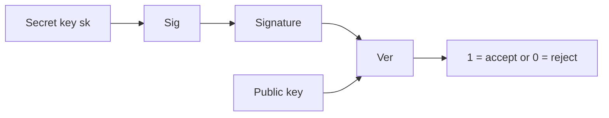
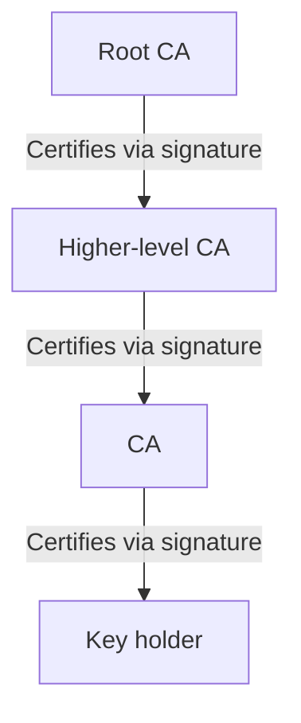

**Security** means both Safety and Security in English:
- Safety: protection against faults
- Security: protection against malicious actions 

There are 5 **security properties** (extended):
1. Confidentiality of data/messages
2. Integrity of data/computations
3. Availability of service
   (CIA triad)
5. Authenticity of files
6. Anonymity of users
   
Cryptography provides 4 **goals**:
1. Confidentiality: an attacker cannot learn the content of messages
2. Integrity: an attacker cannot modify a message without the modification being detected
3. Authenticity: an attacker cannot claim that a message originated from someone who did not send it
4. Non-repudiation: an attacker cannot later deny having sent a message

There are 2 types of cryptography: symmetric (same key for encryption and decryption) and asymmetric (2 keys for encryption and decryption).

**Symmetric cryptosystems** are a 5-tuple (M,K,C,e,d), such that for all plaintexts $m \in \mathcal{M}$ and $k \in \mathcal{K}$ it holds that d(e(m,k), k) = m.

**Kerckhoffs’ Principle**: a cryptosystem must remain secure even if everything about it is publicly known — except the key.

There are also 2 types of ciphers: **classical** ciphers (e.g., shift cipher: Caesar cipher, substitution cipher, Vigenère cipher, OTP) and **modern** ciphers. Modern ciphers contain 3 important aspects: formal definitions, systematic design, and highly secure cryptographic constructions with security proofs (in a security proof there is typically a cryptographic assumption: if the assumption is false, the scheme is no longer secure).

The security of classical ciphers often relies on keeping the algorithm itself secret (security by obscurity), and used mechanical or manual methods.

The security of modern ciphers is based on mathematics and complexity theory, and relies exclusively on keeping the key secret.

### Cryptographic primitives

|                     | **Symmetric cryptographic primitives**                                   | **Asymmetric cryptographic primitives**               |
|---------------------|---------------------------------------------------------------------|--------------------------------------------------|
| **Confidentiality** | <ul><li>Symmetric ciphers</li><li>Block ciphers</li></ul>      | <ul><li>Public Key Encryption (PKE)</li></ul>   |
| **Integrity & Authenticity** | <ul><li>Message Authentication Codes (MAC)</li></ul>   | <ul><li>Digital signatures</li></ul>           |

### Cryptographic constructions (examples)

|                     | **Symmetric constructions**                                   | **Asymmetric constructions**                         |
|---------------------|-------------------------------------------------------------------|----------------------------------------------------------|
| **Confidentiality** | <ul><li>One-Time Pad</li><li>DES (3DES), AES</li></ul>            | <ul><li>RSA encryption</li><li>ElGamal encryption</li></ul> |
| **Integrity & Authenticity** | <ul><li>CBC-MAC</li><li>HMAC</li></ul>                 | <ul><li>RSA signatures</li><li>Schnorr signatures</li></ul>          |

### Symmetric cryptography
- Algorithms: (Gen, Enc, Dec)

**Security games**
1. IND-COA: attacker sees only ciphertexts; the game is that the attacker must distinguish between 2 possible plaintexts. However, the attacker’s winning probability is always approximately 1/2.
2. IND-KPA: attacker knows pairs (m,c), and can derive statistics and patterns from them; there are fixed formats and standards and recurring signatures/footers in emails; the game is that the attacker must distinguish between 2 possible plaintexts. However, the attacker’s winning probability is always approximately 1/2. 
3. IND-CPA: attacker may request encryption of as many messages as desired. However, the attacker’s winning probability is always approximately 1/2.
- Danger: chosen ciphertext attack, e.g., padding oracle attack
4. IND-CCA: attacker obtains access to an oracle that can decrypt chosen ciphertexts. However, the attacker’s winning probability is always approximately 1/2.

**Perfect security**

Formally, for perfect security it holds for all plaintexts m and all ciphertexts c that P[m|c] = P[m].

**One-Time Pad (OTP)** can also be called the Vernam cipher
- OTP for encryption of bitstrings of length n
- Formal definition:
  + Gen: output random key $k \overset{\mathrm{R}}{\gets} \{0,1\}^n$.
  + Enc: for m ∈ M: output Enc(k, m) = k ⊕ m.
  + Dec: for c ∈ C: output Dec(k, c) = k ⊕ c.
- Security:
  + The key may only be used once
  + The key must be generated truly randomly
  + The key must be at least as long as the message
  + The key must be kept absolutely secret and exchanged securely

### Block cipher
- Block ciphers are cryptosystems that can only encrypt blocks of fixed length
- Encryption and decryption of message/ciphertext blocks of fixed length
- Block length n = |m| = |c|: typically 64–128 bits
- Key length k: typically 128–256 bits, and the same key can be used multiple times on different blocks
- Enc(.) here plays the role of a PRP; we evaluate a block cipher as strong or not depending on whether the key space is sufficiently large. This also represents the security of the block cipher (attacker cannot distinguish between Enc(.) and P(.)).
- Examples of block ciphers: AES, DES, 3-DES, Serpent, Twofish, Blowfish, etc.

DES, 3-DES, AES, Serpent, Twofish, Blowfish are block ciphers (concrete algorithms that implement a PRP on fixed block sizes).

**Data Encryption Standard (DES)** 
- Block length n = 64 bits
- Key length k = 56 bits
- Ciphertext length c = 64 bits
- Main weakness: short key

**Triple DES**
- Key length: 3*56 = 168 bits

- vulnerable to Meet-in-the-Middle attack (effective security 112 bits).

**Advanced Encryption Standard (AES)**
 - Block size: 128 bits 
 - Key length: 128, 192 or 256 bits
 - vulnerable to side-channel attacks or fault attacks.
 - Problems of AES:
  + secure only as long as the implementation and associated systems are correctly configured
  + weak key and IV generation can endanger the security of AES
  + side-channel attacks can be used to derive the key (countermeasures: constant-time implementation for timing attacks, masking for power analysis, or AES-NI — a hardware support / extension of the x86 instruction set by Intel and AMD processors enabling secure and faster use of AES)
  
- Problems of block ciphers:
  + Not IND-CPA secure, because deterministic
  + Not possible to encrypt messages of arbitrary length
 
### Modes of Operation
ECB, CBC, CTR are modes of operation that use a block cipher to encrypt and decrypt long messages (multiple blocks).

**Electronic Code Book (ECB) Mode**

- The plaintext must be padded if |m| is not a multiple of the block length (padding function). Randomization of the input to prevent certain attacks.
- Advantages:
  + Simple operation: implementation is straightforward, each block is processed independently
  + Speed: encryption and decryption are parallelizable
  + Fault tolerance: corrupted data blocks do not affect other blocks or their encryption/decryption
- Disadvantages:
  + Deterministic
  + No diffusion: small changes in the plaintext lead to localized changes in the ciphertext

**Cipher Block Chaining (CBC) Mode**

- For formalizing CBC we require **randomized cryptosystems**:
  + a randomized symmetric cryptosystem is a 6-tuple (M,K,C,R,e,d), such that for all plaintexts $m \in \mathcal{M}$ and $k \in \mathcal{K}$ it holds that d(e(m,k,r), k,r) = m.

- For security, the value from R must be chosen uniformly at random (thus unpredictable), and may only be used once.
- Encryption is not parallelizable + decryption is parallelizable. Since decryption is parallelizable, an erroneous ciphertext block only leads to faulty decryption of the current and the immediately following ciphertext block.
  
- CBC is **IND-CPA secure** if the Initialization Vector (IV) is random and unpredictable, and is not reused, but CBC often has padding-related problems in practice.
- What are **padding attacks** on CBC?
  + Assumption:
    1. Attacker has ciphertext and access to a padding oracle, but has no knowledge of plaintext and key. 
    2. The web server uses a verifiable padding scheme (PKCS#7). 
   + Attacker’s steps: the attacker determines whether a decrypted text has valid padding. Then by observing error messages or side-channel measurements, the attacker discovers valid padding.

**Counter Mode (CTR)** 

- The nonce originates from a **randomized counter function**, which maps a random value (nonce) and a natural number (counter) to a bitstring of fixed length. A simple implementation uses the binary representation of the natural number with zero-padding (LSB or MSB encoding). The **problem** is that a randomized counter must never repeat, since the counter has only finitely many values due to the fixed block length; therefore overflow/reuse must be prevented or the maximum period must be chosen sufficiently large.
  
- The length of the combination of nonce and counter depends on the block size. This length defines the maximum values of nonce and counter.
- Encryption and decryption can be parallelized.
- CTR is an OTP construction using the block cipher as a pseudorandom generator.
  
- **Nonce vs. IV**: Nonce is used because CTR only requires uniqueness; a nonce may also be deterministic (→ uniqueness matters), whereas IV emphasizes unpredictability (→ unpredictability matters). Thus the nonce prevents reuse of keystreams, while the IV prevents information leakage from chosen plaintexts.

### Stream ciphers
- Stream ciphers can encrypt bitstrings of arbitrary length
  + Plaintexts and ciphertexts are bitstrings of arbitrary length
  + Key length is fixed
  + A pseudorandom keystream is generated from the key
  + Encryption and decryption are bitwise XOR with the keystream
- A cryptosystem is called a stream cipher if there exists a function (keystream generator) $\mathrm{keystream}(x,z) = |x|$ that outputs a keystream of length |x| such that $e(x,z) = d(x,z) = x \oplus \mathrm{keystream}(x,z)$

- **ChaCha20** is a modern stream cipher developed as an alternative to AES:
  + Block length: 512 bits
  + Key length: 256 bits
  + Faster than AES without hardware support such as AES-NI
  + Suitable for low-performance devices
  + Suitable for high-throughput and low-latency protocols
  + Not susceptible to timing and cache attacks, but susceptible to power/EM analysis attacks
  + Often used in TLS 1.3, WireGuard VPN, etc.
 
---

**Cryptographic hash functions** $H: \ {0,1\}^\* \to \{0,1\}^n$
- Input: message of arbitrary length
- Output: fixed length
- 3 important properties of hash functions:
  + Deterministic
  + Fast computation
  + Integrity protection: small changes lead to a different hash
- 3 security definitions:
  + Pre-image resistance: given h it is hard to find m such that H(m) = h
  + Second preimage resistance: given m it is hard to find m´ ≠ m such that h := H(m) = H(m´)
  + Collision resistance: it is hard to find m and m´ such that h := H(m) = H(m´)
 
| Hash function   | Output               | Security           | Application                                              |
|---------------|----------------------|----------------------|--------------------------------------------------------|
| MD5           | 128 bits             | Insecure             | X                                                      |
| SHA-1         | 160 bits             | Insecure since 2017   | X                                                      |
| SHA-256       | 256 bits             | Secure               | TLS/SSL, hashing, blockchain                           |
| SHA-3/Keccak  | 224/256/384/512 bits | Secure               | Similar to SHA-2 (but slower without hardware support) |

 
### Message Authentication Codes (MACs)
- For maintaining integrity and authenticity of a message
- Algorithms: (Gen, Mac, Vrfy)

   

**CBC-MAC**

and with messages of different length it is not secure; for example, let MAC(M) = t and MAC(B) = s, then the new message M´ = M || (t ⊕ B) has the valid tag s.

Instead we use **HMAC** for messages of arbitrary length.  
$\text{HMAC}_K(m) = H\bigl((K' \oplus \text{opad}) \ \|\ H((K' \oplus \text{ipad}) \ \|\ m)\bigr)$

**Authenticated encryption** combines encryption and integrity protection to guarantee the goals of confidentiality, integrity, and authenticity of the message.
1. Encrypt-then-MAC
   1. Encrypt: c = $\mathrm{Enc}_{k_E}(\text{nonce}, m)$ (nonce here may also be IV)
   2. Authenticate: t = $\mathrm{MAC}_{k_M}(\text{AAD} || c)$
      - Send: (nonce, c, t)
      - Receive: verify tag, and decrypt only if verification succeeds
      - Problems: vulnerable to padding/timing oracles in certain modes (TLS-CBC: Lucky-13, padding oracle); IND-CCA secure due to authentication
2. MAC-then-Encrypt:
   1. Authenticate: t = $\mathrm{MAC}_{k_M}(\text{m})$
   2. Encrypt: c = $\mathrm{Enc}_{k_E}(\text{nonce}, m||t)$
      - Send: (nonce, c)
      - Receive: first decrypt, then verify tag

### Asymmetric cryptography
- Instead, there exists a key pair (pk, sk); this makes it possible that no key exchange is necessary, and furthermore only n key pairs are required instead of n(n-1)/2.
- It is a 7-tuple $(\mathcal{M}, \mathcal{K}_s, \mathcal{K}_p, \mathcal{K}, \mathcal{C}, e, d)$, with
  + $\mathcal{M}$ is the set of plaintexts
  + $\mathcal{K}_s$ is the set of secret / private keys
  + $\mathcal{K}_p$ is the set of public keys
  + $\mathcal{K} \subset \mathcal{K}_s \times \mathcal{K}_p$ is the set of key pairs
  + $\mathcal{C}$ is the set of ciphertexts
  + $e$ is the encryption function: $\mathcal{M} \times \mathcal{K}_p \rightarrow \mathcal{C}$
  + $d$ is the decryption function: $\mathcal{C} \times \mathcal{K}_s \rightarrow \mathcal{M}$

- Algorithms: (Gen, Enc, Dec)

**RSA cryptosystem**
1. RSA key generation: GenRSA(n) with security parameter n
   - Choose 2 large *prime numbers* p, q with p ≠ q, and of equal length
   - Set $N = pq$ and $\varphi(N) = (p-1)(q-1)$
   - Choose $e$ with $1 < e < \varphi(N)$ and $\gcd(e,\varphi(N))=1$.
   - Compute $d$ as the multiplicative inverse of $e$ modulo $\varphi(N)$:
     
   $ed \equiv 1 \pmod{\varphi(N)}.$
   - Public key: $pk=(N,e)$, private key: $sk=(N,d)$
   - Output: (N,e,d) = GenRSA(n)
     
   

2. Textbook RSA

   $\text{Enc}(N,e,m)=m^e \bmod N,\qquad \text{Dec}(N,d,c)=c^d \bmod N$
   
   **Warning:** Textbook RSA is **not secure** (deterministic, malleable, no IND-CPA/CCA security).
   - Textbook RSA is homomorphic, since $(m_0^{\,e} \bmod N)\cdot (m_1^{\,e} \bmod N) \equiv (m_0\cdot m_1)^{e} \pmod N.$

4. RSA-OAEP:
In practice, RSA is used **with secure padding**, typically **RSA-OAEP**.
- Goal: randomization + protection against many structural attacks
- For CCA security today one often uses **KEM-DEM** or directly modern protocols/AEAD.

  

Since textbook RSA is almost always insecure in practice, we need an alternative encryption scheme. Next we consider the **ElGamal scheme**.  
ElGamal operates in a cyclic group $G$ of order $q$ with generator $g$.

**Key generation (by Alice)**
1. Choose secretly $a \in \{1,\dots,q-1\}$ and set $A=g^a$.
2. Public key: $pk=(G,g,A)$, private key: $sk=(G,g,a)$.
   
**Encryption (to Alice)**
For message $m \in G$:
1. Choose random $r \in \{1,\dots,q-1\}$ and set $R=g^r$.
2. Compute shared key:
   $K=A^r=g^{ar}$
3. Set $C=m \circ K$.
4. Ciphertext: $(R,C)$.

**Decryption (Alice)**
1. Compute
   $K = R^a = g^{ra}$
2. Output:
   $m = C \circ K^{-1}.$

**Security intuition:** ElGamal is (under appropriate group assumptions) **IND-CPA secure**, because $r$ is freshly random. Typically: IND-CPA under the **DDH assumption** (depending on the setting).

**Discrete logarithm assumptions**
Setup: cyclic group $G$ of order $q$ with generator $g$.

- **DLog assumption:** given $h\in G$, find $x$ with $g^x=h$ (hard).
- **CDH assumption:** given $g^x, g^y$, compute $g^{xy}$ (hard).
- **DDH assumption:** given $(g^x, g^y, T)$, decide whether $T=g^{xy}$ or random (hard).
       
#### Key exchange
- Both parties jointly generate a key without transmitting it directly.
- Example: Diffie–Hellman (DH): both compute the same secret value $K=g^{xy}$.

1. Diffie-Hellman key exchange (**DH**):
   
   - Goal: two parties generate a shared session key without sending it directly.
   The parties agree on prime $p$ (thus group $G=\mathbb{Z}_p$) and generator $g$ of $\mathbb{Z}_p^\* = \{1,\dots,p-1\}$.
   1. A privately chooses $a$ randomly (with $0<a<p$) and sends $g^a \bmod p$ to B.  
   2. B privately chooses $b$ randomly (with $0<b<p$) and sends $g^b \bmod p$ to A.  
   3. A computes $(g^b)^a \bmod p$.  
   4. B computes $g^{ab} \bmod p$.  
   Since $(g^b)^a = g^{ab}$ holds, both obtain the same key. 
   
   - DH alone provides **no authenticity** → vulnerable to **Man-in-the-Middle**, unless additionally authenticated (e.g., signatures/certificates).

2. Needham–Schroeder key exchange (symmetric) protocol:

$$
\begin{aligned}
\text{i.}\ & A \rightarrow T: \quad A, B, N_A \\
\text{ii.}\ & T \rightarrow A: \quad \{(N_A, K, B, \{(K,A)\}_{K_B})\}_{K_A} \\
\text{iii.}\ & A \rightarrow B: \quad \{(K,A)\}_{K_B} \\
\text{iv.}\ & B \rightarrow A: \quad \{(N_B)\}_{K} \\
\text{v.}\ & A \rightarrow B: \quad \{(N_B - 1)\}_{K}
\end{aligned}
$$

   Here $N_A, N_B$ are nonces (“number used once”), i.e., randomly generated numbers that must never be reused. 
   
   - Insecure against replay if an attacker has broken an old key $K'$ and stored old messages.

7. Needham–Schroeder (asymmetric)
   Let $K_{P_A}, K_{P_B}$ be the public keys of A and B respectively, and $K_{S_T}$ the private signing key of T.
   
$$
\begin{aligned}
\text{i.}\ & A \rightarrow T: A, B \\
\text{ii.}\ & T \rightarrow A: K_{PB}, \{B\}_{K_{ST}} \\
\text{iii.}\ & A \rightarrow B: \{(N_A, A)\}_{K_{PB}} \\
\text{iv.}\ & B \rightarrow T: B, A \\
\text{v.}\ & T \rightarrow B: \{(K_{PA}, A)\}_{K_{ST}} \\
\text{vi.}\ & B \rightarrow A: \{(N_A, N_B)\}_{K_{PA}} \\
\text{vii.}\ & A \rightarrow B: \{(N_B)\}_{K_{PB}}
\end{aligned}
$$

**Security of DH against passive attackers: Computational Diffie-Hellman (CDH)**
Attacker knows $G, g, g^a, g^b$, but not $a,b$.  
He must determine $g^{ab}$ → instance of the CDH problem.
   - Input: $g, g^a, g^b$ 
   - Output: $g^{ab}$ 
Remarks: CDH is considered hard (basis of ElGamal); DH can be implemented in any cyclic group. 

**Security against MitM attack on DH**
- Problem: MitM: “simultaneous” execution of two DH protocols → A and B obtain different keys, E knows both.
- Solution: messages must be signed → authenticated DH (or *Station-to-Station protocol*)
  
**Station-to-Station protocol - STS**
   Assumption: both parties have signing keys $sk_A$, $sk_B$; the certificates are known to both.
   
   $A \rightarrow B: g^a$
   
   $B \rightarrow A: g^b, \mathrm{Sig_{sk_B}(g^a, g^b)}$
   
   $A \rightarrow B: \mathrm{Sig_{sk_A}(g^a, g^b)}$
   
   where $K = g^(ab)$ is the DH shared key.

   Remarks:  
      - The signature allows testing the integrity of $g^a$ and $g^b$.  
      - A and B can verify the signature only if $K$ is correct. 

**Key distribution:**
- A key is generated by one instance and distributed to the communication partners.
- Example: a central server/KDC distributes session keys (Kerberos idea).

To improve practical applicability, **hybrid encryption - KEM-DEM** is used: it combines an asymmetric key exchange (**KEM - Key Encapsulation**) with efficient symmetric encryption of the data (**DEM - Data Encapsulation**).
  - Scheme:
    1. Generate random session key $k$
    2. $c_1 = \text{Enc}^{\text{sym}}_k(m)$ (e.g., AES-GCM / ChaCha20-Poly1305)
    3. $c_2 = \text{Enc}^{\text{pk}}(pk, k)$ (e.g., RSA-OAEP or (EC)DH-based KEM)
    4. Send $(c_1, c_2)$
       
  - Encryption: 
  - Decryption: 
  - Advantage: efficient + (with AEAD/KEM) very strong security properties, often up to IND-CCA.
  - Disadvantage: security depends on the security of both cryptosystems.

## Signatures

*Digital signatures* allow:
- a test of *authenticity* and *integrity* of a message,
- as well as (in practice) *non-repudiation* of the sender.

The basis is asymmetric cryptography: signing is performed with the private key and verification with the public key.

- The pair (pk, sk) also enables **multiple authentication**: authenticate the key once → afterwards verify arbitrarily many signed messages.
  + Algorithms: (Gen, Sig, Ver)

  + Sig(sk,m) depends strongly on the message, thus an attacker cannot forge signatures for new messages.
 
EUF-CMA security formalizes that an attacker cannot generate new valid signatures → prerequisite for authenticity and (cryptographic) non-repudiation.

## Digital signatures – legal framework (eIDAS / VDG)

The EU regulation **eIDAS** (in Germany, among others implemented by the **Trust Services Act (VDG)**) distinguishes three types of electronic signatures:

1. **Simple electronic signature (SES)**
   - May have evidentiary value, but **no special legal presumption**.
   - Example: scanned signature / name under an email.

2. **Advanced electronic signature (AdES)**
   - *Uniquely linked to the signatory* (identification possible).
   - Created using signature creation data that is *under the sole control* of the signatory.
   - *Subsequent changes* to the signed data must be detectable.
   - *No automatic equivalence* to a handwritten signature.

3. **Qualified electronic signature (QES)**
   - *Legally equivalent* to a handwritten signature.
   - Based on a *qualified certificate* from a qualified trust service provider.
   - Created using a *qualified signature creation device* (e.g., smartcard).
   - Recognized EU-wide if based on a qualified certificate of a member state.

So far we know 3 mechanisms for data integrity: collision-resistant hash functions, digital signatures, and MACs. Next we examine **signature schemes**. There are 2 types of signature schemes: **RSA-based signatures** (RSA family), and **discrete-logarithm-based signatures** (DLog family e.g., DSA/ECDSA, Schnorr); both follow the so-called *"Hash-and-Sign principle"*.

- The Hash-and-Sign principle enables signing messages of arbitrary length, and the hash function contributes to the security of the scheme.

## Security notion

1. Knowledge of the attacker:
   1. Key-Only Attack: attacker knows only the public key
   2. Known Signature Attack: attacker knows (multiple) pairs of messages and corresponding signatures
   3. Chosen Message Attack: attacker can (in advance) obtain signatures for arbitrarily many self-chosen messages
   4. Adaptive Chosen Message Attack: attacker can (even during the attack itself) obtain signatures for arbitrarily many self-chosen messages

2. Goals of the attacker:
   1. Existential Forgery: a new valid message/signature pair
   2. Selective Forgery: valid signature for a specific new message; the message is determined before the attack
   3. Universal Forgery: valid signature for any arbitrary document
   4. Total Break: attacker determines the secret key

**Strongest security notion: Existential forgery under adaptive chosen message attacks (EUF-CMA)**

---

## 1. RSA-based signatures

- RSA key generation:
  + public key *(e,n)* and private key *(d,n)*
  + a hash function h with image between 0 and n is also required

- RSA signing: here sk = (N,d) is used
  1. Hash message m to H(m)
  2. Encode the "short" hash value to RSA length:  
     $s = D(H(m), (d,n)) \bmod n$
  3. "Core" signature operation: apply RSA key  
     $\{(H(m))\}^{d} \bmod n$

- RSA verification: here pk = (N,e) is used
  1. Hash message m to H(m)
  2. Encode the "short" hash value to RSA length:  
     $E(s,(e,n)) \equiv \{(s)\}^{e} \bmod n$
  3. Compare signature $\{s\}^{e} \bmod N$ with Encode(H(m))

---

## 2. Discrete-logarithm-based signatures

### 2.1 Schnorr signatures

- Setup:
  + Group G cyclic, prime order q, generator g
  + Keys: private $x \in \{1,...,q-1\}$, public $y = g^{x}$

- Signing a message $m$:
  1. Choose randomly (and secretly) $k \in \{1,\dots,q-1\}$.
  2. Compute $R = g^k$ and $r = H(R \,\|\, m)$.
  3. Compute $s = k + r x \pmod q$.
  4. Signature is $(r,s)$.

- Verification of $(r,s)$ for $m$:
  1. Compute $R' = g^s \cdot y^{-r}$.
  2. Compute $v = H(R' \,\|\, m)$.
  3. Output 1 iff $v = r$, otherwise output 0.

---

### 2.2 Digital Signature Algorithm (DSA)

- Setup:
  + Choose primes $p,q$ with $q \mid (p-1)$ and a generator $g$ of the subgroup of order $q$ in $\mathbb{Z}_p^\*$; $q$ should be a large prime (160 bit, 224 bit or 256 bit).
  + Typically: $g = h^{(p-1)/q} \bmod p$ for a suitable $h$.
  + Private key $x \in \{1,\dots,q-1\}$, public key $y = g^x \bmod p$

- Signing a message $m$:
  1. Compute $h = H(m)$ (and reduce modulo $q$ if necessary).
  2. Choose randomly (and secretly) $k \in \{1,\dots,q-1\}$.
  3. Compute  
     $r = (g^k \bmod p) \bmod q.$  
     If $r = 0$, choose new $k$.
  4. Compute  
     $s = k^{-1}(h + x r) \bmod q.$  
     If $s = 0$, choose new $k$.
  5. Signature is $(r,s)$.

- Verification of $(r,s)$ for $m$:
  1. Check $0 < r < q$ and $0 < s < q$, otherwise reject.
  2. Compute $h = H(m)$ and

     $w = s^{-1} \bmod q,$  
     $u_1 = hw \bmod q,$  
     $u_2 = rw \bmod q.$

  3. Compute  
     $v = ((g^{u_1} \cdot y^{u_2}) \bmod p) \bmod q.$
  4. Accept iff $v = r$.

The nonce $k$ must be **fresh, uniformly distributed and secret** for each signature.  
If $k$ is reused or predictable, the private key $x$ can be leaked.

---

Even if the cryptographic algorithms are secure, the system remains insecure if

- keys do not remain secret, or  
- keys were generated poorly (e.g., RSA modulus $N$ easily factorable).

---

## Types of keys

1. **Long-term keys**
   - long validity (e.g., months/years)
   - often used for **authentication** (e.g., certificates/signing keys)
   - should be particularly well protected

2. **Short-term keys / session keys**
   - valid only for one session (e.g., connection setup / download / call)
   - Advantage: less data per key → less risk if compromised
   - Efficient for symmetric encryption (AES/ChaCha)

## Certificates

Asymmetric cryptography solves the key distribution problem, but creates a new problem:

**How do I know that a public key really belongs to the correct identity?**

→ Without this binding, Man-in-the-Middle attacks are possible.

---

## Trust models

### Direct Trust (e.g., SSH / TOFU)

- Public key/fingerprint is exchanged directly (or stored on first connection – *Trust On First Use*).
- Problem: if the fingerprint is not verified during the first contact, a MitM during the first contact is possible.

There are two fundamental approaches:

---

### 1. Centralized approach: X.509 certificates (PKI)

- **Central / hierarchical approach**: trust is organized in a hierarchy.
- A **Certification Authority (CA)** signs public keys and binds them to identities.
- Typically a **certificate chain** is created:
  + End-entity certificate (e.g., server certificate) is signed by an Intermediate CA
  + Intermediate CA is signed by a higher CA
  + At the top is a **Root Certificate** (Root CA), which the client already trusts (Trust Store)

#### Chain Validation (WebPKI in practice)

- Server sends its certificate + intermediate certificates (usually without the root).
- Client verifies the signature chain up to a root certificate in the local **Trust Store** (browser/OS).
- Only if the chain leads to a trusted root is the server certificate accepted.

**Idea:** If I trust the Root CA, I can trust the server certificate via the chain.

**Important:** The biggest practical problem of asymmetric cryptography is often not the algorithm, but the **PKI** (trust anchors, certificate management, misconfigurations, compromised CAs).

#### CA trust problem (governance)

- A compromised/malicious CA can issue certificates for foreign domains → entire WebPKI endangered.
- Which CAs are trusted is determined by browser/OS manufacturers (Trust Store) + rules/audits (e.g., CA/Browser Forum).
- In practice, a few large CAs dominate the market.

---

### 2. Decentralized approach: Web of Trust (PGP)

- No central trust anchor (no single CA).
- Users manage **keyrings**:
  + own key
  + signatures/certificates of other public keys
- Parties can mutually **certify** (sign) keys.
- Trust is **graded** (different trust levels).
- Problem/question: Is trust **transitive**?
  + If I trust B, do I automatically trust C if B has certified C?

---

### Comparison PKI/X.509 and Web of Trust

- PKI/X.509: centralized, hierarchical, well suited for global scaling (e.g., Web/TLS), but strong dependence on CAs/Trust Stores.
- Web of Trust: decentralized, user-driven, suitable for communities, but harder to scale and evaluate because trust is not clearly defined.

---

## Key loss and key compromise

- Key loss may cause messages to become unreadable.
- Key compromise may cause messages to no longer remain confidential.

To avoid this, invalid keys must be revoked:

- Expiration date: X.509, Web of Trust
- Revocation certificates:
  + X.509: by CA
  + Web of Trust: by user or designated party

---

## Typical certificate validation process

A client accepts a server certificate only if, among other things:

- the signatures of the certificate chain are valid (up to a trusted root),
- the certificate is temporally valid (NotBefore/NotAfter),
- the name matches (domain name in SubjectAltName),
- the certificate is not revoked (CRL/OCSP, depending on the model).

---

### 1. Certification hierarchy

---

### 2. Certificate revocation

1. Variant 1: Certificate Revocation Lists (CRLs)
   - Publish signed list of all revoked certificates.

2. Online Certificate Status Protocol (OCSP)
   - User queries the validity of a specific certificate.
   - Advantages:
     + Real-time query
     + Shorter & more efficient
   - **Practical problems**:
     + OCSP is often treated as **soft-fail/open-fail**: if the OCSP responder is unreachable, clients often still accept the certificate.
     + Trend: instead of revocation, stronger reliance on **short certificate lifetimes** (faster expiration reduces damage).

---

## Validation types of certificates (DV/OV/EV)

- **DV (Domain Validation)**: only control over the domain is verified.
- **OV (Organization Validation)**: additionally the organization is verified.
- **EV (Extended Validation)**: stricter organization verification (historically more prominently displayed, today less UI effect).

### Typical DV methods

- HTTP challenge (e.g., provide file/token under a URL)
- DNS challenge (set TXT record)
- Email challenge (email to domain contact)

### Attacks on DV

- DNS manipulation (e.g., cache poisoning / on-path)
- BGP hijacking (redirect traffic/validation)
- Server/account takeover (webspace/DNS provider compromised)

Practical countermeasure idea: distributed/random validation points (makes targeted redirection more difficult).

---

## What to do with revoked certificates? (certificate revocation list)

- Everyone stores everything? Inefficient, updates must reach everyone.
- Centralized server? Trust issue, availability (bottleneck).

---

## Certificate Transparency (CT)

- Idea: certificates are written to public, append-only logs.
- Process:
  + User requests certificate from CA
  + Certificate is added to the log
  + CA sends certificate and an **SCT (Signed Certificate Timestamp)** to the user (SCT attests that certificate was logged)
  + Web server sends certificate to user when page is accessed
  + User verifies certificate
  + Monitoring: third parties monitor logs and can alert CA in case of changes/problems

---

## Terminology distinction

1. Identification: determine identity
2. Authentication: confirm identity
3. Authorization: determine what someone is allowed to do after successful authentication

---

## Dolev–Yao attacker model

Attacker has full control over the communication channel and can:

- intercept messages  
- delay transmission  
- suppress messages  
- replace messages  
- send under false identity  

However: attacker cannot break cryptographic primitives (“perfect cryptography”).

Distinction:

- passive attacker (only eavesdrops)
- active attacker (manipulates the channel)

# Authentication

## 3 Factors of Authentication – Overview

| Factor (Auth) | Examples | Advantages | Disadvantages |
|---------------|----------|------------|---------------|
| **Knowledge – Something you know** | Password, PIN | easy to change; easy to carry | can be forgotten; easy to duplicate/phish |
| **Possession – Something you have** | Smart card, hardware token | easy to carry; not easy to duplicate | transferable/shareable; easy to steal/lose |
| **Inherence – Something you are** | Biometrics: fingerprint, face | not transferable; individual | often (relatively) forgeable; cannot be changed if leaked; data protection/privacy issues |

---

## Password storage

1. Naive: simple comparison with passwords stored in plaintext.
2. Encryption: store passwords encrypted; server additionally has key pair (sk, pk). One-way functions are required here.
3. Hashing: store passwords as hash values.
4. Rainbow table: use hash function H: password → hash and reduction function R: hash → password to create a chain for each password. However, there is a time-memory tradeoff: the longer the chains, the less memory required, but the more computation time needed.
5. Salted hashing: choose random salt S, at least 64 bits, store H(S || pwd) for the password.
6. Peppering: behaves like salted hashing, but the salt (pepper) is kept secret (not stored together with the hashes in the database).

---

## Tokens

There are 2 **types of tokens**:
- *Software tokens* (e.g., web cookies)
- *Hardware tokens* (e.g., car key)

Additionally, there are 2 **properties of tokens**:
- *Static* (e.g., simple transmission of a secret)
- *Dynamic* (computation using a secret for authentication)

With dynamic tokens we can prevent **replay attacks**.

---

## Biometric authentication

- Errors:
  + False positive
  + False negative

- Problems:
  + Not revocable
  + Requires trustworthy local devices
  + Often easy to forge

---

## Single Sign-On (SSO)

- Is an authentication method. It allows a user to log in to multiple independent software systems using a single set of credentials.
- Idea: a central, trusted provider confirms our identity to all other services we want to access. We log in once and gain access to everything.

### Advantages:
- Only one strong password required
- Increased security: better control over access to resources
- Simplicity and convenience: no constant searching for passwords or resetting forgotten credentials
- IT security measures focus on a central point

### Disadvantages:
- Service availability depends on availability of the SSO
- If the SSO login is compromised, an attacker can access resources and services as the victim

- An example of an SSO protocol is **Kerberos** (especially in enterprise environments). Other common variants use SAML or OpenID Connect.

### Goals of Kerberos:
- Authentication of subjects, called **principals**: including users, PCs/laptops, servers
- Exchange of session keys for principals based on Needham–Schroeder
- SSO for services within an administrative domain (Realm): user authenticates once centrally, afterwards no separate authentication per service required

### Goal of an SSO concept:
- User authenticates once, no separate authentication required for each service usage

### Design:
- For each domain (Realm) there is a **Key Distribution Center (KDC)**

### Tasks of the KDC:
- Authentication of clients (principals) of its domain → **Authentication Server (AS)**
- Issuing tickets as identity credentials → **Ticket Granting Server (TGS)**:
  + A ticket is only for one client C and one server S
  + The ticket issued by the AS for using the TGS is called **Ticket Granting Ticket (TGT)**:

$T_{C,S} = (S, C, addr, timestamp, lifetime, K_{C,S})$

### Kerberos protocol flow

Login (locally on the client): user enters password, a key is derived from it:

$K_{\text{Bob}} := \mathrm{Hash}(\text{Password})$

1. Bob → AS: client encrypts current timestamp with $K_{\text{Bob}}$ and sends it with nonce ${\text{Bob}}_1$ + target ${\text{TGS}}$
2. AS → Bob: AS decrypts with stored $K_{\text{Bob}}$ from key database and issues TGT only if timestamp is “fresh”
3. Bob → TGS: Bob requests a ticket for a specific service (e.g., SMB) and sends the TGT and an authenticator  
   $A_{\text{Bob}} = (\text{Bob}, \mathit{IP\_Addr}, timestamp)$
4. TGS → Client: TGS verifies TGT + authenticator and issues service ticket (e.g., for SMB), including session key $K_{\text{Bob,SMB}}$
5. Client → Service (SMB): Bob uses the ticket at the SMB server (ticket + authenticator)

### Authentication of a principal

- **Pre-shared secrets** between KDC and principal
- The KDC knows the secrets of all network participants

---

## Attacks on Kerberos

### 1. Pass-the-Hash

- Basic principle: attacker steals the password hash
- Goal: hashes are extracted from memory of an already compromised computer
- Attack process: attacker uses this stolen hash directly to authenticate to the KDC
- Result: KDC believes attacker is legitimate user and issues TGT
- Impact: attacker can impersonate user in the network, access resources, and move laterally in the network

### 2. Golden Ticket

- Definition: Golden Ticket is a completely forged TGT
- Prerequisite: attacker already has highest privileges and obtains password hash of the KRBTGT account
- Target: password hash of the KRBTGT account
- Meaning of KRBTGT: service account whose key is used by the KDC to cryptographically sign and encrypt all legitimate TGTs in the domain
- Attack process: with stolen KRBTGT key attacker can create own TGT “offline”
- Power of the ticket: attacker can define
  1. for which user it is valid
  2. which permissions it contains
  3. how long it is valid
- Impact: attacker gains long-term and unrestricted access to all resources in the domain

# Authorization

- Authorization controls who may do what on which resource (**access control**).
- Protection goals: integrity and confidentiality.

There are 2 types of authorization:

1. Policy definition – according to who defines the policy:
   1. **Discretionary Access Control (DAC)**: user-defined access control; owner of the object defines access rights for subjects.
   2. **Mandatory Access Control (MAC)**: system-defined access control; an authority defines access rights.

2. Assignment principle – according to how the policy is modeled:
   1. **Role-Based Access Control (RBAC)**: access rights defined via roles.
   2. **Attribute-Based Access Control (ABAC)**: fine-grained access rights according to logical formulas.

---

## Examples of DAC

### 1. Access Matrix Model

### 2. Access Control List (ACL)

### Advantages:
- Very simple and intuitive to use, flexible
- Easy to implement

### Disadvantages:
- No formal guarantees for information flow
- Cannot model dynamic rights well
- Granting and revoking rights relatively complex
- Trojan horses: programs with unintended access patterns
- Restricted access cases difficult to implement (e.g., changing own password in password file)

---

## Example of MAC: Bell–LaPadula Model

The classical model focusing on confidentiality in multi-level security.  
The model regulates information flows in a hierarchy:

- **No-Read-Up rule**: read access only allowed if hierarchy(subject) ≥ hierarchy(object)
- **No-Write-Down rule**: write access only allowed if hierarchy(object) ≥ hierarchy(subject)

Each subject is assigned a security class $SC(s) \in \{SC\}$ (*clearance*),  
and each object is assigned a security class $SC(o) \in \{SC\}$ (*classification*).

On the security classes SC a partial order $\le$ is defined:

$\forall (l,c) \in SC : (l,c) \le (l',c') \iff l \le l' \land c \subseteq c'$

### Disadvantages:
- Information/objects tend to be classified increasingly higher over time
- Blind write: subject may write objects but no longer read them (integrity problem)
- No modeling of "covert channels"

### Advantages:
- Simple model to implement
- Well suited to represent hierarchical information flows
- Some UNIX operating systems offer BLP extensions

---

# Network Security

## WLAN vs. WAN

- Local Area Network (LAN): set of connected local devices that can communicate with each other
- Wide Area Network (WAN): connects multiple LANs via routers

---

## Protocol

Agreement on how individual nodes in the network communicate:

- Syntax: structure and specification of communication
- Semantics: meaning of communication

---

## Network layer models

### 1. Open Systems Interconnection (OSI model)

### 2. TCP/IP model

---

## Protocols on each layer

### OSI model

### TCP/IP model

---

## 1. Link Layer

- Provides: transmission between two points including conversion into physical signals
- Examples: Ethernet, WiFi, Address Resolution Protocol (ARP)
- Communication must include: sender address, destination address, and data

### Identification via MAC addresses

- 6-byte address that every network-capable device on the Internet has
- Globally unique hardware address (unique per network interface)
- Structure: OUI (first 3 bytes = manufacturer) + device-specific part (last 3 bytes)
- Example: 13:37:ca:fe:f0:0d

---

## Attacks on Link Layer

Some LANs use broadcast communication → attacker can eavesdrop using network card in "promiscuous mode" or analyze traffic with a "packet sniffer".

Since MAC addresses are used for identification, this leads to several attack techniques:

### 1. MAC spoofing

- Not strictly an attack but a weakness of the link layer
- MAC addresses are easily spoofable
- MAC addresses can easily be changed via software

### 2. MAC flooding

- Attack in which the attacker fills the MAC address table of a switch with many fake entries.
- If the table overflows, the switch no longer knows real assignments and floods frames to all ports → effectively behaves like a hub.

### 3. ARP spoofing / ARP poisoning

- Only possible if A determines the MAC address for a known IPv4 address via ARP.
- ARP has no authentication → A accepts unsolicited ARP replies and overwrites its ARP cache.

Attack principle:

If A wants to send a message to B over LAN and only knows B’s IP address, A must learn B’s MAC address.

- Attacker sends forged ARP replies.
- A stores attacker’s MAC in its cache instead of B’s MAC.
- Consequences:
  + Man-in-the-Middle attack
  + Denial of Service

Countermeasures:
- Monitoring
- Encryption on higher layers (IPsec, TLS)
- Use IPv6 with Neighbor Discovery Protocol (NDP)

---

### 4. DHCP Spoofing

- Although DHCP is an application layer protocol (uses UDP), initial broadcasts occur on link layer.
- Client broadcasts request for configuration (IP address, gateway, etc.).
- Attacker sends forged DHCP offer.
- Client cannot distinguish honest from malicious offer.
- Result: client receives false IP/gateway/DNS settings.

Summary:

DHCP spoofing is a **link layer attack with impact on the Internet layer**.

Countermeasures:
- Monitoring, IDS
- DHCP snooping
- Use of higher-layer protection mechanisms

## 2. Internet Layer

- Provides: transmission of packets from any source device to any destination device
- Enables communication across different LANs via global addressing
- Packets contain: source address, destination address, data
- Packets with the same source and destination address may take different routes

---

### Internet Protocol (IP)

- Protocol for communication between devices on the Internet
- Unique identification of devices via **IP address**

1. IPv4: 32-bit address in the form: 120.19.22.00  
2. IPv6: 128-bit address in the form: 2607:f140:8801::1:23  

### Problems of IP (unreliable)

- Packets may be lost
- Packets may contain errors
- Packets may arrive in the wrong order

---

### Internet Control Message Protocol (ICMP)

- Used by routers and hosts to exchange error and control messages regarding IP traffic
- Transported directly over IP

- **Ping of Death**:
  - Intentionally oversized (fragmented) ICMP echo packet
  - When reassembled, exceeds IP size limit
  - May cause systems to crash
  - Not a normal ping

---

## IPsec

- Protocol at the Internet layer for securing IPv4 and IPv6
- Secures communication at the network/IP layer
- Protection independent of TCP/UDP applications
- Transparent security between hosts or gateways

---

### Internet Key Exchange (IKE)

- Control protocol of IPsec
- Used for mutual authentication
- Establishes an IKE Security Association (IKE SA)
- Negotiates shared secret and algorithms for AH/ESP
- Exchange types:

1. **IKE_SA_INIT**
   - Negotiation of security parameters
   - Exchange of nonces and Diffie–Hellman values

2. **IKE_AUTH**
   - Transmission of identities
   - Authentication
   - Establishment of the Security Association (SA)

---

### Security goals of IPsec

- Confidentiality of IP payload data
- Integrity
- Access control
- Authentication of data origin

---

## Operating modes of IPsec

### 1. Transport mode

- Protects only the payload
- Original IP header remains visible
- Typical use: host-to-host communication

Structure:

IP Header | IPsec Header | Encrypted TCP/UDP Payload

- Protects only data, not routing information

---

### 2. Tunnel mode

- Protects the entire original IP packet
- Adds a new outer IP header
- Typical use: site-to-site VPN (gateway-to-gateway)

Structure:

New IP Header | IPsec Header | Encrypted Original IP Packet

- Also hides internal destination address

---

## Security Associations (SAs)

1. **Security Association (SA)**:
   - Unidirectional agreement between communication partners
   - Defines security goals, algorithms, keys, and policies

2. **Security Association Database (SAD)**:
   - Stores SAs

3. **Security Policy Database (SPD)**:
   - Stores policies for handling payload data
   - Examples: discard, allow unprotected, require IPsec

---

## IPsec Protocols

### 1. Authentication Header (AH)

- Optional in IPsec v3
- Provides:
  + Integrity of payload data
  + Authentication of data origin
  + Access control
  + Replay protection
- Also protects static parts of the outer IP header
- Not compatible with NAT (because IP header is authenticated)

---

### 2. Encapsulating Security Payload (ESP)

- Provides:
  + Confidentiality through encryption
  + Optional integrity protection
  + Authentication
  + Replay protection

- More commonly used than AH
- Works with NAT (in tunnel mode)

---
3. **Transport Layer**:
- Provides end-to-end communication on the Internet for different services and enables differentiation between applications via ports
- Protocols: TCP, UDP, and QUIC

## TCP vs. UDP – Overview

| Protocol | Connection | Reliability | Ordering | Transmission/Overhead | Short Description |
|----------|------------|------------|----------|-----------------------|-------------------|
| **TCP** | Connection-oriented (establishes a connection between endpoints) | **Reliable** (guarantees delivery) | **Ordered** | Higher overhead | Used for web (HTTP/HTTPS), email, file transfer |
| **UDP** | Connectionless | **Unreliable** (no delivery guarantee) | **Unordered** | Low overhead | Used for streaming, DNS, VoIP |

### Properties of TCP:
+ TCP splits messages at the sender into smaller packets and reassembles them at the receiver
+ Uses **sequence numbers** to restore ordering at the receiver; each TCP segment carries a sequence number
+ The receiver responds with acknowledgment **ACK**. If the ACK does not reach the sender, retransmission occurs
+ Additionally, there exists a cryptographic protocol above TCP: **TLS – Transport Layer Security**

Data transmission with TCP:

---

### TCP Flags:

1. **ACK**
   + Indicates that the receiver acknowledges receipt of data

2. **SYN**
   + Indicates the initiation of a connection

3. **FIN**
   + Used to terminate a connection
   + Requires acknowledgment (ACK)
   + No more packets are sent, but packets may still be received

4. **RST**
   + Used to immediately terminate a connection

## QUIC (Quick UDP Internet Connections)

- Modern transport protocol developed by Google
- Runs over **UDP**
- Integrates:
  + Transport functionality (reliability, congestion control)
  + Cryptographic protection (TLS 1.3)
- Goals:
  + Reduced latency (0-RTT / 1-RTT handshake)
  + Faster connection establishment compared to TCP + TLS
  + Improved performance for web applications
- Used by HTTP/3

Advantages:
+ Faster handshake
+ Built-in encryption
+ Improved handling of packet loss
+ Multiplexing without head-of-line blocking

---

4. **Application Layer**:
- Provides application-specific network services
- Protocols define how applications communicate over the network
- Examples:
  + HTTP / HTTPS
  + SMTP
  + FTP
  + DNS
  + SSH

---

# Network Security

## LAN vs. WAN

- **Local Area Network (LAN)**: A set of interconnected local devices that can communicate with each other
- **Wide Area Network (WAN)**: Connects multiple LANs using routers

---

## Protocol

A **protocol** defines how nodes in a network communicate with each other:

- **Syntax**: How communication is structured and specified
- **Semantics**: Meaning of the communication

---

## Network Layer Models

### 1. Open Systems Interconnection (OSI Model)

### 2. TCP/IP Model

---

## Protocols on Each Layer

### OSI Model

### TCP/IP Model

---

1. **Link Layer**:
   - Provides transmission between two points including conversion into physical signals
   - Examples: Ethernet, WiFi, Address Resolution Protocol (ARP)
   - Communication must include: sender address, destination address, and data
   - Identification via **MAC addresses**:
     + 6-byte address that every network-capable device on the Internet possesses
     + Globally unique hardware address (unique per network interface)
     + Consists of: OUI (first 3 bytes = manufacturer) + device-specific part (last 3 bytes)
     + Example: 13:37:ca:fe:f0:0d

   - Attacks on the Link Layer:
     These exploit the fact that many LANs use broadcast communication. An attacker can eavesdrop using a network card in **promiscuous mode** or analyze traffic using a **packet sniffer**.  
     Since the Link Layer uses MAC addresses for identification, this enables several attack techniques:

     1. **MAC addresses as access control mechanisms**
        - Not strictly an attack, but a weakness of the Link Layer
        - MAC addresses are easily spoofable
        - MAC addresses can be modified via software

     2. **MAC Flooding**
        - Attack in which the attacker fills the MAC address table of a switch with many forged entries
        - If the table overflows, the switch no longer knows the correct mappings
        - The switch floods frames to all ports
        - It effectively behaves like a hub

     3. **ARP Spoofing / ARP Poisoning**
        - Possible when host A resolves a known IPv4 address via ARP
        - ARP provides no authentication
        - Hosts accept unsolicited ARP replies and overwrite their ARP cache

        - Attack principle:
          If host A wants to send a message to B in a LAN and only knows B’s IP address,
          A must learn B’s MAC address to use the Link Layer protocol.

        

        - The attacker impersonates another party
        - Traffic of other users is redirected through the attacker
        - Consequences:
          + Man-in-the-Middle attacks
          + Denial-of-Service attacks

        - Protocol behavior:
          A sends an ARP request via broadcast
          The attacker sends forged ARP replies
          A stores the attacker’s MAC address in its ARP cache

        - Countermeasures:
          + Detection through monitoring
          + Encryption on higher layers (IPSec, TLS) to mitigate MitM attacks
          + Use IPv6 with Neighbor Discovery Protocol (NDP)

     4. **DHCP Spoofing (Dynamic Host Configuration Protocol Spoofing)**
        - DHCP is technically an Application Layer protocol
        - It uses UDP (Transport Layer)
        - Initial communication uses broadcast (Link Layer)

        - Attack principle:
          The client sends a broadcast request for configuration
          A DHCP server responds with configuration parameters (e.g., IP address, gateway)
          An attacker can send a forged offer
          The client cannot distinguish legitimate from malicious offers
          The client may accept the attacker’s configuration

        - Summary:
          DHCP Spoofing is an **attack on the Link Layer with consequences on the Internet Layer**
          The attacker impersonates a DHCP server on the Link Layer
          Clients receive incorrect IP, gateway, and DNS settings

        - Countermeasures:
          + Monitoring / IDS
          + DHCP Snooping
          + Protection mechanisms on higher layers

---

2. **Internet Layer**:
   - Provides packet transmission from any source device to any destination device
   - Enables communication across multiple LANs via global addressing
   - Packets contain: source address, destination address, data
   - Packets with the same source and destination may take different routes

---

### Internet Protocol (IP)

- Protocol for communication between devices on the Internet
- Provides unique identification via **IP addresses**

1. IPv4: 32-bit address (e.g., 120.19.22.00)
2. IPv6: 128-bit address (e.g., 2607:f140:8801::1:23)

- IP is **unreliable**:
  + Packets may be lost
  + Packets may contain errors
  + Packets may arrive out of order

---

### Internet Control Message Protocol (ICMP)

- Used by routers and hosts to exchange error and control messages
- Transmitted directly over IP

- **Ping of Death**:
  - Intentionally oversized (fragmented) ICMP echo packet
  - Exceeds IP reassembly limits
  - Can crash vulnerable systems
  - Not a normal ping

---

### IPSec

- Protocol on the Internet Layer for securing IPv4 and IPv6
- Secures communication at the IP layer
- Protection is independent of TCP/UDP applications
- Transparent protection between hosts or gateways

- **Internet Key Exchange (IKE)**:
  - Control protocol of IPSec
  - Used for mutual authentication
  - Establishes an IKE Security Association (SA)
  - Negotiates shared secrets and algorithms for AH/ESP
  - Exchanges:
    + **IKE_SA_INIT**:
      - Negotiation of security parameters
      - Exchange of nonces
      - Diffie-Hellman values
    + **IKE_AUTH**:
      - Transmission of identities
      - Authentication
      - Establishment of Security Associations

- Security goals:
  + Confidentiality of IP payload data
  + Integrity
  + Access control
  + Authentication of data origin

- Two operating modes:

  1. **Transport Mode**
     - Protects only the payload
     - Original IP header remains visible
     - Typical: host-to-host communication
     - Structure:
       IP header | IPSec header | encrypted TCP/UDP payload
     - Protects data but not routing information

  2. **Tunnel Mode**
     - Protects the entire original IP packet
     - Adds a new outer IP header
     - Typical: site-to-site VPN (gateway-to-gateway)
     - Structure:
       New IP header | IPSec header | encrypted original IP packet
     - Also hides internal destination address

- **Security Associations (SAs)**:
  1. **Security Association (SA)**:
     - Unidirectional agreement between communication partners
     - Defines security goals, algorithms, keys, and policies of a connection

  2. **Security Association Database (SAD)**:
     - Stores active Security Associations

  3. **Security Policy Database (SPD)**:
     - Stores policies that regulate handling of payload data in connection with IPSec
     - Example policies:
       + discard
       + allow unprotected
       + require IPSec

---

- **Protocols within IPSec**:

  1. **IP Authentication Header (AH)**
     - Optional in IPSec-v3
     - Provides:
       + Integrity of payload data
       + Authentication of data origin
       + Access control
       + Replay protection
     - Also protects static parts of the outer IP header
     - Therefore not compatible with NAT

     

  2. **IP Encapsulating Security Payload (ESP)**
     - Provides confidentiality through encryption and/or
       integrity protection of payload data
     - Provides authentication of data origin
     - Provides replay protection
     - Does not protect the outer IP header
     - More commonly used than AH
     - Compatible with NAT (especially in tunnel mode)

# End of Document
