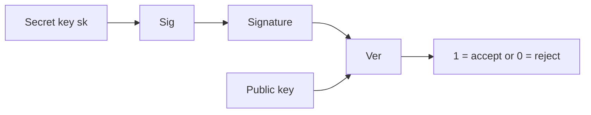

## Security

**Security** means both Safety and Security in English:
- Safety: protection against errors
- Security: protection against malicious actions

There are 5 (extended) **security properties**:
1. Confidentiality of data/messages  
2. Integrity of data/computations  
3. Availability of service  
   (CIA triad)  
5. Authenticity of files  
6. Anonymity of users  

Cryptography provides 4 **goals**:
1. Confidentiality: attacker cannot learn the content of messages  
2. Integrity: attacker cannot modify a message without the modification being detected  
3. Authenticity: attacker cannot claim that a message came from someone who did not send it  
4. Non-repudiation: attacker cannot later deny having sent a message  

There are 2 types of cryptography:  
- Symmetric (same key for encryption and decryption)  
- Asymmetric (2 keys for encryption and decryption)  

**Symmetric cryptosystems** are a 5-tuple $(\mathcal{M}, \mathcal{K}, \mathcal{C}, e, d)$ such that for all plaintexts $m \in \mathcal{M}$ and $k \in \mathcal{K}$ it holds that:

$$
d(e(m,k), k) = m
$$

**Kerckhoffs’ principle**: a cryptosystem must remain secure even if everything about it is publicly known – except the key.

There are also 2 types of ciphers:  
- **Classical ciphers** (e.g., shift cipher: Caesar cipher, substitution cipher, Vigenère cipher, OTP)  
- **Modern ciphers**

Modern ciphers contain 3 important aspects:
- Formal definitions  
- Systematic design  
- Highly secure cryptographic constructions with security proofs  
  (security proofs rely on cryptographic assumptions: if the assumption is false, the scheme is no longer secure)

The security of classical ciphers often relied on keeping the algorithm secret (Security by Obscurity) and used mechanical or manual methods.

The security of modern ciphers is based on mathematics and complexity theory and relies exclusively on keeping the key secret.

### Cryptographic Primitives

|                     | **Symmetric Cryptographic Primitives** | **Asymmetric Cryptographic Primitives** |
|---------------------|-----------------------------------------|------------------------------------------|
| **Confidentiality** | <ul><li>Symmetric ciphers</li><li>Block ciphers</li></ul> | <ul><li>Public Key Encryption (PKE)</li></ul> |
| **Integrity & Authenticity** | <ul><li>Message Authentication Codes (MAC)</li></ul> | <ul><li>Digital signatures</li></ul> |

### Cryptographic Constructions (Examples)

|                     | **Symmetric Constructions** | **Asymmetric Constructions** |
|---------------------|-----------------------------|-------------------------------|
| **Confidentiality** | <ul><li>One-Time Pad</li><li>DES (3DES), AES</li></ul> | <ul><li>RSA encryption</li><li>ElGamal encryption</li></ul> |
| **Integrity & Authenticity** | <ul><li>CBC-MAC</li><li>HMAC</li></ul> | <ul><li>RSA signatures</li><li>Schnorr signatures</li></ul> |

---

### Symmetric Cryptography

- Algorithms: (Gen, Enc, Dec)


---

**Security Game**

1. **IND-COA**: The attacker only sees ciphertexts.  
   The game is that the attacker must distinguish between two possible plaintexts.  
   However, the attacker’s probability of winning remains at $\frac{1}{2}$.

2. **IND-KPA**: The attacker knows pairs $(m,c)$ and can derive statistics and patterns from them (fixed formats and standards, recurring signatures/footers in emails).  
   The game is that the attacker must distinguish between two possible plaintexts.  
   However, the attacker’s probability of winning remains at $\frac{1}{2}$.

3. **IND-CPA**: The attacker may request encryption of as many messages as desired.  
   However, the attacker’s probability of winning remains at $\frac{1}{2}$.  

   - Danger: Chosen Ciphertext Attack, e.g., Padding Oracle Attack

4. **IND-CCA**: The attacker has access to an oracle that can decrypt chosen ciphertexts.  
   However, the attacker’s probability of winning remains at $\frac{1}{2}$.

---

### Perfect Secrecy

Formally, perfect secrecy holds if for all plaintexts $m$ and all ciphertexts $c$:

$$
P[m \mid c] = P[m]
$$

---

### One-Time Pad (OTP)

OTP can also be called the Vernam cipher.

- OTP encrypts bit strings of length $n$.
- Formal definition:
  - Gen: output a random key $k \overset{\mathrm{R}}{\gets} \{0,1\}^n$.
  - Enc: for $m \in \mathcal{M}$: output $\mathrm{Enc}(k,m) = k \oplus m$.
  - Dec: for $c \in \mathcal{C}$: output $\mathrm{Dec}(k,c) = k \oplus c$.

- Security:
  - The key may only be used once.
  - The key must be truly random.
  - The key must be at least as long as the message.
  - The key must remain absolutely secret and must be securely exchanged.
 
### Block Cipher

- Block ciphers are cryptosystems that can only encrypt blocks of fixed length.
- Encryption and decryption of message/ciphertext blocks with fixed length.
- Block length $n = |m| = |c|$: typically 64–128 bits.
- Key length $k$: typically 128–256 bits, and the same key can be used multiple times on different blocks.
- $\mathrm{Enc}(\cdot)$ plays the role of a PRP (pseudorandom permutation).  
  We evaluate whether a block cipher is strong depending on whether the key space is large enough.  
  This also represents the security of a block cipher (an attacker cannot distinguish between $\mathrm{Enc}(\cdot)$ and a random permutation $P(\cdot)$).
- Examples of block ciphers: AES, DES, 3-DES, Serpent, Twofish, Blowfish, etc.


DES, 3-DES, AES, Serpent, Twofish, Blowfish are block ciphers (concrete algorithms implementing a PRP on fixed block sizes).

---

**Data Encryption Standard (DES)**  
- Block length $n = 64$ bits  
- Key length $k = 56$ bits  
- Ciphertext length $c = 64$ bits  
- Main weakness: short key  

---

**Triple DES**
- Key length: $3 \cdot 56 = 168$ bits  


- Vulnerable to Meet-in-the-Middle attack (effective security ≈ 112 bits).

---

**Advanced Encryption Standard (AES)**
- Block size: 128 bits  
- Key length: 128, 192, or 256 bits  
- Vulnerable to side-channel attacks or fault attacks.  

- Problems of AES:
  - Secure only as long as the implementation and associated systems are correctly configured.
  - Weak key and IV generation can endanger AES security.
  - Side-channel attacks can be used to derive the key.  
    (Countermeasures: constant-time implementation against timing attacks, masking against power analysis, or AES-NI — a hardware support / extension of the x86 instruction set by Intel and AMD processors that enables secure and faster AES execution.)

- Problems of block ciphers:
  - Not IND-CPA secure because deterministic.
  - Not possible to encrypt messages of arbitrary length.
 
### Modes of Operation

ECB, CBC, CTR are modes of operation that use a block cipher to encrypt and decrypt long messages (multiple blocks).

---

### Electronic Code Book (ECB) Mode


- The plaintext must be padded if $|m|$ is not a multiple of the block length (padding function).  
  Randomizing the input helps prevent certain attacks.

- Advantages:
  - Simple to use: implementation is straightforward, each block is processed independently.
  - Speed: encryption and decryption can be parallelized.
  - Fault tolerance: corrupted data blocks do not affect other blocks or their encryption/decryption.

- Disadvantages:
  - Deterministic.
  - No diffusion: small changes in the plaintext lead to localized changes in the ciphertext.

---

### Cipher Block Chaining (CBC) Mode


- To formalize CBC, we need **randomized cryptosystems**:
  - A randomized symmetric cryptosystem is a 6-tuple $(\mathcal{M}, \mathcal{K}, \mathcal{C}, \mathcal{R}, e, d)$ such that for all plaintexts $m \in \mathcal{M}$ and $k \in \mathcal{K}$ it holds that:

$$
d(e(m,k,r), k, r) = m
$$

- For security, the value from $\mathcal{R}$ must be chosen uniformly at random (unpredictable) and may only be used once.
- Encryption is not parallelizable; decryption is parallelizable.  
  Because decryption is parallelizable, a faulty ciphertext block only affects the decryption of the current and the immediately following ciphertext block.

- CBC is **IND-CPA secure** if the Initialization Vector (IV) is random and unpredictable and is not reused.  
  However, CBC often has padding problems in practice.

- What are **padding attacks** on CBC?
  - Assumptions:
    1. The attacker has the ciphertext and access to a padding oracle, but has no knowledge of the plaintext or key.
    2. The web server uses a verifiable padding scheme (PKCS#7).
  - Attacker’s steps:
    - The attacker must learn whether a decrypted text has valid padding.
    - He observes either error messages or side-channel measurements.
    - From this, he determines valid padding and recovers plaintext.

---

### Counter Mode (CTR)


- The nonce comes from a **randomized counter function**, which maps a random value (nonce) and a natural number (counter) to a bit string of fixed length.  
  A simple implementation uses the binary representation of the natural number with zero-padding (LSB or MSB encoding).  
  The **problem** is that a randomized counter must never repeat. Since the counter has only finitely many values due to fixed block length, overflows/reuse must be prevented or the maximum period must be chosen large enough.

- The length of the combination of nonce and counter depends on the block size.  
  This length defines the maximum values of nonce and counter.

- Encryption and decryption can be parallelized.
- CTR is an OTP construction using the block cipher as a pseudorandom generator.

- **Nonce vs. IV**:
  - Nonce is used because CTR only requires uniqueness (→ uniqueness matters).  
  - Nonce may also be deterministic.
  - IV emphasizes unpredictability (→ unpredictability matters).  
  - Nonce prevents reuse of keystreams, while IV prevents information leakage from chosen plaintexts.
 
### Stream Ciphers

- Stream ciphers can encrypt bit strings of arbitrary length.
  - Plaintexts and ciphertexts are bit strings of arbitrary length.
  - Key length is fixed.
  - A pseudorandom keystream is generated from the key.
  - Encryption and decryption are performed by bitwise XOR with the keystream.

- A cryptosystem is called a stream cipher if there exists a function (keystream generator) $\mathrm{keystream}(x,z)$ that outputs a keystream of length $|x|$, such that:

$$
e(x,z) = d(x,z) = x \oplus \mathrm{keystream}(x,z)
$$

---

- **ChaCha20** is a modern stream cipher developed as an alternative to AES:
  - Block length: 512 bits
  - Key length: 256 bits
  - Faster than AES without hardware support such as AES-NI
  - Suitable for low-performance devices
  - Suitable for high-throughput and low-latency protocols
  - Not vulnerable to timing and cache attacks, but vulnerable to power/EM analysis attacks
  - Often used in TLS 1.3, WireGuard VPN, etc.

---

## Cryptographic Hash Functions

$H : \{0,1\}^\* \rightarrow \{0,1\}^n$

- Input: message of arbitrary length
- Output: fixed length

- 3 important properties of a hash function:
  - Deterministic
  - Fast computation
  - Integrity protection: small changes result in a different hash

- 3 security definitions:
  - Pre-image resistance: given $h$, it is hard to find $m$ such that $H(m) = h$
  - Second pre-image resistance: given $m$, it is hard to find $m' \neq m$ such that $H(m) = H(m')$
  - Collision resistance: it is hard to find $m$ and $m'$ such that $H(m) = H(m')$

| Hash function | Output | Security | Application |
|--------------|--------|----------|-------------|
| MD5 | 128 bits | Insecure | X |
| SHA-1 | 160 bits | Insecure since 2017 | X |
| SHA-256 | 256 bits | Secure | TLS/SSL, hashing, blockchain |
| SHA-3/Keccak | 224/256/384/512 bits | Secure | Similar to SHA-2 (but slower without hardware support) |

### Message Authentication Codes (MACs)

- Used to ensure integrity and authenticity of a message.
- Algorithms: (Gen, Mac, Vrfy)


---

### CBC-MAC


For messages of different lengths, however, it is not secure.  
For example, let $\mathrm{MAC}(M) = t$ and $\mathrm{MAC}(B) = s$.  
Then the new message $M' = M \parallel (t \oplus B)$ has the valid tag $s$.


Instead, we use **HMAC** for messages of arbitrary length.

$$
\mathrm{HMAC}_K(m) = H\bigl((K' \oplus \mathrm{opad}) \ \| \ H((K' \oplus \mathrm{ipad}) \ \| \ m)\bigr)
$$

---

### Authenticated Encryption

Authenticated encryption combines encryption and integrity protection to achieve:

- Confidentiality  
- Integrity  
- Authenticity of the message  

1. **Encrypt-then-MAC**
   1. Encrypt:  
      $c = \mathrm{Enc}_{k_E}(\text{nonce}, m)$  
      (nonce here may also be an IV)
   2. Authenticate:  
      $t = \mathrm{MAC}_{k_M}(\text{AAD} \parallel c)$  
      - Send: $(\text{nonce}, c, t)$  
      - Receiver: verify tag, and decrypt only if verification succeeds  
      - Problems: vulnerable to padding/timing oracles in certain modes (TLS-CBC: Lucky-13, padding oracle); IND-CCA secure due to authentication  

2. **MAC-then-Encrypt**
   1. Authenticate:  
      $t = \mathrm{MAC}_{k_M}(m)$  
   2. Encrypt:  
      $c = \mathrm{Enc}_{k_E}(\text{nonce}, m \parallel t)$  
      - Send: $(\text{nonce}, c)$  
      - Receiver: first decrypt, then verify tag
     
### Asymmetric Cryptography

- Instead, there is a key pair $(pk, sk)$, which makes key exchange unnecessary.  
  This also implies that only $n$ key pairs are needed instead of $\frac{n(n-1)}{2}$.
- It is a 7-tuple $(\mathcal{M}, \mathcal{K}_s, \mathcal{K}_p, \mathcal{K}, \mathcal{C}, e, d)$, with:
  - $\mathcal{M}$ is the set of plaintexts
  - $\mathcal{K}_s$ is the set of secret/private keys
  - $\mathcal{K}_p$ is the set of public keys
  - $\mathcal{K} \subset \mathcal{K}_s \times \mathcal{K}_p$ is the set of key pairs
  - $\mathcal{C}$ is the set of ciphertexts
  - $e$ is the encryption function: $\mathcal{M} \times \mathcal{K}_p \rightarrow \mathcal{C}$
  - $d$ is the decryption function: $\mathcal{C} \times \mathcal{K}_s \rightarrow \mathcal{M}$

- Algorithms: (Gen, Enc, Dec)


---

## RSA Cryptosystem

1. **RSA key generation: GenRSA(n)** with security parameter $n$
   - Choose 2 large *prime numbers* $p, q$ with $p \neq q$ and of equal length.
   - Set $N = pq$ and $\varphi(N) = (p-1)(q-1)$.
   - Choose $e$ with $1 < e < \varphi(N)$ and $\gcd(e,\varphi(N)) = 1$.
   - Compute $d$ as the multiplicative inverse of $e$ modulo $\varphi(N)$:

$$
ed \equiv 1 \pmod{\varphi(N)}
$$

   - Public key: $pk = (N,e)$, private key: $sk = (N,d)$
   - Output: $(N,e,d) = \mathrm{GenRSA}(n)$


---

2. **Textbook RSA**

$$
\mathrm{Enc}(N,e,m) = m^e \bmod N, \qquad
\mathrm{Dec}(N,d,c) = c^d \bmod N
$$

**Warning:** Textbook RSA is **not secure** (deterministic, malleable, no IND-CPA/CCA security).

- Textbook RSA is homomorphic, since:

$$
(m_0^{\,e} \bmod N) \cdot (m_1^{\,e} \bmod N)
\equiv (m_0 \cdot m_1)^e \pmod N
$$

---

4. **RSA-OAEP**

In practice, RSA is used **with secure padding**, typically **RSA-OAEP**.

- Goal: randomization + protection against many structural attacks
- For CCA security, modern systems often use **KEM-DEM** or directly modern protocols/AEAD.


Since textbook RSA is almost always insecure in practice, we need an alternative encryption scheme.  
Next, we consider the **ElGamal scheme**.

ElGamal works in a cyclic group $G$ of order $q$ with generator $g$.

---

### Key Generation (by Alice)

1. Choose secret $a \in \{1,\dots,q-1\}$ and set $A = g^a$.
2. Public key: $pk = (G,g,A)$, private key: $sk = (G,g,a)$.

---

### Encryption (to Alice)

For message $m \in G$:

1. Choose random $r \in \{1,\dots,q-1\}$ and set $R = g^r$.
2. Compute shared key:
   $K = A^r = g^{ar}$
3. Set $C = m \circ K$.
4. Ciphertext: $(R,C)$.

---

### Decryption (Alice)

1. Compute:
   $K = R^a = g^{ra}$
2. Output:
   $m = C \circ K^{-1}$.

---

**Security intuition:** ElGamal is (under suitable group assumptions) **IND-CPA secure**, because $r$ is freshly random.  
Typically: IND-CPA under the **DDH assumption** (depending on the setting).

### Discrete Logarithm Assumption

Setup: cyclic group $G$ of order $q$ with generator $g$.

- **DLog assumption:** given $h \in G$, find $x$ such that $g^x = h$ (hard).
- **CDH assumption:** given $g^x, g^y$, compute $g^{xy}$ (hard).
- **DDH assumption:** given $(g^x, g^y, T)$, decide whether $T = g^{xy}$ or random (hard).

---

#### Key Exchange

- Both parties jointly generate a key without directly transmitting it.
- Example: Diffie–Hellman (DH): both compute the same secret value $K = g^{xy}$.

---

### 1. Diffie–Hellman Key Exchange (DH)


- Goal: Two parties generate a shared session key without sending it directly.

The parties agree on a prime number $p$ (so that the group $G = \mathbb{Z}_p$) and a generator $g$ of $\mathbb{Z}_p^\* = \{1,\dots,p-1\}$.

1. A privately chooses $a$ randomly (with $0 < a < p$) and sends $g^a \bmod p$ to B.
2. B privately chooses $b$ randomly (with $0 < b < p$) and sends $g^b \bmod p$ to A.
3. A computes $(g^b)^a \bmod p$.
4. B computes $g^{ab} \bmod p$.

Since $(g^b)^a = g^{ab}$, both obtain the same key.

- DH alone provides **no authenticity** → vulnerable to **Man-in-the-Middle**, if not additionally authenticated (e.g., signatures/certificates).

---

### 2. Needham–Schroeder Key Exchange (symmetric) Protocol

$$
\begin{aligned}
\text{i.}\ & A \rightarrow T: \quad A, B, N_A \\
\text{ii.}\ & T \rightarrow A: \quad \{(N_A, K, B, \{(K,A)\}_{K_B})\}_{K_A} \\
\text{iii.}\ & A \rightarrow B: \quad \{(K,A)\}_{K_B} \\
\text{iv.}\ & B \rightarrow A: \quad \{(N_B)\}_{K} \\
\text{v.}\ & A \rightarrow B: \quad \{(N_B - 1)\}_{K}
\end{aligned}
$$

Here $N_A, N_B$ are nonces (“number used once”), i.e., randomly generated numbers that must never be reused.

- Insecure under replay if an attacker has broken an old key $K'$ and stored old messages.

---

### 7. Needham–Schroeder (asymmetric)

Let $K_{P_A}, K_{P_B}$ be the public keys of A and B, respectively, and $K_{S_T}$ the private signing key of T.

$$
\begin{aligned}
\text{i.}\ & A \rightarrow T: A, B \\
\text{ii.}\ & T \rightarrow A: K_{PB}, \{B\}_{K_{ST}} \\
\text{iii.}\ & A \rightarrow B: \{(N_A, A)\}_{K_{PB}} \\
\text{iv.}\ & B \rightarrow T: B, A \\
\text{v.}\ & T \rightarrow B: \{(K_{PA}, A)\}_{K_{ST}} \\
\text{vi.}\ & B \rightarrow A: \{(N_A, N_B)\}_{K_{PA}} \\
\text{vii.}\ & A \rightarrow B: \{(N_B)\}_{K_{PB}}
\end{aligned}
$$

---

### Security of DH Against Passive Attackers: Computational Diffie–Hellman (CDH)

The attacker knows $G, g, g^a, g^b$, but not $a,b$.

He must compute $g^{ab}$ → instance of the CDH problem.

- Input: $g, g^a, g^b$
- Output: $g^{ab}$

Remarks: CDH is considered hard (basis of ElGamal); DH can be implemented in any cyclic group.

---

### Security Against MitM Attack on DH

- Problem: MitM: “simultaneous” execution of two DH protocols → A and B obtain different keys, E knows both.
- Solution: Messages must be signed → authenticated DH (or *Station-to-Station protocol*).

---

### Station-to-Station Protocol (STS)

Assumption: Both parties have signing keys $sk_A$, $sk_B$; certificates are known to both.

$A \rightarrow B: g^a$

$B \rightarrow A: g^b, \mathrm{Sig}_{sk_B}(g^a, g^b)$

$A \rightarrow B: \mathrm{Sig}_{sk_A}(g^a, g^b)$

where $K = g^{ab}$ is the DH shared key.

Remarks:
- The signature allows testing integrity of $g^a$ and $g^b$.
- A and B can only decrypt the signature if $K$ is correct.

### Key Distribution

- A key is generated by one entity and distributed to the communication partners.
- Example: a central server/KDC distributes session keys (Kerberos idea).

To improve practical usability, **hybrid encryption – KEM-DEM** is used.  
It combines an asymmetric key exchange (**KEM – Key Encapsulation**) with efficient symmetric encryption of the data (**DEM – Data Encapsulation**).

- Scheme:
  1. Generate random session key $k$
  2. $c_1 = \mathrm{Enc}^{\mathrm{sym}}_k(m)$ (e.g., AES-GCM / ChaCha20-Poly1305)
  3. $c_2 = \mathrm{Enc}^{\mathrm{pk}}(pk, k)$ (e.g., RSA-OAEP or (EC)DH-based KEM)
  4. Send $(c_1, c_2)$

- Encryption:  
  

- Decryption:  
  

- Advantage: efficient + (with AEAD/KEM) very strong security properties, often up to IND-CCA.
- Disadvantage: security depends on the security of both cryptosystems.

---

## Signatures

*Digital signatures* allow:
- testing *authenticity* and *integrity* of a message,
- as well as (in practice) *non-repudiation* of the sender.

The basis is asymmetric cryptography: signing is done with the private key and verification with the public key.



- The pair $(pk, sk)$ also enables **multiple authentication**: once the key is authenticated → afterwards arbitrarily many signed messages can be verified.
  - Algorithms: (Gen, Sig, Ver)

  

- $\mathrm{Sig}(sk,m)$ strongly depends on the message, so an attacker cannot forge signatures for new messages.

EUF-CMA security formalizes that an attacker cannot produce new valid signatures → prerequisite for authenticity and (cryptographic) non-repudiation.

### Legal Framework for Digital Signatures

The legal recognition of digital signatures in the EU is regulated by the **eIDAS Regulation**.

eIDAS distinguishes between:

1. **Simple electronic signature**
2. **Advanced electronic signature**
3. **Qualified electronic signature**

---

### Simple Electronic Signature

- Any electronic data used to sign.
- Example:
  - Typed name under an email
  - Scanned signature

- No special technical requirements.
- Low evidentiary value.

---

### Advanced Electronic Signature

Must:

- Be uniquely linked to the signatory
- Enable identification of the signatory
- Be created using means under sole control of the signatory
- Be linked to the data so that subsequent changes are detectable

Provides higher evidentiary value.

---

### Qualified Electronic Signature

- Based on a qualified certificate.
- Created using a qualified signature creation device.
- Legally equivalent to a handwritten signature.

---

### Verification of Signatures

Verification includes:

- Checking the cryptographic validity
- Checking certificate chain
- Checking certificate validity period
- Checking revocation status (CRL / OCSP)

---

## Public Key Infrastructure (PKI)

PKI solves the problem:

How do we know that a public key belongs to a specific entity?

Solution:

- Certificates issued by a Certificate Authority (CA).

A certificate contains:

- Public key
- Identity information
- Validity period
- Signature of the CA

---

### Certificate Chain

- Root CA (trusted)
- Intermediate CA
- End-entity certificate

Trust is based on:

- Pre-installed root certificates in operating systems and browsers.

---

### Certificate Revocation

If a private key is compromised:

- The certificate must be revoked.

Mechanisms:

- CRL (Certificate Revocation List)
- OCSP (Online Certificate Status Protocol)

## Transport Layer Security (TLS)

TLS provides:

- Confidentiality  
- Integrity  
- Authentication  

TLS combines:

- Asymmetric cryptography (for authentication and key exchange)
- Symmetric cryptography (for data encryption)
- Hash functions (for integrity)

---

### TLS Handshake (Simplified)

1. **ClientHello**
   - Supported TLS versions
   - Supported cipher suites
   - Random value

2. **ServerHello**
   - Selected TLS version
   - Selected cipher suite
   - Random value
   - Certificate

3. **Key Exchange**
   - Diffie–Hellman (often ECDHE)
   - Establishment of a shared secret

4. **Finished Messages**
   - Both sides verify integrity of the handshake

After the handshake:

- Symmetric session keys are used for secure communication.

---

### Forward Secrecy

Forward Secrecy means:

- Compromise of the long-term private key does not compromise past session keys.

Achieved by:

- Ephemeral Diffie–Hellman (DHE / ECDHE)

Without Forward Secrecy:

- If the private key is leaked, previously recorded traffic can be decrypted.

---

### Cipher Suites

A TLS cipher suite defines:

- Key exchange algorithm
- Authentication algorithm
- Symmetric encryption algorithm
- Hash/MAC algorithm

Example:

```
TLS_ECDHE_RSA_WITH_AES_128_GCM_SHA256
```

Meaning:

- ECDHE → Key exchange
- RSA → Authentication
- AES_128_GCM → Encryption
- SHA256 → Hash function

---

### Downgrade Attacks

An attacker attempts to force:

- Use of older TLS versions
- Use of weaker cipher suites

Examples:

- Version rollback attack
- Cipher suite rollback attack

Modern TLS versions (TLS 1.3) include downgrade protection mechanisms.

---

### Padding Oracle Attack (TLS Context)

Applies to:

- CBC mode in older TLS versions

If a server reveals padding errors:

- An attacker can decrypt ciphertext block-by-block.

Mitigation:

- Use AEAD modes (AES-GCM, ChaCha20-Poly1305)
- Constant-time implementations

---

### Man-in-the-Middle (MitM)

Attacker:

- Intercepts communication
- Modifies or forwards messages

Mitigation:

- Proper certificate validation
- PKI trust chain

---

### Man-on-the-Side (MotS)

Attacker:

- Can observe traffic
- Can inject packets
- Cannot block or modify legitimate packets

Typical attacks:

- DNS injection
- TCP RST injection

## Censorship Mechanisms

Censorship can take place at different layers of the network stack.

---

### DNS Manipulation

DNS manipulation interferes with the resolution of domain names.

1. **DNS Injection**
   - The attacker injects a fake DNS response.
   - The client accepts the first valid response (race condition).
   - The user is redirected to an incorrect IP address.

2. **DNS Filtering**
   - DNS requests or responses are blocked.
   - Requires blocking capability (not only injection).
   - Often implemented by ISPs or state-level filtering.

---

### IP Blocking

- Blocking communication to specific IP addresses.
- Can be implemented:
  - On the end device
  - By the ISP
  - By firewalls
  - At state level

Limitations:
- Multiple domains may share one IP address (collateral damage).
- Can be bypassed via IP rotation, CDNs, or VPNs.

---

### Deep Packet Inspection (DPI)

Deep Packet Inspection enables:

- Inspection of packet headers
- Inspection of packet payload
- Pattern matching
- Keyword filtering
- Traffic fingerprinting

Properties:

- Has full access to:
  - Source and destination ports
  - IP addresses
  - Packet payload (if not encrypted)

- Operates directly in the data path:
  - Allows or drops packets
  - Based on predefined rules

Limitations:

- Computationally expensive
- Time-consuming
- Cannot decrypt strong end-to-end encryption
- May rely on AI/ML models
- Not reliable against unknown or new attack patterns

## Privacy

Privacy means the protection of personal data and user identity in digital systems.

Privacy goals include:

- Confidentiality of personal data  
- Anonymity  
- Pseudonymity  
- Unlinkability  
- Protection against profiling  

---

### Anonymity

A user is anonymous if they cannot be identified within a group (anonymity set).

If the anonymity set has size $n$, then the probability of correctly identifying a user is:

$$
\frac{1}{n}
$$

The larger the anonymity set, the stronger the anonymity.

---

### Pseudonymity

- A user acts under a pseudonym.
- Activities can be linked to the pseudonym.
- The real identity may still be discoverable.

---

### Unlinkability

Unlinkability means that:

- Different actions cannot be linked to the same user.
- Observers cannot determine whether two communications originate from the same entity.

---

### Tor (The Onion Router)

Tor provides anonymity through multi-hop routing.

Basic principle:

- Data is encrypted in layers (“onion encryption”).
- Each relay removes one encryption layer.
- No single relay knows both sender and receiver.

Properties:

- Protects against local traffic analysis.
- Vulnerable against a global passive adversary.
- Exit nodes can observe unencrypted traffic.

---

### VPN (Virtual Private Network)

A VPN provides:

- An encrypted tunnel between client and VPN server.
- Protection against local network observers (e.g., ISP).

Limitations:

- The VPN provider can see the traffic.
- Does not provide full anonymity.

## Privacy-Enhancing Technologies (PETs)

Privacy-Enhancing Technologies aim to protect sensitive data and reduce trust requirements in centralized systems.

---

### Federated Learning

Federated Learning is a decentralized machine learning approach.

Goal:

- Train a global model
- Without sharing raw training data

Procedure:

1. The server distributes a global model to clients.
2. Clients train locally on their own data.
3. Clients send model updates (e.g., gradients) to the server.
4. The server aggregates the updates.
5. The process is repeated iteratively.

Advantage:

- Raw data remains local.

Risks:

- Model updates may leak information.
- Possible membership inference attacks.
- Possible model inversion attacks.

---

### Membership Inference Attack

Goal:

- Determine whether a specific data record was part of the training set.

If a model behaves differently on seen vs. unseen data,  
an attacker may infer membership.

---

### Differential Privacy

Differential Privacy provides a formal privacy guarantee.

A randomized algorithm $\mathcal{A}$ satisfies $\varepsilon$-differential privacy if for all neighboring datasets $D$ and $D'$:

$$
\Pr[\mathcal{A}(D) \in S] \leq e^{\varepsilon} \Pr[\mathcal{A}(D') \in S]
$$

Meaning:

- The output distribution changes only slightly if one individual is added or removed.

Smaller $\varepsilon$ → stronger privacy guarantee.

---

### Secure Aggregation

Goal:

- The server should only see aggregated model updates.
- Individual updates remain hidden.

Technique:

- Cryptographic masking
- Multi-party computation

### Homomorphic Encryption

Homomorphic Encryption allows computations to be performed on encrypted data.

Property:

If

$$
c_1 = \mathrm{Enc}(m_1), \quad c_2 = \mathrm{Enc}(m_2)
$$

then there exists an operation $\circ$ such that:

$$
\mathrm{Dec}(c_1 \circ c_2) = m_1 \star m_2
$$

Depending on the scheme:

- Partially homomorphic encryption (supports one operation, e.g., addition or multiplication)
- Somewhat homomorphic encryption (limited number of operations)
- Fully homomorphic encryption (arbitrary computations on ciphertexts)

Advantage:

- Server can compute without seeing plaintext data.

Disadvantages:

- Very high computational cost
- Large ciphertext sizes
- Complex implementation

---

### Secure Multi-Party Computation (SMPC)

Goal:

- Multiple parties jointly compute a function
- Without revealing their private inputs

Given private inputs $x_1, x_2, \dots, x_n$,  
compute:

$$
f(x_1, x_2, \dots, x_n)
$$

without revealing individual $x_i$.

Techniques:

- Secret sharing
- Oblivious transfer
- Garbled circuits

Applications:

- Privacy-preserving statistics
- Secure voting
- Joint data analysis without data exchange

---

### Comparison of PETs

| Technique | Protects Raw Data | Allows Computation | Performance |
|------------|------------------|-------------------|-------------|
| Federated Learning | Yes | Yes | Medium |
| Differential Privacy | Partially | Yes | High |
| Homomorphic Encryption | Yes | Yes | Low |
| SMPC | Yes | Yes | Low–Medium |

## IT Forensics

IT Forensics deals with:

- Identification  
- Preservation  
- Analysis  
- Presentation  

of digital evidence.

Goal:

- Reconstruction of events
- Collection of legally usable evidence
- Analysis of security incidents

---

### Phases of IT Forensics

1. **Identification**
   - Identify relevant systems and data sources.
   - Determine scope of investigation.

2. **Preservation**
   - Secure and preserve evidence.
   - Prevent alteration of data.
   - Create forensic copies (bit-by-bit images).

3. **Analysis**
   - Examine data for relevant traces.
   - Reconstruct timeline of events.
   - Correlate logs and artifacts.

4. **Presentation**
   - Document findings.
   - Prepare expert reports.
   - Present results in court if required.

---

### Forensic Principles

- Integrity of evidence must be maintained.
- Chain of custody must be documented.
- All steps must be reproducible.
- Original evidence must not be modified.

---

### Hash Values in Forensics

Cryptographic hash functions are used to ensure integrity.

Procedure:

1. Compute hash of original evidence.
2. Create forensic copy.
3. Compute hash of copy.
4. Compare hashes.

If:

$$
H(\text{original}) = H(\text{copy})
$$

then integrity is verified.

---

### Types of Digital Evidence

- Log files
- File system metadata
- Network traffic captures
- Memory dumps
- Emails
- Browser history
- System artifacts

---

### Challenges in IT Forensics

- Encryption
- Large data volumes
- Anti-forensics techniques
- Cloud environments
- Legal and jurisdictional issues

