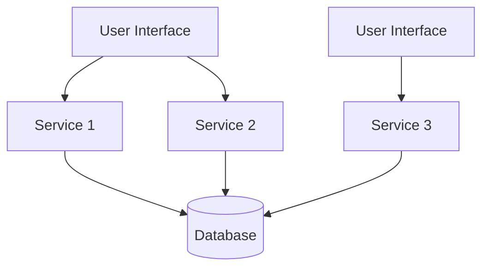
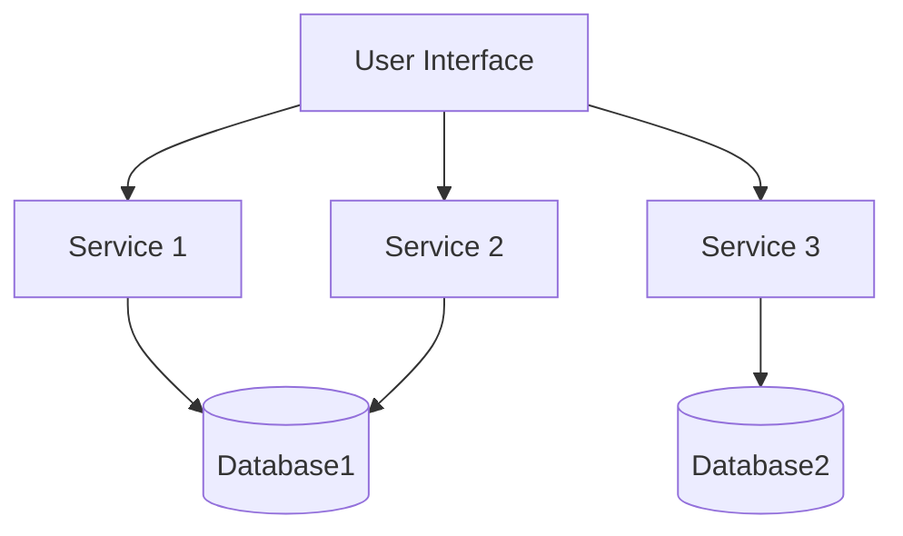
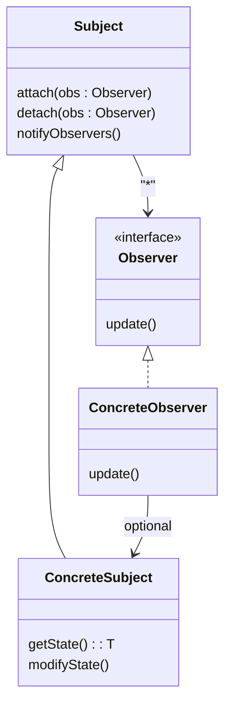
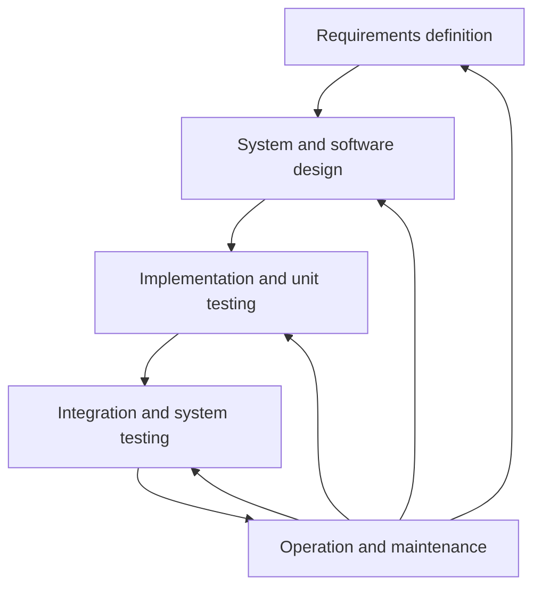
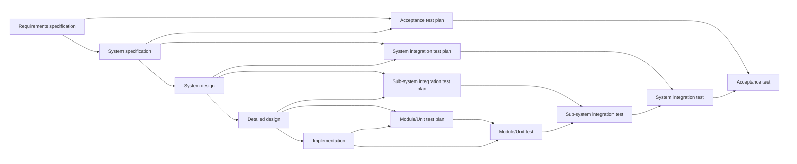

# Software-engineering summary
*software includes*
  - an executable program and its data
  - Configuration files
  - System documentation
  - Support environment

*Different kinds of Software*
  - Application SW:
    + interacts directly with the end user
    + is used for general purpose SW as well as customized SW for specific purposes
  - System-level SW:
    + does not interface with the end user
    + keeps a system running 
  - SW as aService (SaaS):
    + runs on a server
    + indirectly accessed via client
   
*Project phases*
  - analysis
  - design
  - evaluation of design
  - construction
  - quality control

*Requirement types*
  - User requirements:
    + services expected to be provided by the system
    + operational contraints
  - System requirements:
    + determine the system interface; define solution space
    + refinement of user requirements
  - Functional requirements:
    + specify services to be provided by the system
    + specify system reations to specific inputs/events
    + specify system behavior in specific situations
  - Non-functional requirements:
    + contraints on the services or functions offered by the systen, including: Service-level agreement, Contraints from development process, Alignment to standards
  - Doamin requirements:
  - + derived from application domain
   
*Loop of requirements elicitation and analysis*:
  1. requirements discovery
  2. requirements classification and organisation
  3. requirements prioritisation and negotiation
  4. requirements documentation 

**Requirements discovery**
*Generic types of viewpoints*
  1. Interactor viewpoints: persons or systems that will directly interact with the system such as end users, administrative and service personal
  2. Indirect viewpoints: Stakeholders that influence the requirements, but will not directly use the system
  3. Domain viewpoints: domain characteristics and contraints that influence the system requirements

*Techniques: Interviews*
  1. closed interviews: predefined set of questions
  2. Open interviews: no predefined agenda
     
**Requirements classification and organisation**
*Model for categorizing requirements*
   - FURPS+:
     + Functional
     + Usability
     + Reliability
     + Performance
     + Supportability
  - +:
    + Interface
    + Operations
    + Packageing
    + Legal
    
**Requirements prioritisation and negotiation**
  - Requirements are prioritized
  - Conflicts are found and resolved through negotiation

**Requirements documentation**
  - The requirements are documented and used as input for the next iteration
  - The produced documents may be formal or informal

*Software Requirements Specification Document (SRS): Level of detail depends on:*
  - Tyoe of system
  - Development process
  - Location of manufacture, external contractor or in-hause

*Requirement validation*
| Validity | Consistency | Completeness | Realism | Verifiability | Traceability |
|---|---|---|---|---|---|

*Kinds of Use cases*
  1. White box: use cases provide a detailed view of interaction of internals when satisfying a user goal
  2. Black box: use cases encapsulate the system and describe only interactions with external actors
  3. Corporate: use cases decribe a business process
  4. System: use cases are performed and described with respect to the system under design

*Dimension of Software Architecture*
  1. Operational: Availablity, Scalability, Performance
  2. Structural: Extensibility, Maintainability, Leverability
  3. Cross-Cutting: Accessibility, Privacy, Security

*Architecture Characteristics have to meet these following criteria*
  1. specifies a non-domain design consideration: specifies operational and design criteria concerning how to implement a given requirement
  2. influences a structural design aspect: requires the struction of specific architectural elememts
  3. critical that application performs as intended: meets functional and non-functional requirements
**Monolithic Architectureal Styles**
*Layered architecture of software architecture*
  - defines responsibilities for each layer
  - has 2 layer types: open and close:
    + Top-down request must pass through closed layer and can skip open layer
    + Open layers improve performance but reduce isolation

*Pipes and Filters*
  - Pipes:
    + are undirectional, point-to-point channels from a data source to a target
    + allow any data format, formats supporting samaller data chunks are preferred for better performance/throughput
  - Filters:
    + self-contained and independent from other filters
    + stateless
    + Kinds of filters: **producer** (Source of the data), **Transformer** (receives data from its input channels, performs operations on the data, forwards the result via its output channel), **Consumer** (sink of the data), **tester** (receives input, tests whether data satisfies certain conditions, redirects data according to outcome of test to different output channels)

*Model-View-Controller (MVC)*
- Model: is the business logic and data storage independent of input behavior and output representation
- View: representation of the model data to the ueer: data obtained from model, frequently more than one different kind od view
- Controller: translates user interactions to operations on the model: each view is associated to a controller, all interactions via controller
- Some characteristics of MVC:
  + Controller and View are directly coupled with the Model
  + Model is not directly coupled with the Controller of the View
 
**Distributed Architectural Styles**
*Service-based*

*TODO*

*Software factors*: Modularity, Comprehensibility, Cohension, Concision, Correctness

*Software external quality factors*: Validity, Robustness, Extensibility, Reusability, Compatibility, Portability, Efficienty, Usability, Functionality

*Software metrics*
  1. Fan-in/fan-out:
     - Fan-in of method m = number of methods calling m
     - Fan-out of method m = number of methods called by m
  2. Length od code: Length od source code
  3. Cyclomatrix complexity: independent paths through code
  4. Depth of conditional nesting: deep nesting hard to understand
  5. Weighted methods per class: methos weight depends on size/complexity, summed up per class
  6. Depth of inheritance: deep inheritance tree: classes depend on many design constraints

*Types of cohesion*
  1. Coincidental: no meaningful relation amongst class elements, that are desirable, except utility classes
  2. Temporal: all class elements executed together
  3. Sequential: result of one method is input to another
  4. Communicational: all functions/ methods of class access same input/output
  5. Functional: all class elements contribute to achieve a single, well-defined responsibility

*Responsibility-Driven Design (RDD)*
  - is a systematic approach to think about the design of software objects and components in terms of responsibilities, roles and collaborations

*Types of responsibilities*
  1. Doing-responsibilities: performing a task by doing iy, initiating action in other objects, or controlling and coordinating activities in other objects
  2. Knowing-responsibilities: knowing and providing information to other objects
  3. Relation between responsibilities and methods: to implement a responsibility, methods act alone or collaborate with other methods, maybe even ethods of other objects
  4. Assigning to multiple objects: poor choices in responsibilities assignment lead to fragile systems, that are hard to maintain, understand, reuse, or extend

*God classes*:
  - contains most of the system logic:
    + poorly distributed responsibilities
    + not an object-oriented design
  - recognizing by
    + classes with unclear responsilities
    + classes with low cohension
    + uses classes with public field accessors
   
*Refactoring*: is a disciplined technique for restructuring an existing body of code, altering its internal structure without changing its external behavior

*Abstract Coupling*
  - observer pattern realizes abstract coupling between subject and observers
  - implementation of attach(), detach(), notify() operations need to know only observers interface
  - observers can be added and removed dynamically

*Test coverage*
  1. Structural coverage:
     - statement coverage: each statement executed at least once
     - basic block coverage: each block executed at least once
     - branch coverage: each outgoing edge from a node in the control flow graph executed at once
     - path coverage: each path in the control flow graph executed at least once
  2. Logic-based coverage
     - condition coverage: each condition evaluated as true and as false in at least one test run
     - decision coverage: each decision evaluated as true and as false in at least one test run
     - modified condition decision coverage: combines ápects ò CC, DC, and independent tests
     - multiple-condition coverage: all true-false combinations of conditions exercised at least on test run
         
*Automated Test Case Generation (ATCG)*
  1. White box (code-based): code of Implementation under test (IUT) is analyzed to achieve coverage, ex.,
    - syntactic approaches:
     + scanning for conditions, evaluation
     + suitable to achieve logic-based coverage criteria
     + can be over-approximation: unreach code, infeasible decisions
    - symbolic execution:
     + unwinding CFG with symbolic values
     + suitable to achieve structural coverage criteria
     + can be under-approximation: unreached code
  3. Black box: analysis of input data or model of IUT

*Automatic static verification techniques*
  - Static checking: typically based on CFG of IUT and constraint solving: check runtime exception, liveness, information flow; fully automated; over-approximating and possibly many false positives; scales reasonably well
    + examples:
      1. Control flow analysis (CF): determines control flow in program
      2. Data flow analysis (DF): liveness analysis, etc.
      3. Information path analysis (IF): value dependency analysis, etc.
      4. Execution path analysis (PA): identify and analyze execution paths
  - Bug finding: based on pattern matching, heuristics: fast, scales well, handles full Java; over- and under-approximates (false positive+ incomplete)
    + example: SpotBugs: bug detection in Java, finds bug patterns, works at byte code level
   
  *Java Modelling Language (JML)*: is a contract-based specification language tailored to Java, is a behaviorial interface specification language (BISL); JML= Java + FOL + Contracts + Invariants + etc.

  *Working principle of deductive verification*
  - using path exploration and symbolic execution explores all paths in CFG of straight-line programs
  - assumptions of symbolic execution for deductive verification:
    + finite number of paths
    + use symbolic values to represent all inputs
      loops approximated invariants
  - keys to scalability of deductive verification: approximate effect of a method call with a contract:
    + during symbolic execution, replace called method with contract
    + using substitution and first-order deduction instead od path exploration

*Software variability engineering*: Software Product Line Engineering (SPLE) assumes the necessity (differing requirments and features) to maintain different product variants as given

*Fundamental process activities of Software engineering process*
  1. Software specification: define the software to be produced and the constraints of its operation
  2. Software development: design, implementation, verification of the software
  3. Software alidation: to ensure that software behaves according to the requirements of the customer
  4. Software evaluation: adapt anf modify the software to cope with changing customer and market requirements

*Process Models*
  **1. The waterfall Model**: is a Generic Process Model (GPM)

  - Problems of the waterfall model:
     + not an iterative process => early prototyping impossible
     + change of requirements, design, etc. is difficult
     + testing starts only in the later stages
     + different phases executed by different teams
  
  **2. The V-model**

- Problems:
  + not iterative
  + change of requirements expensive
  + can be used only when:

*Characteristics of good user stories*: INVEST
- Independent
- Negotiable
- Valuable
- Estimable
- Small
- Testable
    

